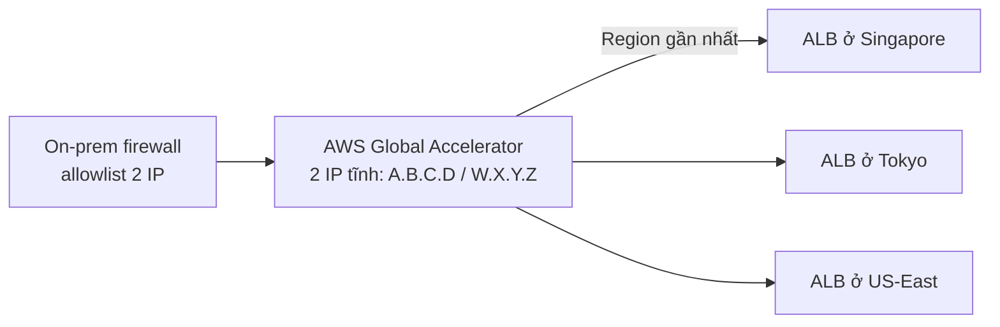
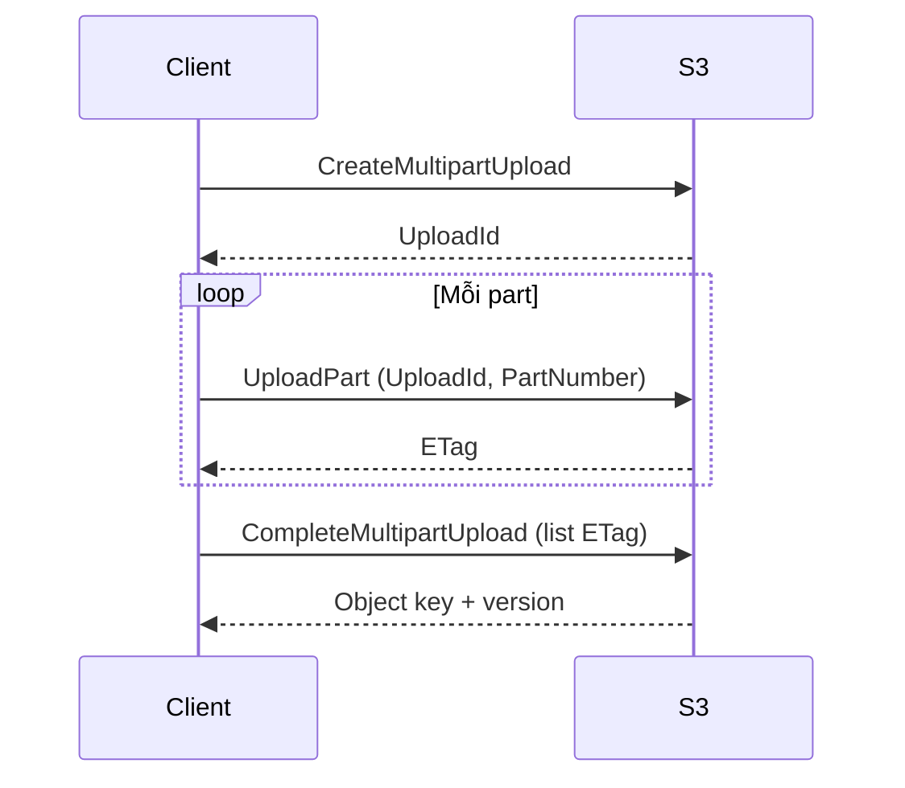

# Teaching Patterns — Viết giải thích AWS dễ hiểu

> **File này được load khi viết section "Giải thích câu hỏi", "Vì sao đúng", "Vì sao các đáp án khác sai".**
>
> Mục tiêu: nâng chất lượng sư phạm của giải thích — không chỉ đúng kỹ thuật mà còn dễ nuốt, dễ nhớ, dễ ôn lại.

> **⚠️ Quy tắc về phong cách tối quan trọng:** Tất cả các "pattern" và "pass" trong file này là **khung tư duy nội bộ** để giúp viết hay hơn — KHÔNG dùng chúng làm heading hiển thị trong câu trả lời. Người đọc cần một bài giảng **liền mạch, ngôn ngữ tự nhiên**, không phải một báo cáo có nhãn `Pass 1 — Trực giác`, `Pass 2 — Kỹ thuật`, `Decision walkthrough:`. Chuyển ý bằng câu nối tự nhiên (vd: "Đi vào chi tiết kỹ thuật một chút...", "Cụ thể trong AWS...", "Tài liệu AWS nói rõ:") thay vì heading meta-process.

## Mục lục

- [Component toolkit — chọn cái fit nội dung](#component-toolkit--chọn-cái-fit-nội-dung)
- [Nguyên tắc dẫn dắt: trực giác trước, kỹ thuật sau](#nguyên-tắc-dẫn-dắt-trực-giác-trước-kỹ-thuật-sau)
- [Pattern 1 — Analogy đời thường](#pattern-1--analogy-đời-thường)
- [Pattern 2 — Diagram (Mermaid hoặc ASCII)](#pattern-2--diagram-mermaid-hoặc-ascii)
- [Pattern 3 — Comparison table](#pattern-3--comparison-table)
- [Pattern 4 — Numbered step table](#pattern-4--numbered-step-table)
- [Pattern 5 — Anticipated follow-up](#pattern-5--anticipated-follow-up)
- [Pattern 6 — TL;DR cuối section](#pattern-6--tldr-cuối-section)
- [Pattern 7 — Bằng chứng quan sát được](#pattern-7--bằng-chứng-quan-sát-được)
- [Pattern 8 — Gọi tên design pattern](#pattern-8--gọi-tên-design-pattern)
- [Pattern 9 — Decision walkthrough (loại trừ tuần tự)](#pattern-9--decision-walkthrough-loại-trừ-tuần-tự)
- [Pattern 10 — Cost component breakdown](#pattern-10--cost-component-breakdown)
- [Pattern 11 — "Đừng nhầm với..." callout](#pattern-11--đừng-nhầm-với-callout)
- [Cấu trúc "Giải thích câu hỏi" — storytelling order](#cấu-trúc-giải-thích-câu-hỏi--storytelling-order)
- [Cấu trúc "Vì sao đúng"](#cấu-trúc-vì-sao-đúng)
- [Cấu trúc "Vì sao sai"](#cấu-trúc-vì-sao-sai)

> **📎 Special cases (multi-select, negation):** xem [`special-cases.md`](special-cases.md) — chỉ load file đó khi Bước 1 phát hiện trigger tương ứng. KHÔNG load mặc định để tiết kiệm context.

---

## Component toolkit — chọn cái fit nội dung

**Triết lý:** *structure cố định, content linh hoạt*. Bên trong mỗi subsection (`### Giải thích câu hỏi`, `### Vì sao đúng`, `#### ❌ #N — ...`), pick component theo loại nội dung — KHÔNG tick checklist cứng. Một câu về IAM policy → JSON code block đáng giá hơn analogy. Một câu về topology → diagram đáng giá hơn bullet list.

| Component | Khi nên dùng | Khi nên TRÁNH |
|---|---|---|
| **Analogy đời thường** | Concept trừu tượng (eventual consistency, indirection, control plane, IAM trust); misconception cô đọng trong "Vì sao sai" | Câu thuần về limit/quota/syntax; analogy quá dài (>2 câu) làm loãng |
| **Mermaid diagram** | Topology, flow, state machine, sequence — đặc biệt khi câu trả lời render trong webapp `/docs/` (Fumadocs hỗ trợ Mermaid) | Diagram đơn giản chỉ 2-3 box → ASCII gọn hơn; khi notes hiển thị ở nơi không render Mermaid |
| **ASCII diagram** | Topology/flow gọn ≤15 dòng, an toàn render mọi nơi (D1 notes, terminal, plain markdown) | Cấu trúc phức tạp >15 dòng → khó đọc, dùng Mermaid |
| **Comparison table** | ≥2 entity dễ nhầm cần phân biệt thuộc tính (ALB vs NLB, EBS vs EFS, IP của ALB vs IP của GA) | 1 entity duy nhất; >7 dòng → tách 2 bảng |
| **Step table / numbered list** | Quy trình tuần tự, request flow, deployment sequence | Không có thứ tự — dùng bullet thường |
| **Code block (`bash`/`json`/`yaml`)** | CLI command, IAM policy, bucket policy, CFN/TF snippet, SDK call, sample API request/response | Khi không có config/code thực tế — đừng "fake" code minh họa |
| **Inline code (`backtick`)** | Tên API, parameter, config key, ARN format, header name | Câu văn xuôi — đừng inline code mọi từ |
| **Bullet list** | Liệt kê đặc điểm/constraint/cost component không có thứ tự | Có ≥3 chiều so sánh → comparison table tốt hơn |
| **Numbered list** | Decision walkthrough, deployment steps, sự kiện tuần tự | Liệt kê không có thứ tự logic — dùng bullet |
| **Blockquote** | Quote nguyên văn AWS docs (kèm dịch), highlight câu hệ quả, TL;DR, "Kiểm chứng nhanh:", "Đừng nhầm với..." | Không có phần text cần emphasize đặc biệt |
| **Callout với emoji** | `⚠️` cảnh báo/near-twin; `💡` insight; `📌` ghi chú quan trọng; `🔑` key concept | Lạm dụng emoji làm rối |
| **Bold key terms** | Thuật ngữ AWS lần đầu xuất hiện, từ khóa then chốt trong câu trả lời | Bold mọi thứ → mất ý nghĩa highlight |

**Chiến thuật pick component:**

1. Đọc câu hỏi & đáp án → xác định **bản chất nội dung** (topology? config? cost? misconception about indirection? near-twin confusion?)
2. Map sang component fit nhất từ bảng trên
3. Áp **trigger BẮT BUỘC** nếu match (≥3 options → decision walkthrough; cost-driven → cost table; near-twin → callout)
4. Còn lại tự do — miễn sao "đầy đủ và dễ hiểu nhất"

**Mẫu code block phổ biến:**

```bash
# CLI command minh họa
aws s3api put-bucket-policy \
  --bucket my-bucket \
  --policy file://policy.json
```

```json
{
  "Version": "2012-10-17",
  "Statement": [{
    "Effect": "Allow",
    "Action": "s3:GetObject",
    "Resource": "arn:aws:s3:::my-bucket/*"
  }]
}
```

```yaml
# CloudFormation snippet
Resources:
  MyBucket:
    Type: AWS::S3::Bucket
    Properties:
      BucketName: my-bucket
      VersioningConfiguration:
        Status: Enabled
```

---

## Nguyên tắc dẫn dắt: trực giác trước, kỹ thuật sau

Mỗi đáp án đúng được viết như một **đoạn văn liền mạch**, dẫn dắt người đọc theo thứ tự:

1. **Trực giác trước** — Cho người đọc *cảm thấy* tại sao đúng:
   - Mở đầu bằng analogy đời thường HOẶC ASCII diagram
   - 1 câu tóm tắt cơ chế

2. **Kỹ thuật sau** — Bám sát tài liệu AWS, có quote + dịch:
   - Trích dẫn AWS docs (giữ rules trong SKILL.md chính)
   - Numbered steps nếu có quy trình
   - Comparison table nếu có ≥2 entity dễ nhầm

**Quan trọng:** đây là *thứ tự nội dung*, KHÔNG phải *cấu trúc heading*. KHÔNG viết các nhãn `Pass 1 — Trực giác`, `Pass 2 — Kỹ thuật` ra câu trả lời. Người đọc chỉ cần thấy một bài giảng tự nhiên, không cần biết bạn chia thành mấy "pass". Dùng câu nối kiểu *"Cụ thể hơn về kỹ thuật:"*, *"Tài liệu AWS mô tả như sau:"*, *"Đi sâu vào cơ chế:"* để chuyển từ phần trực giác sang phần kỹ thuật.

---

## Pattern 1 — Analogy đời thường

**Khi nào dùng:**
- Concept trừu tượng (control plane, DNS resolution, eventual consistency)
- Misconception phổ biến trong option sai
- Khi quote AWS docs quá khô khan

**Quy tắc viết analogy:**
- 1-2 câu, dùng tình huống đời thường (gửi thư, bảo vệ tòa nhà, phòng cháy chữa cháy, làm việc nhóm)
- KHÔNG dùng analogy IT (sẽ vô nghĩa với người mới)
- Phải làm nổi bật ĐÚNG khía cạnh đang giải thích, không lan man

**Ví dụ tốt:**

| Concept | Analogy |
|---------|---------|
| Global Accelerator front ALB | *"Cổng vào toàn cầu có địa chỉ cố định, đứng trước các cánh cửa hay đổi"* |
| Lambda script tự update firewall | *"Mỗi 5 phút cử người chạy ra hỏi IP rồi gọi điện cho IT update firewall"* |
| Cross-region NLB → ALB | *"Đặt bảo vệ ở Hà Nội bảo chuyển khách qua cửa sau Sài Gòn"* — không làm được |
| S3 eventual consistency (legacy) | *"Bưu điện đã nhận thư nhưng chưa kịp dán lên hộp, người tìm ngay sau đó có thể không thấy"* |
| IAM role chain | *"Đưa thẻ ra vào tạm thời cho người ngoài, có hạn dùng và phạm vi giới hạn"* |
| SQS dead-letter queue | *"Hộp thư riêng cho thư bị trả lại, để xử lý sau, không làm tắc luồng chính"* |

**Anti-pattern (TRÁNH):**
- ❌ "Giống như một load balancer" (vẫn là IT, không giải thích gì)
- ❌ Analogy quá dài (3+ câu) → loãng
- ❌ Analogy không khớp với vấn đề → gây hiểu sai

---

## Pattern 2 — Diagram (Mermaid hoặc ASCII)

**Khi nào dùng:**
- Front door / fan-out (1 entry → N targets)
- Cấu trúc tầng/lớp (Layer 4 vs 7, control plane vs data plane, public vs private subnet)
- Flow request (client → service → backend)
- Topology mạng (VPC, subnet, route, peering)
- Replication / failover topology
- State machine, sequence của event

**Khi nào KHÔNG dùng:**
- Câu hỏi thuần về limit/quota/pricing
- Câu hỏi về cú pháp API/CLI/IAM policy → dùng code block
- Concept đã rõ ràng từ tên service (vd: "S3 Standard vs S3 Glacier")

### Mermaid vs ASCII — chọn cái nào?

| Ngữ cảnh hiển thị | Khuyến nghị |
|---|---|
| Webapp Fumadocs (`/docs/...`) | **Mermaid** — render đẹp, scale tốt, rich syntax |
| D1 notes (`/beads/...`) | **ASCII** nếu trang practice không render Mermaid; **Mermaid** nếu có. Khi không chắc, dùng ASCII (an toàn) |
| Diagram đơn giản 2-3 box | **ASCII** — gọn, không cần init renderer |
| Diagram phức tạp (≥5 node, branching, sequence) | **Mermaid** — gọn syntax, dễ đọc hơn ASCII |
| Sequence diagram (request/response qua nhiều service) | **Mermaid sequenceDiagram** — không có equivalent gọn cho ASCII |

### Mermaid — quy tắc & ví dụ

- Dùng các diagram type phù hợp: `flowchart`, `sequenceDiagram`, `stateDiagram-v2`, `erDiagram`
- Đặt trong code block với ngôn ngữ `mermaid`
- Ngắn gọn — node label tiếng Việt OK, nhưng tránh quá dài

**Ví dụ flowchart (front door / fan-out):**



**Ví dụ sequenceDiagram (S3 multipart upload):**



### ASCII — quy tắc & ví dụ

- Gọn dưới 15 dòng
- Dùng box-drawing chars: `┌ ─ ┐ │ └ ▼ ◄ ►`
- Có chú thích bên cạnh hoặc trong box
- Đặt ngay sau analogy, trước technical detail

**Ví dụ:**

```
                     ┌─────────────────────────┐
                     │  AWS Global Accelerator │
On-prem firewall ───►│   2 IP tĩnh: A.B.C.D    │
   (allowlist 2 IP)  │              W.X.Y.Z    │
                     └───────────┬─────────────┘
                                 │ (route theo Region gần nhất)
                  ┌──────────────┼──────────────┐
                  ▼              ▼              ▼
              ALB ở             ALB ở          ALB ở
            Singapore           Tokyo         US-East
```

---

## Pattern 3 — Comparison table

**Khi nào dùng:**
- Có ≥2 entity dễ nhầm trong câu hỏi (ALB vs NLB, Gateway endpoint vs Interface endpoint, EBS vs EFS)
- Cần phân biệt thuộc tính (cost, latency, region scope, durability)
- Nhiều IP/ID/loại trong cùng 1 câu chuyện (vd: "IP của ALB" vs "IP của Global Accelerator")

**Quy tắc:**
- Tối đa 4 cột, 5-7 dòng
- Cột đầu là **trục so sánh** (loại / thuộc tính), các cột sau là **giá trị**
- Bold các khác biệt then chốt

**Ví dụ:**

| Loại IP | Có đổi không? | Ai dùng? |
|---------|---------------|----------|
| **2 IP tĩnh của Global Accelerator** | ❌ KHÔNG đổi | Firewall on-prem allowlist — **đây là cái client thấy** |
| **IP nội bộ của ALB** | ✅ Đổi liên tục | Chỉ AWS biết, AWS tự manage — **bạn không cần biết** |

---

## Pattern 4 — Numbered step table

**Khi nào dùng:**
- Có quy trình triển khai cần làm theo thứ tự
- Có chuỗi sự kiện (request flow, failover sequence, deployment)

**Quy tắc:**
- Bảng 2-3 cột: Bước / Việc làm / (Ai làm — optional)
- 4-7 dòng là vừa đủ; nhiều hơn → tách thành 2 bảng

**Ví dụ:**

| Bước | Việc làm |
|------|----------|
| 1 | Tạo Global Accelerator → nhận 2 IP tĩnh |
| 2 | Add các ALB ở mỗi Region làm endpoint |
| 3 | Khai 2 IP này vào allowlist firewall on-prem |
| 4 | Sau này ALB scale, đổi IP, thêm Region mới... → **firewall không cần đụng vào nữa** |

---

## Pattern 5 — Anticipated follow-up

**Khi nào dùng (MẠNH MẼ KHUYẾN NGHỊ):**
- Mọi câu hỏi nâng cao mà người mới CHẮC CHẮN sẽ thắc mắc sau khi đọc giải thích
- Khi đáp án đúng có vẻ "phép thuật" và cần giải thích cơ chế

**Format:**

```markdown
### Câu hỏi quan trọng: <câu hỏi follow-up>

**<Trả lời ngắn 1 dòng>**

<Giải thích 2-4 đoạn, có thể kèm quote AWS hoặc bằng chứng quan sát được.>
```

**Ví dụ thực tế:**

> **Câu hỏi quan trọng: nếu ALB đổi IP thì Global Accelerator có sai config không?**
>
> **KHÔNG. Vẫn hoạt động bình thường.**
>
> Lý do: khi cấu hình endpoint, Global Accelerator **không lưu IP của ALB** — nó lưu **ARN** của ALB...

**Cách nghĩ ra follow-up tốt:**
- Cơ chế nào còn "magic" sau khi giải thích chính? → giải thích cơ chế đó
- Constraint nào của đáp án đúng có thể là deal-breaker? → preempt
- Đáp án đúng có scale tới ranh giới nào? → nêu giới hạn

---

## Pattern 6 — TL;DR cuối section

**Khi nào dùng (MANDATORY cho section "Vì sao đúng"):**
- Sau phần technical detail, đặt 1 box TL;DR

**Format:**

```markdown
> **TL;DR:** <1-2 câu chốt lại ý chính, dạng dễ thuộc>
```

**Ví dụ:**

> **TL;DR:** Global Accelerator register ALB bằng **ARN**, không bằng **IP**. ALB đổi IP bao nhiêu lần cũng được, AWS tự sync nội bộ. Client chỉ thấy 2 IP tĩnh — không bao giờ đổi.

**Quy tắc:**
- Tối đa 2 câu
- Dùng từ in đậm cho key term
- KHÔNG copy từ option text — phải distill insight

---

## Pattern 7 — Bằng chứng quan sát được

**Khi nào dùng:**
- Khi có một observation cụ thể từ Console/CLI/API trực tiếp confirm được kết luận
- Đặc biệt mạnh khi reinforce một cơ chế abstract

**Format:** 1 đoạn văn xuôi ngắn, đặt gần cuối phần "Vì sao đúng" (sau quote AWS, trước TL;DR), mở đầu bằng *"Kiểm chứng nhanh:"* hoặc *"Bằng chứng trực tiếp:"* — KHÔNG dùng heading.

**Ví dụ:**

> **Kiểm chứng nhanh:** Trong AWS Console, khi tạo endpoint cho Global Accelerator, bạn sẽ thấy chỉ có 2 thông tin được lưu: Endpoint type là `Application Load Balancer`, và ô dropdown chọn ALB → AWS lưu ARN. **Không có ô nào để bạn nhập IP cả.** Đó là bằng chứng trực tiếp rằng IP của ALB không liên quan gì đến config Global Accelerator.

→ Pattern này biến lý thuyết thành "nhìn thấy được", giúp người đọc tin và nhớ lâu.

---

## Pattern 8 — Gọi tên design pattern

**Khi nào dùng (lồng vào section "Vì sao đúng" hoặc TL;DR):**
- Câu hỏi minh họa một pattern AWS thường gặp
- Pattern có thể transfer sang câu hỏi khác

**Format:** thêm 1 bullet có dạng:

```markdown
- **Pattern thiết kế:** <tên pattern> — <giải thích 1 câu> (gặp lại ở: <list service>)
```

**Catalog pattern phổ biến trong AWS:**

| Tên pattern | Service ví dụ | Khi nhận diện |
|-------------|---------------|---------------|
| **Stable indirection layer** | Global Accelerator, Route 53, CloudFront | "Static endpoint che cho động" |
| **Decoupling via queue** | SQS, EventBridge, SNS | "Async, retry, DLQ" |
| **Eventual consistency boundary** | S3, DynamoDB GSI, Route 53 | "Có lag giữa write và read" |
| **Pull vs push** | SQS (pull) vs SNS (push) | "Ai khởi tạo gửi/nhận?" |
| **Active-active vs active-passive** | Route 53 routing, Aurora Global DB | "Multi-region failover" |
| **Per-request vs reserved capacity** | DynamoDB On-Demand vs Provisioned, Lambda concurrency | "Pay-per-use vs commit" |
| **Symmetric vs asymmetric crypto** | KMS keys, ACM, IAM signing | "Sign/verify vs encrypt/decrypt" |
| **Control plane vs data plane** | IAM, EC2 API vs traffic | "Quản lý cấu hình vs phục vụ traffic" |
| **Push down filter / predicate pushdown** | S3 Select, Athena partition projection | "Lọc gần nguồn dữ liệu" |
| **Defense in depth** | SG + NACL + WAF + Shield | "Nhiều lớp bảo vệ chồng nhau" |
| **Least-privilege boundary** | IAM permissions boundary, SCP | "Trần quyền tối đa" |

→ Việc gọi tên giúp người đọc "lưu" câu trả lời vào framework rộng hơn, dễ áp dụng cho câu mới.

---

## Pattern 9 — Decision walkthrough (loại trừ tuần tự)

**Khi nào dùng (MẠNH MẼ KHUYẾN NGHỊ):**
- Câu có **≥3 lựa chọn ở các category khác nhau** (vd: NLB vs ALB vs PrivateLink vs EIP)
- Câu so sánh services/storage classes với multiple constraints
- Câu mà thứ tự loại trừ quan trọng để hiểu lý do

**Vì sao cần:** Bullet list "vì sao đúng / vì sao sai" cho từng option riêng lẻ KHÔNG thể hiện được **flow loại trừ**. Người đọc cần thấy *thứ tự* mỗi constraint loại đi class giải pháp nào.

**Format (KHÔNG đặt heading "Decision walkthrough:" — dẫn vào bằng câu nối tự nhiên):**

```markdown
Đi qua từng option theo thứ tự constraint của đề:

1. <Constraint 1 từ đề bài> → loại class giải pháp nào? (loại #N, #M)
2. <Constraint 2 từ đề bài> → loại tiếp class nào? (loại #X)
3. <Constraint 3> → còn lại option nào?
4. → Còn lại: **#Y ✅**
```

**Ví dụ thực tế (Bastion HA):**

```markdown
Lần lượt loại trừ theo các yêu cầu của đề:

1. Bastion phục vụ SSH → cần Layer 4 (TCP) → loại **ALB** (Layer 7).
2. Cần entry point public từ internet → loại **VPC Endpoint** (private only).
3. Cần HA cho fleet, có health check → loại **Elastic IP** (1 IP gắn 1 instance,
   không health-based routing).
4. → Còn lại: **NLB ✅**
```

**Vị trí đặt:** Đặt ngay sau analogy/diagram và trước khi quote AWS, làm cây cầu nối tự nhiên giữa trực giác và phần technical detail. Block này thay thế phần *"Vì sao đáp án đúng là #X"* dài dòng — đi thẳng vào logic loại trừ. **KHÔNG dùng heading `**Decision walkthrough:**`** — chỉ dẫn vào bằng một câu mở đầu tự nhiên (vd: *"Lần lượt loại trừ theo các yêu cầu của đề:"*, *"Đi qua từng option:"*, *"Áp các constraint của đề lên 4 option:"*).

**Anti-pattern:**
- ❌ Decision walkthrough "fake" liệt kê constraint nhưng không loại trừ thật → vô dụng
- ❌ Bước nhảy quá lớn ("Constraint 1 + 2 + 3 → #Y") → mất giá trị dẫn dắt
- ❌ Quá 5 bước → quá phức tạp, gộp lại

---

## Pattern 10 — Cost component breakdown

**Khi nào dùng:**
- Đáp án xoay quanh từ khóa **cost-optimal, lowest cost, most cost-effective, minimize spend, reduce charges**
- Có ≥2 option cùng đạt mục tiêu kỹ thuật, khác nhau ở chi phí
- Nguồn AWS Pricing có công bố con số cụ thể

**Vì sao cần:** "Rẻ hơn" trừu tượng. Người đọc cần biết **rẻ ở chỗ nào**: storage charge? request charge? data transfer? KMS API call? để nhớ pattern cho câu sau.

**Format bảng (3 cột tối thiểu):**

```markdown
**Cost breakdown:**

| Thành phần phí | Option đúng (#X) | Option sai (#Y) |
|----------------|------------------|------------------|
| Storage | <giá> | <giá> |
| Request (PUT/GET) | <giá> | <giá> |
| Data transfer | <giá> | <giá> |
| Hidden cost | <vd: KMS API call> | <vd: NAT GB processed> |
| **Ước tính tháng (1 TB)** | **~$X** | **~$Y** |
```

**Quy tắc:**
- Giá trị phải **trích từ AWS Pricing chính thức** (có MCP verify)
- Nếu không tra được con số chính xác, dùng dạng định tính: `$$ vs $$$$` thay vì bịa số
- Highlight dòng **Hidden cost** — đây là chỗ AWS exam hay đánh lừa (NAT data processing, cross-AZ transfer, KMS request, ...)
- Dòng cuối là **ước tính tổng tháng cho 1 use case cụ thể** (1 TB, 1M requests, ...) — biến trừu tượng thành con số

**Ví dụ:**

```markdown
**Cost breakdown** (1 TB image archive, infrequent access):

| Thành phần | S3 Intelligent-Tiering (#3) | S3 Standard (#1) |
|------------|-----------------------------|--------------------|
| Storage tier | tự move sang IA sau 30d | luôn Standard |
| Storage charge | ~$0.0125/GB-mo (IA) | $0.023/GB-mo |
| Monitoring fee | $0.0025/1k objects | 0 |
| **Total/tháng (1 TB)** | **~$13** | **~$24** |
```

→ Người đọc thấy `Intelligent-Tiering` rẻ ~45% nhờ tiered storage, monitoring fee chỉ là phần nhỏ.

**Anti-pattern:**
- ❌ Bịa số ("rẻ hơn 30%") không có nguồn → vi phạm "không suy đoán"
- ❌ Quá nhiều dòng (>6) → mất focus, gộp lại
- ❌ Không có dòng total → người đọc phải tự cộng

---

## Pattern 11 — "Đừng nhầm với..." callout

**Khi nào dùng:**
- Câu hỏi có service **dễ nhầm với service tương tự** trong AWS exam
- Đáp án đúng có **near-twin service** thường bị chọn nhầm

**Catalog các nhóm service dễ nhầm trong AWS:**

| Nhóm | Confusion |
|------|-----------|
| ALB / NLB / GWLB / CLB | Layer khác nhau, target khác nhau |
| EBS / EFS / FSx / Instance Store | Block vs file vs ephemeral |
| Direct Connect / Site-to-Site VPN / Transit Gateway / VPC Peering | Connectivity options |
| Gateway endpoint / Interface endpoint / PrivateLink | VPC endpoints |
| KDS / Kinesis Firehose / MSK / SQS | Streaming/queue |
| Dedicated Instance / Dedicated Host / Bare Metal | Tenancy |
| Spot Instance / Spot Fleet / Spot Block / EC2 Fleet | Spot pricing |
| Aurora / RDS / DynamoDB / DocumentDB / Neptune | Database engines |
| S3 Standard / IA / One Zone-IA / Glacier Instant / Glacier Flexible / Glacier Deep | Storage classes |
| Lambda / Fargate / ECS / EKS / EC2 | Compute |
| Route 53 routing policies (Simple/Weighted/Latency/Failover/Geolocation/Geoproximity/Multi-value) | Routing |
| Savings Plans (Compute / EC2 Instance / SageMaker) | Coverage |
| IAM Role / Resource Policy / Permissions Boundary / SCP | Permission scope |
| Reserved Instances / Savings Plans / On-Demand / Spot | Pricing models |

**Format callout:**

```markdown
> **⚠️ Đừng nhầm với:**
>
> - **<Service near-twin>** — <khác biệt quan trọng nhất, 1 câu>. Câu này KHÔNG phù hợp vì <constraint cụ thể từ đề>.
> - **<Service near-twin 2>** — <khác biệt>. <Vì sao loại>.
```

**Ví dụ:**

```markdown
> **⚠️ Đừng nhầm với:**
>
> - **Dedicated Host** — bạn quản lý từng physical server, thấy được socket/core,
>   dùng cho BYOL license cần host-affinity. Câu này KHÔNG yêu cầu host-affinity → loại.
> - **Bare Metal instance** — dành cho workload cần direct access tới hardware
>   (vd hypervisor stack), không phải single-tenant compliance đơn thuần.
```

**Vị trí đặt:** Cuối section "Vì sao đúng", **trước TL;DR**. Hoặc thay TL;DR nếu service confusion là insight chính của câu.

**Anti-pattern:**
- ❌ Liệt kê 5+ service tương tự → loãng, người đọc không nhớ
- ❌ Lặp lại nội dung "Vì sao sai" của các option → trùng lặp
- ❌ Callout cho service không trong cùng AWS category → không phải "near-twin" thật

---

## Cấu trúc "Giải thích câu hỏi" — storytelling order

Thay vì liệt kê constraint, viết theo thứ tự **kể chuyện**:

1. **Vấn đề mấu chốt** (1-2 câu): Bài toán cốt lõi là gì, *tại sao* nó khó. KHÔNG diễn đạt lại đề.
2. **Tại sao yêu cầu của đề khó** (1 đoạn): Phân tích các từ khóa ("scalable", "minimal config", "multi-Region"...) — mỗi từ khóa loại trừ class giải pháp nào.
3. **Hệ quả** (1 câu chốt, dạng bullet hoặc highlight): "→ Cần một giải pháp mà ___ KHÔNG ___."

**Ví dụ tốt:**

```markdown
### Giải thích câu hỏi

Đề bài đang nói về một tình huống rất thực tế:

- Công ty có **nhiều ALB** ở **nhiều AWS Region** khác nhau...
- Có **firewall on-premises**. Firewall hoạt động kiểu *"chỉ cho phép kết nối tới các IP nằm trong allowlist"*.

**Vấn đề mấu chốt:** ALB **KHÔNG có IP cố định**.

- AWS chỉ cấp DNS name; IP đằng sau **liên tục đổi**...
- Hôm nay IP là `1.2.3.4`, mai có thể thành `5.6.7.8` → firewall allowlist IP cũ thì hôm sau **đứt kết nối**.

Đề nhấn mạnh 2 yêu cầu:
- **Scalable** — nhiều Region, traffic biến động
- **Minimal configuration changes** — không muốn cứ vài ngày phải update firewall

→ **Cần giải pháp mà IP entry point KHÔNG BAO GIỜ ĐỔI**, dù ALB phía sau scale kiểu gì.
```

**Anti-pattern:**
- ❌ Liệt kê constraint kiểu báo cáo ("Câu hỏi yêu cầu X, có Y, Z...") không tạo cảm giác "vấn đề"
- ❌ Kết thúc mà không có câu hệ quả → người đọc không biết cần đi tìm gì

---

## Cấu trúc "Vì sao đúng"

Viết liền mạch theo thứ tự dưới đây — KHÔNG dùng heading `Pass 1`, `Pass 2`, `Trực giác:`, `Kỹ thuật:`. Dùng câu nối tự nhiên (vd. *"Cụ thể trong AWS..."*, *"Tài liệu AWS mô tả..."*).

**Cố định (mandatory):**

- **Mở đầu trực giác** (component pick từ toolkit theo nội dung — analogy/diagram/comparison table/code block/...) + 1 câu tóm tắt cơ chế
- **Phần kỹ thuật bám AWS docs** — quote + dịch nếu cần chứng minh kết luận
- **TL;DR cuối section** — 1-2 câu chốt, key term in đậm

**Linh hoạt (chọn fit nội dung — không tick mọi cái):**

| Khi nội dung là... | Component nên dùng |
|---|---|
| Concept trừu tượng (indirection, eventual consistency) | Analogy đời thường mở đầu |
| Topology / flow / failover | Mermaid hoặc ASCII diagram |
| Phân biệt entity dễ nhầm | Comparison table |
| Quy trình/sự kiện tuần tự | Numbered steps hoặc bảng "Bước / Việc làm" |
| Câu xoay quanh config/policy/CLI | Code block (`bash`/`json`/`yaml`) |
| ≥3 options khác category (TRIGGER) | Decision walkthrough numbered list (Pattern 9) |
| Cost-driven (TRIGGER) | Cost breakdown table (Pattern 10) |
| Service có near-twin (TRIGGER) | Callout `⚠️ Đừng nhầm với...` (Pattern 11) |

**Khuyến nghị (optional, dùng khi tăng giá trị sư phạm):**

- Anticipated follow-up — đặt 1 câu hỏi mà người mới CHẮC CHẮN sẽ thắc mắc, rồi trả lời ngay (Pattern 5)
- Bằng chứng quan sát được — đoạn văn xuôi mở bằng *"Kiểm chứng nhanh:"* (Pattern 7)
- Gọi tên design pattern AWS lồng vào TL;DR (Pattern 8)

---

## Cấu trúc "Vì sao sai"

Mỗi option sai dùng heading `#### ❌ #N — <option>` (emoji ❌ trong heading).

**Cố định (mandatory):**

- **Mở đầu cô đọng misconception** — option đánh trúng nhầm lẫn nào của người làm bài
- **Lý do kỹ thuật** 3-5 câu — chứng minh sai

**Linh hoạt (chọn cách cô đọng misconception fit nhất):**

| Misconception thuộc loại... | Component khuyến nghị mở đầu |
|---|---|
| Hiểu sai cơ chế trừu tượng | Analogy 1 câu — vd: *"Giống như cử người chạy ra hỏi IP rồi gọi điện cho IT update firewall."* |
| Hiểu sai topology/flow | Diagram nhỏ hoặc 1 dòng box-drawing minh họa cấu hình sai |
| Sai về tham số/policy/syntax | Inline code/code block snippet show config invalid |
| So sánh sai với đáp án đúng | Minimal table 2 cột option sai vs đáp án đúng |
| Đã rõ ngay từ tên option | 1 câu pin-point — vd: *"Tier này là cold storage, không phục vụ low-latency read."* |

**Component lý do kỹ thuật** (chọn fit):
- Quote+dịch AWS docs nếu cần chứng minh sai bằng nguồn chính thức
- Code block nếu cần show API/policy minh họa
- Bullet list liệt kê các vi phạm/giới hạn
- Constraint cứng — vd: *"VPC bị giới hạn trong 1 Region nên không cross-Region được"*

Tránh: rút gọn quá mức (1-2 câu chung chung) → không có giá trị sư phạm.

**Ví dụ tốt:**

```markdown
### ❌ #3 — Đặt 1 NLB ở 1 Region, register private IP của các ALB ở Region khác

Giống như: *"Đặt một bảo vệ ở cổng Hà Nội rồi bảo bảo vệ chuyển khách trực tiếp vào nhà ở Sài Gòn qua cửa sau."* — không làm được.

AWS có tính năng **ALB as target of NLB**, nhưng có ràng buộc cứng:

> "To associate an Application Load Balancer as a target of a Network Load Balancer, the load balancers must be in the same VPC within the same account."
>
> *→ Để gắn ALB làm target của NLB, hai LB phải ở cùng VPC trong cùng account.*

- VPC bị **giới hạn trong 1 Region** → không thể có 1 NLB ở Region A mà target ALB ở Region B.
- Ngoài ra, register **private IP** của ALB cũng sai về thiết kế: IP đó sẽ đổi khi ALB scale → đứt kết nối.

→ Không khả thi về kỹ thuật **và** sai về kiến trúc.
```

---

## Special cases — multi-select & negation

Hai loại câu này dùng template format khác. Khi Bước 1 (Chuẩn hóa đầu vào trong SKILL.md) phát hiện trigger, **load file [`special-cases.md`](special-cases.md)** để biết template chi tiết.

- **Multi-select** trigger: `Select two`, `Select three`, `Choose all that apply`, `chọn N`
- **Negation** trigger: `NOT`, `except`, `incorrect`, `violates`, `cannot`, `không`, `không được`, `sai`, `loại trừ`, `cấm`, `không thể`, `ít khả năng nhất`

KHÔNG load `special-cases.md` mặc định cho mọi câu — chỉ khi match trigger, để tiết kiệm context.
