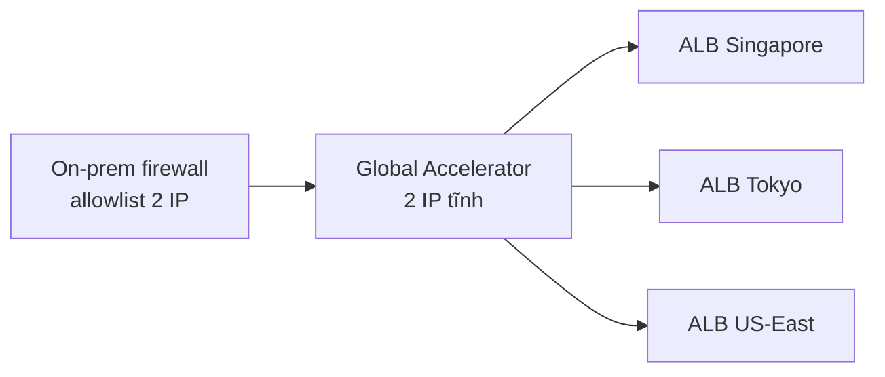

# Teaching Patterns — Viết giải thích AWS dễ hiểu

> **Load khi:** viết section "Giải thích câu hỏi", "Vì sao đúng", "Vì sao các đáp án khác sai".
>
> **Mục tiêu:** giải thích đúng kỹ thuật + dễ nuốt, dễ nhớ, dễ ôn lại.
>
> **⚠️ Phong cách:** Pattern 1-11 là **khung tư duy nội bộ** — KHÔNG dùng `Pass 1 — Trực giác`, `Pass 2 — Kỹ thuật`, `Decision walkthrough:` làm heading hiển thị. Viết liền mạch, dùng câu nối tự nhiên (*"Cụ thể trong AWS..."*, *"Tài liệu AWS mô tả..."*) thay vì heading meta-process.
>
> **📎 Special cases:** [`special-cases.md`](special-cases.md) — chỉ load khi Bước 1 phát hiện multi-select hoặc negation.

## Mục lục

- [Component toolkit — chọn cái fit nội dung](#component-toolkit--chọn-cái-fit-nội-dung)
- [Pattern 1 — Analogy đời thường](#pattern-1--analogy-đời-thường)
- [Pattern 2 — Diagram (Mermaid hoặc ASCII)](#pattern-2--diagram-mermaid-hoặc-ascii)
- [Pattern 3 — Comparison table](#pattern-3--comparison-table)
- [Pattern 4 — Numbered step table](#pattern-4--numbered-step-table)
- [Pattern 5 — Anticipated follow-up](#pattern-5--anticipated-follow-up)
- [Pattern 6 — TL;DR cuối section](#pattern-6--tldr-cuối-section)
- [Pattern 7 — Bằng chứng quan sát được](#pattern-7--bằng-chứng-quan-sát-được)
- [Pattern 8 — Gọi tên design pattern](#pattern-8--gọi-tên-design-pattern)
- [Pattern 9 — Decision walkthrough (loại trừ tuần tự)](#pattern-9--decision-walkthrough-loại-trừ-tuần-tự)
- [Pattern 10 — Cost component breakdown](#pattern-10--cost-component-breakdown)
- [Pattern 11 — "Đừng nhầm với..." callout](#pattern-11--đừng-nhầm-với-callout)
- [Cấu trúc các subsection](#cấu-trúc-các-subsection)

---

## Component toolkit — chọn cái fit nội dung

**Triết lý:** *structure cố định, content linh hoạt*. Bên trong mỗi subsection, pick component theo bản chất nội dung — KHÔNG tick checklist cứng. Câu về IAM policy → JSON code block đáng giá hơn analogy. Câu về topology → diagram đáng giá hơn bullet list.

| Component | Khi dùng | Khi tránh |
|---|---|---|
| **Analogy đời thường** | Concept trừu tượng (eventual consistency, indirection, control plane); cô đọng misconception | Câu thuần limit/quota/syntax; analogy >2 câu |
| **Mermaid diagram** | Topology/flow/sequence phức tạp ≥5 node; render trong webapp Fumadocs | Diagram đơn giản 2-3 box (ASCII gọn hơn) |
| **ASCII diagram** | Topology/flow gọn ≤15 dòng; an toàn render mọi nơi | Cấu trúc >15 dòng — dùng Mermaid |
| **Comparison table** | ≥2 entity dễ nhầm (ALB vs NLB, EBS vs EFS) | 1 entity duy nhất; >7 dòng |
| **Step table / numbered list** | Quy trình tuần tự, request flow | Không có thứ tự — dùng bullet |
| **Code block** (`bash`/`json`/`yaml`) | CLI, IAM policy, CFN/TF snippet, SDK call | Không có config thực — đừng "fake" code |
| **Inline code** (`backtick`) | Tên API, parameter, ARN format | Câu văn xuôi |
| **Bullet list** | Liệt kê đặc điểm/constraint không có thứ tự | ≥3 chiều so sánh — dùng table |
| **Numbered list** | Decision walkthrough, deployment steps | Liệt kê không có thứ tự logic |
| **Blockquote** | Quote AWS docs (kèm dịch), highlight TL;DR/hệ quả/"Đừng nhầm với..." | Không có text cần emphasize |
| **Callout emoji** | `⚠️` warning/near-twin; `💡` insight; `📌` ghi chú; `🔑` key concept | Lạm dụng emoji |
| **Bold key terms** | Thuật ngữ AWS lần đầu, từ khóa then chốt | Bold mọi thứ → mất ý nghĩa |

**Chiến thuật pick:**

1. Đọc câu hỏi & đáp án → xác định **bản chất nội dung** (topology? config? cost? indirection? near-twin?)
2. Map sang component fit nhất từ bảng trên
3. Áp **trigger BẮT BUỘC** nếu match (≥3 options → Pattern 9; cost-driven → Pattern 10; near-twin → Pattern 11)
4. Còn lại tự do — miễn sao "đầy đủ và dễ hiểu nhất"

**Mẫu code block phổ biến:**

```json
{
  "Version": "2012-10-17",
  "Statement": [{ "Effect": "Allow", "Action": "s3:GetObject", "Resource": "arn:aws:s3:::my-bucket/*" }]
}
```

```bash
aws s3api put-bucket-policy --bucket my-bucket --policy file://policy.json
```

---

## Pattern 1 — Analogy đời thường

1-2 câu, dùng tình huống đời thường (gửi thư, bảo vệ tòa nhà). KHÔNG analogy IT (vô nghĩa với người mới). Phải làm nổi đúng khía cạnh đang giải thích.

| Concept | Analogy |
|---|---|
| Global Accelerator front ALB | *"Cổng vào toàn cầu có địa chỉ cố định, đứng trước các cánh cửa hay đổi"* |
| Lambda script tự update firewall | *"Mỗi 5 phút cử người chạy ra hỏi IP rồi gọi điện cho IT update firewall"* |
| Cross-region NLB → ALB | *"Đặt bảo vệ ở Hà Nội bảo chuyển khách qua cửa sau Sài Gòn"* — không làm được |
| S3 eventual consistency (legacy) | *"Bưu điện đã nhận thư nhưng chưa kịp dán lên hộp, người tìm ngay sau đó có thể không thấy"* |
| IAM role chain | *"Đưa thẻ ra vào tạm thời cho người ngoài, có hạn dùng và phạm vi giới hạn"* |
| SQS dead-letter queue | *"Hộp thư riêng cho thư bị trả lại, để xử lý sau, không làm tắc luồng chính"* |

**Tránh:** "Giống như một load balancer" (vẫn IT); analogy >2 câu (loãng); analogy không khớp (gây hiểu sai).

---

## Pattern 2 — Diagram (Mermaid hoặc ASCII)

**Mermaid vs ASCII:**

| Tình huống | Chọn |
|---|---|
| Webapp Fumadocs (`/docs/...`) | Mermaid |
| D1 notes / nơi không chắc render | ASCII (an toàn) |
| Diagram đơn giản 2-3 box | ASCII |
| ≥5 node, branching, sequence | Mermaid |

**Mermaid types khả dụng:** `flowchart`, `sequenceDiagram`, `stateDiagram-v2`, `erDiagram`. Đặt trong code block ngôn ngữ `mermaid`.

**Ví dụ flowchart (front door / fan-out):**



**Ví dụ ASCII:**

```
                     ┌─────────────────────────┐
On-prem firewall ───►│  Global Accelerator     │
   (allowlist 2 IP)  │  2 IP tĩnh: A.B / W.X   │
                     └───────────┬─────────────┘
                  ┌──────────────┼──────────────┐
                  ▼              ▼              ▼
              ALB SG          ALB Tokyo      ALB US
```

**Quy tắc ASCII:** ≤15 dòng, dùng box-drawing (`┌─┐│└▼◄►`), có chú thích.

---

## Pattern 3 — Comparison table

≥2 entity dễ nhầm cần phân biệt thuộc tính. Tối đa 4 cột × 5-7 dòng. Cột đầu là trục so sánh, các cột sau là giá trị. Bold các khác biệt then chốt.

| Loại IP | Có đổi không? | Ai dùng? |
|---|---|---|
| **2 IP tĩnh của Global Accelerator** | ❌ KHÔNG đổi | Firewall on-prem allowlist — **client thấy** |
| **IP nội bộ của ALB** | ✅ Đổi liên tục | AWS tự manage — **bạn không cần biết** |

---

## Pattern 4 — Numbered step table

Quy trình triển khai/sự kiện theo thứ tự. Bảng 2-3 cột (Bước / Việc làm / Ai làm). 4-7 dòng, nhiều hơn → tách 2 bảng.

| Bước | Việc làm |
|---|---|
| 1 | Tạo Global Accelerator → nhận 2 IP tĩnh |
| 2 | Add các ALB ở mỗi Region làm endpoint |
| 3 | Khai 2 IP này vào allowlist firewall on-prem |
| 4 | Sau này ALB scale, đổi IP, thêm Region → **firewall không cần đụng vào nữa** |

---

## Pattern 5 — Anticipated follow-up

**Khi dùng:** đáp án đúng có vẻ "magic"; cơ chế nào còn ẩn cần giải thích; constraint deal-breaker tiềm ẩn.

**Format:**

```markdown
### Câu hỏi quan trọng: <follow-up>

**<Trả lời ngắn 1 dòng>**

<Giải thích 2-4 đoạn, kèm quote AWS hoặc bằng chứng quan sát được.>
```

**Ví dụ:**

> **Câu hỏi quan trọng: nếu ALB đổi IP thì Global Accelerator có sai config không?**
>
> **KHÔNG. Vẫn hoạt động bình thường.**
>
> Lý do: khi cấu hình endpoint, Global Accelerator **không lưu IP của ALB** — nó lưu **ARN** của ALB...

**Cách nghĩ ra follow-up tốt:** cơ chế còn "magic"? constraint deal-breaker? scale tới ranh giới nào?

---

## Pattern 6 — TL;DR cuối section

**Mandatory** cuối "Vì sao đúng". 1-2 câu chốt insight, key term in đậm. KHÔNG copy từ option text — phải distill insight.

> **TL;DR:** Global Accelerator register ALB bằng **ARN**, không bằng **IP**. ALB đổi IP bao nhiêu lần cũng được, AWS tự sync nội bộ. Client chỉ thấy 2 IP tĩnh — không bao giờ đổi.

---

## Pattern 7 — Bằng chứng quan sát được

Observation cụ thể từ Console/CLI/API confirm cơ chế abstract. 1 đoạn văn xuôi ngắn, mở bằng *"Kiểm chứng nhanh:"* — KHÔNG dùng heading. Đặt sau quote AWS, trước TL;DR.

> **Kiểm chứng nhanh:** Trong AWS Console khi tạo endpoint cho Global Accelerator, chỉ có Endpoint type `Application Load Balancer` + dropdown chọn ALB → AWS lưu ARN. **Không có ô nào để bạn nhập IP cả.** Bằng chứng trực tiếp rằng IP của ALB không liên quan gì đến config Global Accelerator.

→ Biến lý thuyết thành "nhìn thấy được", giúp tin và nhớ lâu.

---

## Pattern 8 — Gọi tên design pattern

Lồng vào "Vì sao đúng" hoặc TL;DR khi câu minh họa pattern AWS thường gặp. Format:

```markdown
- **Pattern thiết kế:** <tên pattern> — <giải thích 1 câu> (gặp lại ở: <list service>)
```

**Catalog pattern phổ biến:**

| Tên pattern | Service ví dụ | Khi nhận diện |
|---|---|---|
| Stable indirection layer | Global Accelerator, Route 53, CloudFront | "Static endpoint che cho động" |
| Decoupling via queue | SQS, EventBridge, SNS | "Async, retry, DLQ" |
| Eventual consistency boundary | S3, DynamoDB GSI, Route 53 | "Có lag giữa write và read" |
| Pull vs push | SQS (pull) vs SNS (push) | "Ai khởi tạo gửi/nhận?" |
| Active-active vs active-passive | Route 53 routing, Aurora Global DB | "Multi-region failover" |
| Per-request vs reserved capacity | DynamoDB On-Demand vs Provisioned, Lambda | "Pay-per-use vs commit" |
| Symmetric vs asymmetric crypto | KMS keys, ACM, IAM signing | "Sign/verify vs encrypt/decrypt" |
| Control plane vs data plane | IAM, EC2 API vs traffic | "Quản lý cấu hình vs phục vụ traffic" |
| Predicate pushdown | S3 Select, Athena partition projection | "Lọc gần nguồn dữ liệu" |
| Defense in depth | SG + NACL + WAF + Shield | "Nhiều lớp bảo vệ chồng nhau" |
| Least-privilege boundary | IAM permissions boundary, SCP | "Trần quyền tối đa" |

→ Gọi tên giúp người đọc "lưu" câu trả lời vào framework rộng, dễ áp dụng cho câu mới.

---

## Pattern 9 — Decision walkthrough (loại trừ tuần tự)

**Trigger BẮT BUỘC:** câu có ≥3 options ở category khác nhau (NLB vs ALB vs PrivateLink vs EIP), hoặc thứ tự loại trừ quan trọng.

**Vì sao cần:** bullet "vì sao đúng/sai" cho từng option riêng lẻ KHÔNG thể hiện được **flow loại trừ** — cần thấy *thứ tự* mỗi constraint loại class nào.

**Format** (KHÔNG đặt heading "Decision walkthrough:" — dẫn vào câu nối tự nhiên):

```markdown
Đi qua từng option theo thứ tự constraint của đề:

1. <Constraint 1> → loại class nào? (loại #N, #M)
2. <Constraint 2> → loại class nào? (loại #X)
3. <Constraint 3> → còn lại option nào?
4. → Còn lại: **#Y ✅**
```

**Ví dụ (Bastion HA):**

```markdown
1. Bastion phục vụ SSH → cần Layer 4 (TCP) → loại **ALB** (Layer 7).
2. Cần entry point public → loại **VPC Endpoint** (private only).
3. Cần HA + health check → loại **Elastic IP** (1 IP gắn 1 instance).
4. → Còn lại: **NLB ✅**
```

**Vị trí:** sau analogy/diagram, trước quote AWS — làm cây cầu giữa trực giác và technical detail.

**Tránh:** decision walkthrough "fake" liệt kê constraint nhưng không loại trừ thật; bước nhảy quá lớn; quá 5 bước.

---

## Pattern 10 — Cost component breakdown

**Trigger BẮT BUỘC:** đáp án xoay quanh `cost-optimal`, `lowest cost`, `cheapest`, `chi phí thấp nhất`.

**Vì sao cần:** "rẻ hơn" trừu tượng. Người đọc cần biết **rẻ ở chỗ nào** (storage? request? data transfer? KMS API?) để nhớ pattern.

**Format bảng (3 cột tối thiểu, có dòng total):**

```markdown
| Thành phần phí | Option đúng (#X) | Option sai (#Y) |
|---|---|---|
| Storage | <giá> | <giá> |
| Request (PUT/GET) | <giá> | <giá> |
| Data transfer | <giá> | <giá> |
| Hidden cost | <vd KMS API> | <vd NAT GB> |
| **Total/tháng (1 TB)** | **~$X** | **~$Y** |
```

**Quy tắc:**
- Số liệu **trích từ AWS Pricing chính thức** (MCP verify). Không tra được → dùng định tính `$$ vs $$$$`, KHÔNG bịa số.
- Highlight dòng **Hidden cost** — chỗ AWS exam hay đánh lừa (NAT data, cross-AZ transfer, KMS request).
- Dòng cuối là **ước tính tổng/tháng** cho 1 use case cụ thể (1 TB, 1M requests) — biến trừu tượng thành con số.

**Ví dụ:**

```markdown
**Cost breakdown** (1 TB image archive, infrequent access):

| Thành phần | S3 Intelligent-Tiering (#3) | S3 Standard (#1) |
|---|---|---|
| Storage tier | tự move sang IA sau 30d | luôn Standard |
| Storage charge | ~$0.0125/GB-mo (IA) | $0.023/GB-mo |
| Monitoring fee | $0.0025/1k objects | 0 |
| **Total/tháng (1 TB)** | **~$13** | **~$24** |
```

→ Intelligent-Tiering rẻ ~45% nhờ tiered storage; monitoring fee chỉ là phần nhỏ.

---

## Pattern 11 — "Đừng nhầm với..." callout

**Trigger BẮT BUỘC:** đáp án đúng có **near-twin service** thường bị chọn nhầm.

**Catalog near-twin services:**

| Nhóm | Confusion |
|---|---|
| ALB / NLB / GWLB / CLB | Layer & target khác nhau |
| EBS / EFS / FSx / Instance Store | Block / file / ephemeral |
| Direct Connect / Site-to-Site VPN / TGW / VPC Peering | Connectivity options |
| Gateway endpoint / Interface endpoint / PrivateLink | VPC endpoints |
| KDS / Firehose / MSK / SQS | Streaming/queue |
| Dedicated Instance / Dedicated Host / Bare Metal | Tenancy |
| Spot Instance / Spot Fleet / Spot Block / EC2 Fleet | Spot pricing |
| Aurora / RDS / DynamoDB / DocumentDB / Neptune | DB engines |
| S3 Standard / IA / One Zone-IA / Glacier Instant/Flexible/Deep | Storage classes |
| Lambda / Fargate / ECS / EKS / EC2 | Compute |
| Route 53 routing (Simple/Weighted/Latency/Failover/Geo/Multi-value) | Routing policies |
| Savings Plans (Compute / EC2 Instance / SageMaker) | SP coverage |
| IAM Role / Resource Policy / Permissions Boundary / SCP | Permission scope |
| Reserved Instances / Savings Plans / On-Demand / Spot | Pricing models |

**Format & ví dụ:**

```markdown
> **⚠️ Đừng nhầm với:**
>
> - **Dedicated Host** — quản lý từng physical server, dùng cho BYOL license cần host-affinity. Câu này KHÔNG yêu cầu host-affinity → loại.
> - **Bare Metal instance** — workload cần direct access tới hardware (vd hypervisor stack), không phải single-tenant compliance.
```

**Vị trí:** cuối "Vì sao đúng", trước TL;DR. Hoặc thay TL;DR nếu service confusion là insight chính.

**Tránh:** liệt kê 5+ service (loãng); lặp nội dung "Vì sao sai"; service không trong cùng AWS category.

---

## Cấu trúc các subsection

### "Giải thích câu hỏi" — storytelling order

Thay vì liệt kê constraint, kể chuyện theo 3 nhịp:

1. **Vấn đề mấu chốt** (1-2 câu): bài toán cốt lõi là gì, *tại sao* khó. KHÔNG diễn đạt lại đề.
2. **Tại sao yêu cầu khó**: phân tích các từ khóa (`scalable`, `minimal config`, `cost-optimal`, `multi-Region`...) — mỗi từ khóa loại class giải pháp nào.
3. **Hệ quả** (1 câu chốt highlight): "→ Cần một giải pháp mà ___ KHÔNG ___."

**Component có thể dùng:** bullet list (keyword + ý nghĩa), table (keyword → loại class), Mermaid/ASCII (nếu vấn đề về topology), code block (nếu đề có policy/CLI), blockquote (highlight câu hệ quả), bold key terms.

**Ví dụ ngắn:**

> **Vấn đề mấu chốt:** ALB **KHÔNG có IP cố định**. AWS chỉ cấp DNS name; IP đằng sau liên tục đổi khi scale.
>
> Đề nhấn: *scalable* (nhiều Region, traffic biến động) + *minimal config* (không muốn cứ vài ngày update firewall).
>
> → **Cần giải pháp mà IP entry point KHÔNG BAO GIỜ ĐỔI**, dù ALB phía sau scale kiểu gì.

**Tránh:** liệt kê constraint kiểu báo cáo; kết thúc mà không có câu hệ quả.

### "Vì sao đúng"

Viết liền mạch theo flow: trực giác → kỹ thuật → quote AWS → (follow-up nếu có) → TL;DR. Câu nối tự nhiên (*"Cụ thể trong AWS..."*).

**Cố định (mandatory):**
- Mở đầu trực giác (component pick từ Component toolkit theo nội dung) + 1 câu tóm tắt cơ chế
- Phần kỹ thuật bám AWS docs — quote + dịch khi cần chứng minh
- TL;DR cuối section (Pattern 6) — 1-2 câu chốt, key term in đậm

**Trigger pattern bắt buộc:** ≥3 options khác category → Pattern 9 | cost-driven → Pattern 10 | near-twin → Pattern 11.

**Khuyến nghị (optional, tăng giá trị sư phạm):**
- Pattern 5 (anticipated follow-up) khi đáp án còn vẻ "magic"
- Pattern 7 (bằng chứng quan sát được) khi có observation từ Console/CLI
- Pattern 8 (gọi tên design pattern) khi câu minh họa pattern AWS phổ biến

→ Mapping `nội dung → component` xem [Component toolkit](#component-toolkit--chọn-cái-fit-nội-dung).

### "Vì sao sai"

Mỗi option sai dùng heading `#### ❌ #N — <option>` (emoji ❌ trong heading).

**Cố định (mandatory):**
- Mở đầu cô đọng misconception — option đánh trúng nhầm lẫn nào của người làm bài
- Lý do kỹ thuật 3-5 câu chứng minh sai

**Cách cô đọng misconception** (chọn fit):
- *Analogy 1 câu* — vd: *"Giống như cử người chạy ra hỏi IP rồi gọi điện cho IT update firewall."*
- *Diagram nhỏ / minimal table* nếu misconception về topology/so sánh
- *Inline code/snippet* nếu sai về tham số/policy/syntax
- *1 câu pin-point* nếu misconception đã rõ từ tên option

**Component lý do kỹ thuật** (chọn fit): quote+dịch AWS docs; code block show config invalid; bullet list các vi phạm; constraint cứng (vd: *"VPC giới hạn trong 1 Region nên không cross-Region được"*).

**Tránh:** rút gọn quá mức (1-2 câu chung chung) → không có giá trị sư phạm.

**Ví dụ tốt:**

```markdown
#### ❌ #3 — Đặt 1 NLB ở 1 Region, register private IP của các ALB ở Region khác

Giống như: *"Đặt một bảo vệ ở cổng Hà Nội rồi bảo bảo vệ chuyển khách trực tiếp vào nhà ở Sài Gòn qua cửa sau."* — không làm được.

AWS có tính năng **ALB as target of NLB** nhưng có ràng buộc cứng:

> "To associate an Application Load Balancer as a target of a Network Load Balancer, the load balancers must be in the same VPC within the same account."
>
> *→ Để gắn ALB làm target của NLB, hai LB phải ở cùng VPC trong cùng account.*

- VPC giới hạn trong 1 Region → không thể có NLB Region A target ALB Region B.
- Register private IP của ALB cũng sai thiết kế: IP đổi khi ALB scale → đứt kết nối.

→ Không khả thi kỹ thuật **và** sai kiến trúc.
```
