# AWS Disaster Recovery & Migration - Tổng Quan & Diagrams

## 📋 Mục lục

- [Overview Diagram](#overview-diagram)
- [RPO & RTO](#rpo--rto)
- [4 DR Patterns](#4-dr-patterns)
- [6Rs Migration Strategies](#6rs-migration-strategies)
- [Data Transfer & Migration Services](#data-transfer--migration-services)
- [DMS - Database Migration Service](#dms---database-migration-service)
- [AWS Backup](#aws-backup)
- [Tổng hợp: Khi nào dùng service nào?](#tổng-hợp-khi-nào-dùng-service-nào)
- [Best Practices](#best-practices)
- [Exam Tips](#exam-tips)

---

## Overview Diagram

### Toàn cảnh Disaster Recovery & Migration trong AWS

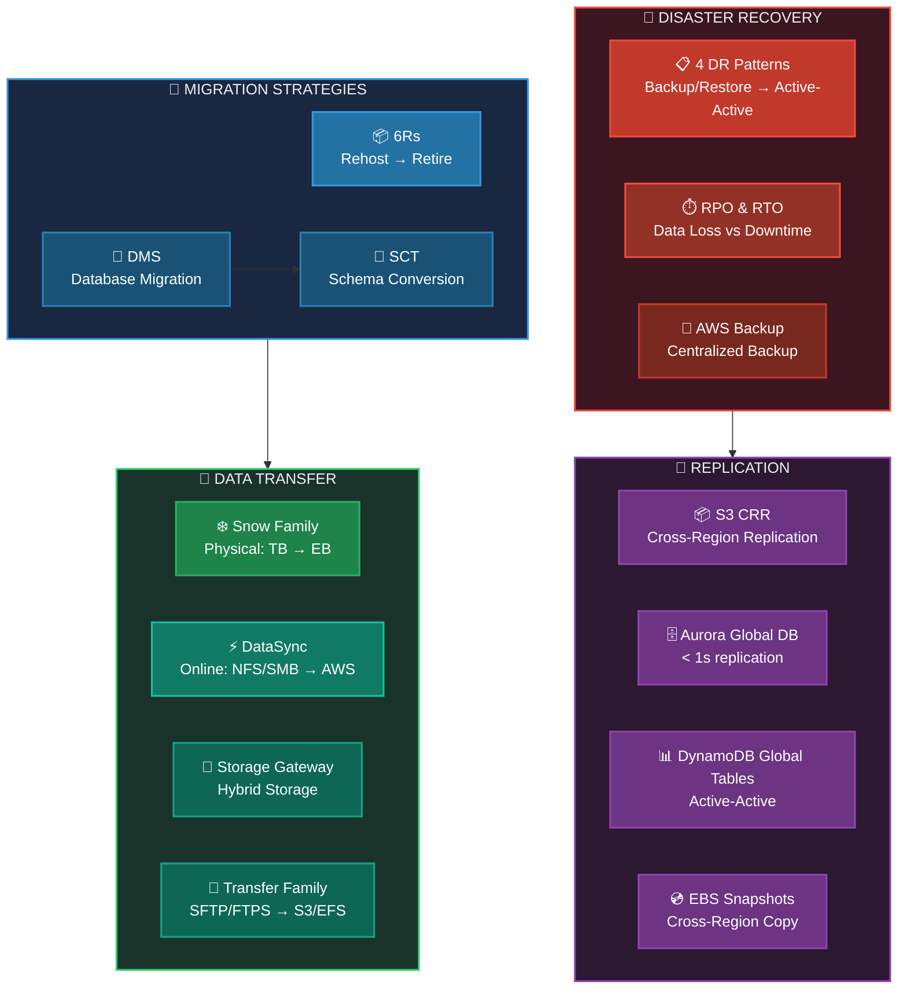

### Bảng so sánh nhanh

| Service | Câu hỏi trả lời | Ví dụ |
|---------|-----------------|-------|
| **DR Patterns** | Khôi phục khi sự cố? | Backup/Restore → Active-Active |
| **6Rs** | Chiến lược migration? | Rehost, Replatform, Refactor... |
| **DMS** | Migrate database? | Oracle → Aurora, MySQL → RDS |
| **SCT** | Convert DB schema? | Oracle schema → PostgreSQL |
| **Snow Family** | Data lớn, không có mạng? | 10 TB → Exabyte, ship vật lý |
| **DataSync** | Sync files qua mạng? | On-prem NFS → S3/EFS |
| **Storage Gateway** | Hybrid storage? | On-prem app dùng S3 như NFS |
| **Transfer Family** | SFTP/FTPS → AWS? | Partner upload files qua SFTP |
| **AWS Backup** | Backup tập trung? | Backup RDS, EBS, EFS, DynamoDB |

---

## RPO & RTO

### Hai khái niệm quan trọng nhất của DR

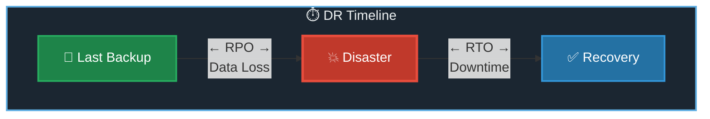

```
┌─────────────────────────────────────────────────────────────────────────────┐
│                           RPO vs RTO                                        │
├─────────────────────────────────────────────────────────────────────────────┤
│                                                                             │
│  ⏱️ RPO (Recovery Point Objective)   ⏱️ RTO (Recovery Time Objective)       │
│  ══════════════════════════════════   ══════════════════════════════════    │
│                                                                             │
│  "Mất bao nhiêu DATA?"               "DOWN bao lâu?"                        │
│                                                                             │
│  • Data từ last backup → disaster    • Thời gian từ disaster → recovery     │
│  • RPO = 1h → mất tối đa 1h data     • RTO = 4h → down tối đa 4h            │
│  • RPO nhỏ = backup thường xuyên     • RTO nhỏ = recover nhanh              │
│  • RPO nhỏ = TỐN TIỀN hơn            • RTO nhỏ = TỐN TIỀN hơn               │
│                                                                             │
│  ┌─────────────────────────────────────────────────────────────┐            │
│  │ Last Backup ◄── RPO ──► DISASTER ◄── RTO ──► Recovery       │            │
│  │             (data loss)           (downtime)                │            │
│  └─────────────────────────────────────────────────────────────┘            │
│                                                                             │
│  Ví dụ:                                                                     │
│  • E-commerce: RPO = 1 min, RTO = 5 min ($$$$)                              │
│  • Dev/Test:   RPO = 24h,  RTO = 24h   ($)                                  │
│  • Banking:    RPO ≈ 0,    RTO ≈ 0     ($$$$$)                              │
│                                                                             │
└─────────────────────────────────────────────────────────────────────────────┘
```

> [!IMPORTANT]
> **Tại sao RPO chỉ tính từ Last Backup → Disaster (không phải → Recovery)?**
> - Sau khi disaster xảy ra, hệ thống **DOWN** → không ai ghi thêm data mới → **không mất thêm data**
> - RPO = data **đã tạo nhưng chưa kịp backup** trước khi sự cố
> - RTO = thời gian hệ thống **down nhưng không mất thêm data** (vì không ai dùng được)
>
> **Ví dụ cụ thể:**
> - 8:00 AM — Backup xong ✅
> - 8:00 → 10:00 — Users tạo data mới (2 giờ data)
> - 10:00 AM — 💥 Disaster! Hệ thống down
> - 10:00 → 14:00 — Đang recover (4 giờ down, nhưng **không ai ghi data**)
> - 14:00 PM — ✅ Recovery xong, restore từ backup 8:00
> - → **RPO = 2h** (mất data 8:00–10:00), **RTO = 4h** (down 10:00–14:00)

---

## 4 DR Patterns

### Cost vs Recovery Time

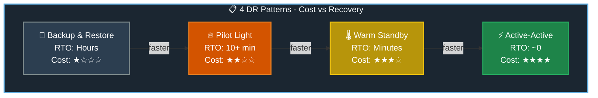

### Chi tiết từng Pattern

```mermaid
graph TB
    subgraph P1["💾 1. Backup & Restore"]
        P1_PRI["🏢 Primary Region<br/>App + DB running"]
        P1_DR["📦 DR Region<br/>CHỈ có snapshots/AMIs<br/>KHÔNG có gì running"]
        P1_PRI -->|"S3 CRR<br/>EBS Snapshots"| P1_DR
    end

    subgraph P2["🔥 2. Pilot Light"]
        P2_PRI["🏢 Primary Region<br/>App + DB running"]
        P2_DR["🗄️ DR Region<br/>DB running + replicate<br/>App servers OFF"]
        P2_PRI -->|"DB replication<br/>async"| P2_DR
    end

    subgraph P3["🌡️ 3. Warm Standby"]
        P3_PRI["🏢 Primary Region<br/>App 100% + DB"]
        P3_DR["📊 DR Region<br/>App 25% + DB replica<br/>Scaled-down running"]
        P3_PRI -->|"DB replication<br/>App scaled-down"| P3_DR
    end

    subgraph P4["⚡ 4. Active-Active"]
        P4_A["🏢 Region A<br/>App 100% + DB<br/>Serving traffic"]
        P4_B["🏢 Region B<br/>App 100% + DB<br/>Serving traffic"]
        P4_A <-->|"Bi-directional<br/>replication"| P4_B
    end

    style P1 fill:#1b2631,color:#ecf0f1,stroke:#7f8c8d,stroke-width:2px
    style P2 fill:#2c1810,color:#ecf0f1,stroke:#e67e22,stroke-width:2px
    style P3 fill:#2c2810,color:#ecf0f1,stroke:#f1c40f,stroke-width:2px
    style P4 fill:#1a332a,color:#ecf0f1,stroke:#2ecc71,stroke-width:2px

    style P1_PRI fill:#2471a3,color:#fff,stroke:#3498db,stroke-width:2px
    style P1_DR fill:#2c3e50,color:#fff,stroke:#7f8c8d,stroke-width:2px
    style P2_PRI fill:#2471a3,color:#fff,stroke:#3498db,stroke-width:2px
    style P2_DR fill:#d35400,color:#fff,stroke:#e67e22,stroke-width:2px
    style P3_PRI fill:#2471a3,color:#fff,stroke:#3498db,stroke-width:2px
    style P3_DR fill:#b7950b,color:#fff,stroke:#f1c40f,stroke-width:2px
    style P4_A fill:#1e8449,color:#fff,stroke:#27ae60,stroke-width:2px
    style P4_B fill:#1e8449,color:#fff,stroke:#27ae60,stroke-width:2px
```

### So sánh chi tiết

| Pattern | RPO | RTO | Cost | DR Region chạy gì? | Khi disaster thì làm gì? |
|---------|-----|-----|------|--------------------|-----------------------------|
| **Backup & Restore** | Hours | 24+ hours | $ | Không có gì chạy, chỉ snapshots | Restore snapshots → Launch infra |
| **Pilot Light** | Minutes | 10-30 min | $$ | DB chạy, App OFF | Start app servers, promote DB |
| **Warm Standby** | Seconds | Minutes | $$$ | DB + App scaled-down (25%) | Scale up app, Route53 failover |
| **Active-Active** | ~0 | ~0 | $$$$ | 100% full, serving traffic | Không cần làm gì (auto) |

#### 💾 Pattern 1: Backup & Restore — Chi tiết

```
┌─────────────────────────────────────────────────────────────────────────────┐
│  💾 BACKUP & RESTORE          RPO: Hours | RTO: 24+ hours | Cost: $         │
├─────────────────────────────────────────────────────────────────────────────┤
│                                                                             │
│  PRIMARY REGION                         DR REGION                           │
│  ┌─────────────────────┐                ┌─────────────────────┐             │
│  │ ✅ App Servers      │                │ ❌ KHÔNG CÓ GÌ CHẠY │             │
│  │ ✅ Database         │  ──backup──►   │                     │             │
│  │ ✅ Storage          │                │ 📦 Chỉ lưu:         │             │
│  └─────────────────────┘                │ • AMIs              │             │
│                                         │ • DB Snapshots      │             │
│  AWS Services dùng:                     │ • S3 backups        │             │
│  • S3 Cross-Region Replication          └─────────────────────┘             │
│  • EBS Snapshot cross-region copy                                           │
│  • RDS automated backups                                                    │
│  • AWS Backup (centralized)                                                 │
│                                                                             │
│  🔧 Khi Disaster xảy ra:                                                    │
│  1. Restore DB từ snapshot              (⏱️ 30-60 min)                      │
│  2. Launch EC2 từ AMI                   (⏱️ 10-30 min)                      │
│  3. Deploy application code             (⏱️ 15-30 min)                      │
│  4. Update Route 53 DNS                 (⏱️ 5-15 min)                       │
│  5. Test & validate                     (⏱️ 30+ min)                        │
│  → Tổng: vài giờ đến 1 ngày                                                 │
│                                                                             │
│  ✅ Ưu điểm: Chi phí thấp nhất, đơn giản                                    │
│  ❌ Nhược điểm: Recovery time rất dài                                       │
│  🎯 Use case: Dev/Test, non-critical workloads, archival systems            │
│                                                                             │
└─────────────────────────────────────────────────────────────────────────────┘
```

#### 🔥 Pattern 2: Pilot Light — Chi tiết

```
┌─────────────────────────────────────────────────────────────────────────────┐
│  🔥 PILOT LIGHT                RPO: Minutes | RTO: 10-30 min | Cost: $$     │
├─────────────────────────────────────────────────────────────────────────────┤
│                                                                             │
│  PRIMARY REGION                         DR REGION                           │
│  ┌─────────────────────┐               ┌─────────────────────┐              │
│  │ ✅ App Servers      │               │ ❌ App servers OFF  │              │
│  │ ✅ Database (Write) │ ──replicate─► │ ✅ DB replica (Read)│              │
│  │ ✅ Storage          │               │ 📦 AMIs sẵn sàng    │              │
│  └─────────────────────┘               └─────────────────────┘              │
│                                                                             │
│  📌 "Pilot Light" = ngọn lửa nhỏ trong lò gas                               │
│  → Core (DB) luôn chạy, sẵn sàng "bật cháy" lên                             │
│  → App servers CHỈ start khi có disaster                                    │
│                                                                             │
│  AWS Services dùng:                                                         │
│  • RDS Read Replica cross-region (async)                                    │
│  • Aurora Global Database (< 1s lag)                                        │
│  • AMIs pre-built trong DR region                                           │
│  • Route 53 health checks + failover                                        │
│                                                                             │
│  🔧 Khi Disaster xảy ra:                                                    │
│  1. Promote DB replica → primary        (⏱️ 1-5 min)                        │
│  2. Launch app servers từ AMI           (⏱️ 5-15 min)                       │
│  3. Scale to production size            (⏱️ 5-10 min)                       │
│  4. Route 53 tự failover (health check) (⏱️ auto)                           │
│  → Tổng: 10-30 phút                                                         │
│                                                                             │
│  ✅ Ưu điểm: DB luôn sync, fast DB failover                                 │
│  ❌ Nhược điểm: App servers cần thời gian start & scale                     │
│  🎯 Use case: Core business apps, e-commerce backend                        │
│                                                                             │
└─────────────────────────────────────────────────────────────────────────────┘
```

#### 🌡️ Pattern 3: Warm Standby — Chi tiết

```
┌─────────────────────────────────────────────────────────────────────────────┐
│  🌡️ WARM STANDBY             RPO: Seconds | RTO: Minutes | Cost: $$$        │
├─────────────────────────────────────────────────────────────────────────────┤
│                                                                             │
│  PRIMARY REGION                         DR REGION                           │
│  ┌─────────────────────┐               ┌─────────────────────┐              │
│  │ ✅ App Servers 100% │               │ ✅ App Servers 25%  │              │
│  │ ✅ Database (Write) │ ──replicate─► │ ✅ DB replica (Read)│              │
│  │ ✅ ALB + ASG        │               │ ✅ ALB + ASG (min)  │              │
│  └─────────────────────┘               └─────────────────────┘              │
│                                                                             │
│  📌 Toàn bộ infrastructure CHẠY nhưng SCALED-DOWN                           │
│  → Có thể handle một ít traffic ngay lập tức                                │
│  → Chỉ cần SCALE UP, không cần START từ đầu                                 │
│                                                                             │
│  AWS Services dùng:                                                         │
│  • RDS Multi-AZ + Read Replica cross-region                                 │
│  • Aurora Global Database                                                   │
│  • ASG với min capacity thấp (1-2 instances)                                │
│  • ALB đã configured sẵn                                                    │
│  • Route 53 weighted/failover routing                                       │
│                                                                             │
│  🔧 Khi Disaster xảy ra:                                                    │
│  1. Promote DB replica → primary        (⏱️ 1-5 min)                        │
│  2. ASG scale up (25% → 100%)           (⏱️ 3-10 min)                       │
│  3. Route 53 tự failover (health check) (⏱️ auto, < 1 min)                  │
│  → Tổng: vài phút                                                           │
│                                                                             │
│  ✅ Ưu điểm: Recovery nhanh, app đã running sẵn                             │
│  ❌ Nhược điểm: Tốn tiền hơn (25% infra luôn chạy)                          │
│  🎯 Use case: Business-critical apps, SaaS platforms                        │
│                                                                             │
└─────────────────────────────────────────────────────────────────────────────┘
```

#### ⚡ Pattern 4: Active-Active (Multi-Site) — Chi tiết

```
┌─────────────────────────────────────────────────────────────────────────────┐
│  ⚡ ACTIVE-ACTIVE              RPO: ~0 | RTO: ~0 | Cost: $$$$                │
├─────────────────────────────────────────────────────────────────────────────┤
│                                                                             │
│  REGION A (Active)                      REGION B (Active)                   │
│  ┌─────────────────────┐               ┌─────────────────────┐              │
│  │ ✅ App Servers 100% │               │ ✅ App Servers 100% │              │
│  │ ✅ Database (R/W)   │ ◄─replicate─► │ ✅ Database (R/W)   │              │
│  │ ✅ ALB + ASG 100%   │               │ ✅ ALB + ASG 100%   │              │
│  └─────────────────────┘               └─────────────────────┘              │
│           ↑                                      ↑                          │
│           └──── Route 53 (Latency/Weighted) ─────┘                          │
│                        Users                                                │
│                                                                             │
│  📌 CẢ HAI regions đều SERVE TRAFFIC đồng thời                              │
│  → Không có "primary" hay "secondary"                                       │
│  → Khi 1 region down → traffic tự chuyển sang region còn lại                │
│  → ZERO downtime                                                            │
│                                                                             │
│  AWS Services dùng:                                                         │
│  • DynamoDB Global Tables (active-active, < 1s sync)                        │
│  • Aurora Global Database (write forwarding)                                │
│  • Route 53 latency-based / weighted routing                                │
│  • Global Accelerator (optional, static IPs)                                │
│  • CloudFormation StackSets (deploy đồng bộ)                                │
│                                                                             │
│  🔧 Khi Disaster xảy ra:                                                    │
│  1. Route 53 health check phát hiện     (⏱️ auto, seconds)                  │
│  2. Traffic tự route sang region healthy (⏱️ auto, seconds)                 │
│  3. KHÔNG cần action thủ công           (⏱️ 0)                              │
│  → Tổng: gần như 0s                                                         │
│                                                                             │
│  ✅ Ưu điểm: Zero downtime, best user experience                            │
│  ❌ Nhược điểm: Chi phí gấp đôi, phức tạp data consistency                  │
│  ⚠️ Challenge: Conflict resolution (last writer wins - DynamoDB)            │
│  🎯 Use case: Mission-critical (banking, healthcare, global SaaS)           │
│                                                                             │
└─────────────────────────────────────────────────────────────────────────────┘
```

> [!IMPORTANT]
> **Pilot Light vs Warm Standby — Cách phân biệt dễ nhớ:**
> - **Pilot Light** = chỉ **core** (DB) chạy, app servers **OFF** → cần thời gian start
> - **Warm Standby** = **toàn bộ** infra chạy nhưng **scaled-down** → chỉ cần scale up
> - Tên "Pilot Light" từ ngọn lửa nhỏ trong lò gas — luôn cháy để sẵn sàng bật lên
> - Tên "Warm Standby" = hâm nóng sẵn, mọi thứ "ấm" và chạy rồi

---

## 6Rs Migration Strategies

### Từ dễ đến khó

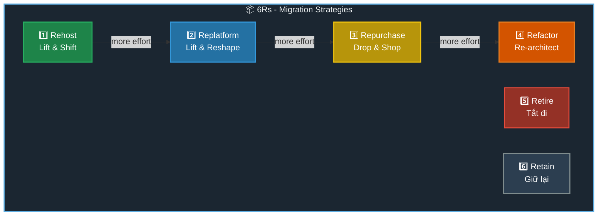

```
┌─────────────────────────────────────────────────────────────────────────────┐
│                        6Rs MIGRATION STRATEGIES                             │
├─────────────────────────────────────────────────────────────────────────────┤
│                                                                             │
│  1️⃣  REHOST ("Lift & Shift")                                                │
│     └── Chuyển nguyên xi lên cloud, KHÔNG thay đổi gì                      │
│     └── VD: MySQL on-prem → MySQL trên EC2                                 │
│     └── Dùng AWS Application Migration Service                             │
│                                                                             │
│  2️⃣  REPLATFORM ("Lift & Reshape")                                          │
│     └── Thay đổi NHỎ để dùng managed services                             │
│     └── VD: MySQL on-prem → RDS MySQL (AWS quản lý)                       │
│     └── ⭐ "Reduce operational burden" = REPLATFORM                        │
│                                                                             │
│  3️⃣  REPURCHASE ("Drop & Shop")                                             │
│     └── Mua SaaS thay thế                                                  │
│     └── VD: CRM tự build → Salesforce                                      │
│     └── VD: Email server → Amazon WorkMail                                 │
│                                                                             │
│  4️⃣  REFACTOR ("Re-architect")                                              │
│     └── Viết lại code để cloud-native                                      │
│     └── VD: Monolith → Microservices + Lambda + DynamoDB                   │
│     └── Effort cao nhất, benefit lớn nhất                                  │
│                                                                             │
│  5️⃣  RETIRE                                                                 │
│     └── Không cần nữa → tắt đi, decommission                             │
│     └── Tiết kiệm cost, giảm complexity                                   │
│                                                                             │
│  6️⃣  RETAIN (Revisit)                                                       │
│     └── Chưa migrate, giữ lại on-prem                                     │
│     └── VD: App sắp EOL, compliance yêu cầu on-prem                       │
│                                                                             │
└─────────────────────────────────────────────────────────────────────────────┘
```

> [!TIP]
> **Exam key:** Nếu đề nói "reduce operational burden" hoặc "move to managed service" → **Replatform** (KHÔNG phải Rehost!)

---

## Data Transfer & Migration Services

### Chọn service nào để chuyển data?

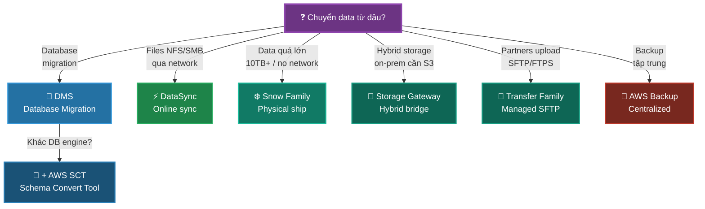

### So sánh Data Transfer Services

| Service | Loại data | Cách chuyển | Speed | Use case |
|---------|-----------|-------------|-------|----------|
| **DMS** | Database | Online, CDC | Network-dep | DB migration, continuous replication |
| **DataSync** | Files (NFS/SMB) | Online, agent | Up to 10Gbps | One-time or scheduled sync |
| **Snow Family** | Any data | Physical ship | Days (shipping) | Massive data 10TB+, no/slow network |
| **Storage Gateway** | Files/Blocks/Tapes | Hybrid bridge | Network-dep | Ongoing hybrid access |
| **Transfer Family** | Files (SFTP/FTPS) | Online, managed | Network-dep | B2B file exchange |
| **S3 Transfer Accel** | S3 objects | CloudFront Edge | Faster upload | Large uploads cross-region |

### Snow Family: Chọn device nào?

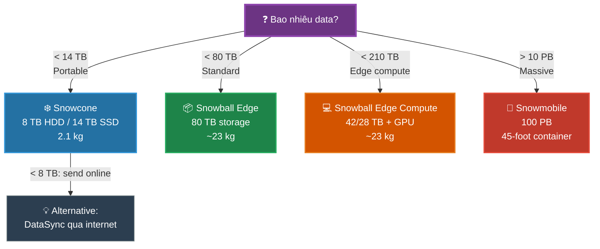

### Storage Gateway: 3 loại Gateway

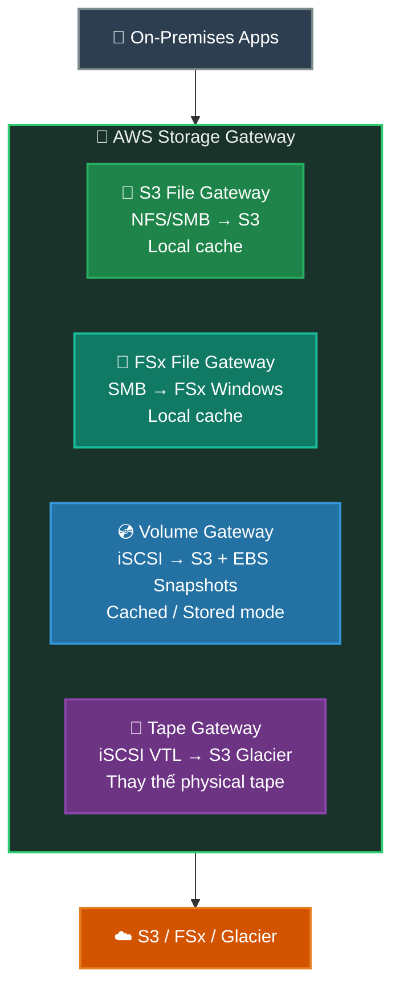

> [!NOTE]
> **Storage Gateway vs DataSync:**
> - **Storage Gateway** = hybrid bridge, on-prem apps liên tục dùng S3/FSx qua NFS/SMB (ongoing access)
> - **DataSync** = chuyển data một lần hoặc scheduled sync (migration/sync job)
> - Storage Gateway KHÔNG migrate data cũ — cần DataSync hoặc Snow Family cho initial migration

---

## DMS - Database Migration Service

### Architecture & Flow

```mermaid
graph LR
    subgraph SOURCE["📤 Source DB"]
        S_ORA["Oracle"]
        S_MYSQL["MySQL"]
        S_PG["PostgreSQL"]
        S_MSSQL["SQL Server"]
        S_MONGO["MongoDB"]
    end

    subgraph DMS_INST["🔄 DMS"]
        RI["Replication Instance<br/>EC2 chạy DMS"]
        RT["Replication Task"]
    end

    subgraph TARGET["📥 Target DB"]
        T_RDS["RDS"]
        T_AURORA["Aurora"]
        T_DDB["DynamoDB"]
        T_S3["S3"]
        T_REDSHIFT["Redshift"]
    end

    SOURCE --> DMS_INST --> TARGET

    style SOURCE fill:#2c1810,color:#ecf0f1,stroke:#e67e22,stroke-width:2px
    style DMS_INST fill:#1a2740,color:#ecf0f1,stroke:#3498db,stroke-width:2px
    style TARGET fill:#1a332a,color:#ecf0f1,stroke:#2ecc71,stroke-width:2px

    style S_ORA fill:#d35400,color:#fff,stroke:#e67e22,stroke-width:2px
    style S_MYSQL fill:#d35400,color:#fff,stroke:#e67e22,stroke-width:2px
    style S_PG fill:#d35400,color:#fff,stroke:#e67e22,stroke-width:2px
    style S_MSSQL fill:#d35400,color:#fff,stroke:#e67e22,stroke-width:2px
    style S_MONGO fill:#d35400,color:#fff,stroke:#e67e22,stroke-width:2px
    style RI fill:#2471a3,color:#fff,stroke:#3498db,stroke-width:2px
    style RT fill:#1a5276,color:#fff,stroke:#2980b9,stroke-width:2px
    style T_RDS fill:#1e8449,color:#fff,stroke:#27ae60,stroke-width:2px
    style T_AURORA fill:#1e8449,color:#fff,stroke:#27ae60,stroke-width:2px
    style T_DDB fill:#1e8449,color:#fff,stroke:#27ae60,stroke-width:2px
    style T_S3 fill:#1e8449,color:#fff,stroke:#27ae60,stroke-width:2px
    style T_REDSHIFT fill:#1e8449,color:#fff,stroke:#27ae60,stroke-width:2px
```

### Khi nào cần SCT (Schema Conversion Tool)?

```
┌─────────────────────────────────────────────────────────────────────────────┐
│                   DMS: Homogeneous vs Heterogeneous                         │
├─────────────────────────────────────────────────────────────────────────────┤
│                                                                             │
│  ✅ HOMOGENEOUS (same engine) → KHÔNG cần SCT                               │
│  ═══════════════════════════════════════════                                │
│  MySQL → RDS MySQL                                                          │
│  PostgreSQL → Aurora PostgreSQL                                             │
│  Oracle → RDS Oracle                                                        │
│                                                                             │
│  ⚠️ HETEROGENEOUS (khác engine) → CẦN SCT trước                             │
│  ═══════════════════════════════════════════                                │
│  Oracle → Aurora PostgreSQL     (SCT convert schema trước)                  │
│  SQL Server → Aurora MySQL      (SCT convert schema trước)                  │
│  Oracle → DynamoDB              (SCT convert schema trước)                  │
│                                                                             │
│  📌 SCT Workflow:                                                           │
│  Source Schema → SCT convert → Target Schema → DMS migrate data             │
│                                                                             │
│  📌 DMS Features:                                                           │
│  • Source DB KHÔNG bị downtime trong migration                              │
│  • CDC (Change Data Capture) = continuous replication                       │
│  • Full load + CDC = initial migration + ongoing sync                       │
│                                                                             │
└─────────────────────────────────────────────────────────────────────────────┘
```

---

## AWS Backup

### Backup tập trung cho nhiều services

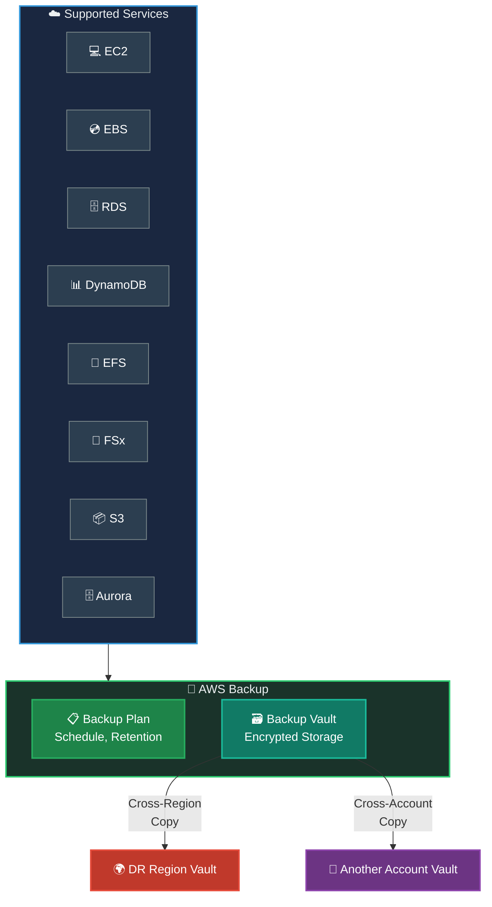

```
┌─────────────────────────────────────────────────────────────────────────────┐
│                         AWS BACKUP                                          │
├─────────────────────────────────────────────────────────────────────────────┤
│                                                                             │
│  📋 Backup Plan:                                                            │
│  • Schedule: Hourly / Daily / Weekly / Monthly / Custom cron                │
│  • Retention: 1 day → Forever                                               │
│  • Lifecycle: Move to cold storage sau X ngày                               │
│  • Cross-Region Copy: Tự động copy backup sang DR region                    │
│  • Cross-Account Copy: Copy sang account khác (security)                    │
│                                                                             │
│  🗃️ Backup Vault:                                                           │
│  • Encrypted với KMS                                                        │
│  • Vault Lock: WORM (Write Once Read Many) — không xóa được                 │
│  • Resource-based access policies                                           │
│                                                                             │
│  ✅ PITR (Point-in-Time Recovery):                                          │
│  • RDS, Aurora, DynamoDB                                                    │
│  • Restore DB đến bất kỳ thời điểm nào trong retention window               │
│                                                                             │
└─────────────────────────────────────────────────────────────────────────────┘
```

---

## Tổng hợp: Khi nào dùng service nào?

### Decision Tree chi tiết

```mermaid
graph TB
    Q["❓ Bạn đang cần gì?"]

    Q -->|"DR cho<br/>production app"| DR_Q{"💥 Budget?"}
    DR_Q -->|"Thấp<br/>non-critical"| BR["💾 Backup & Restore<br/>RTO: Hours, Cost: ★☆☆☆"]
    DR_Q -->|"TB<br/>core business"| PL["🔥 Pilot Light<br/>RTO: 10+ min, Cost: ★★☆☆"]
    DR_Q -->|"Cao<br/>critical"| WS["🌡️ Warm Standby<br/>RTO: Min, Cost: ★★★☆"]
    DR_Q -->|"Rất cao<br/>mission-critical"| AA["⚡ Active-Active<br/>RTO: ~0, Cost: ★★★★"]

    Q -->|"Migrate<br/>database"| DMS_Q{"🔄 Same engine?"}
    DMS_Q -->|"Yes<br/>MySQL→RDS MySQL"| DMS_H["🔄 DMS only<br/>Homogeneous"]
    DMS_Q -->|"No<br/>Oracle→Aurora"| DMS_HE["🔧 SCT + DMS<br/>Heterogeneous"]

    Q -->|"Migrate<br/>data/files"| DATA_Q{"📡 How much?"}
    DATA_Q -->|"< 10 TB<br/>via network"| DSYNC_N["⚡ DataSync"]
    DATA_Q -->|"10-80 TB<br/>or no network"| SNOW_N["❄️ Snowball Edge"]
    DATA_Q -->|"> 10 PB"| SM_N["🚛 Snowmobile"]

    Q -->|"Ongoing hybrid<br/>storage access"| SGW_N["🌉 Storage Gateway"]
    Q -->|"Partners upload<br/>SFTP files"| TF_N["📁 Transfer Family"]
    Q -->|"Centralized<br/>backup"| BKP_N["💾 AWS Backup"]

    style Q fill:#6c3483,color:#fff,stroke:#8e44ad,stroke-width:3px
    style DR_Q fill:#78281f,color:#fff,stroke:#c0392b,stroke-width:2px
    style DMS_Q fill:#1a5276,color:#fff,stroke:#2980b9,stroke-width:2px
    style DATA_Q fill:#0e6655,color:#fff,stroke:#16a085,stroke-width:2px
    style BR fill:#2c3e50,color:#fff,stroke:#7f8c8d,stroke-width:2px
    style PL fill:#d35400,color:#fff,stroke:#e67e22,stroke-width:2px
    style WS fill:#b7950b,color:#fff,stroke:#f1c40f,stroke-width:2px
    style AA fill:#1e8449,color:#fff,stroke:#27ae60,stroke-width:2px
    style DMS_H fill:#2471a3,color:#fff,stroke:#3498db,stroke-width:2px
    style DMS_HE fill:#1a5276,color:#fff,stroke:#2980b9,stroke-width:2px
    style DSYNC_N fill:#1e8449,color:#fff,stroke:#27ae60,stroke-width:2px
    style SNOW_N fill:#117a65,color:#fff,stroke:#1abc9c,stroke-width:2px
    style SM_N fill:#c0392b,color:#fff,stroke:#e74c3c,stroke-width:2px
    style SGW_N fill:#0e6655,color:#fff,stroke:#16a085,stroke-width:2px
    style TF_N fill:#0e6655,color:#fff,stroke:#16a085,stroke-width:2px
    style BKP_N fill:#78281f,color:#fff,stroke:#c0392b,stroke-width:2px
```

### Câu hỏi thường gặp trong exam

| Câu hỏi | Đáp án |
|----------|--------|
| "Minimal downtime DB migration?" | **DMS** (CDC mode) |
| "Oracle → Aurora PostgreSQL?" | **SCT + DMS** |
| "MySQL → RDS MySQL?" | **DMS only** (homogeneous) |
| "100 TB data, no internet?" | **Snowball Edge** |
| "10 PB data center migration?" | **Snowmobile** |
| "Sync on-prem NFS to S3?" | **DataSync** |
| "On-prem app dùng S3 như NFS?" | **S3 File Gateway** |
| "Replace physical tape backup?" | **Tape Gateway** |
| "Partner upload files qua SFTP?" | **Transfer Family** |
| "Centralized backup, cross-region?" | **AWS Backup** |
| "RPO ~0, RTO ~0?" | **Active-Active** (Multi-Site) |
| "Lowest cost DR?" | **Backup & Restore** |
| "DB replicate, app OFF?" | **Pilot Light** |
| "Full infra nhưng scaled-down?" | **Warm Standby** |
| "Reduce operational burden?" | **Replatform** (6Rs) |
| "Viết lại code cloud-native?" | **Refactor** (6Rs) |
| "Chuyển nguyên xi lên cloud?" | **Rehost / Lift & Shift** (6Rs) |

---

## Replication Services cho DR

### AWS services hỗ trợ cross-region replication

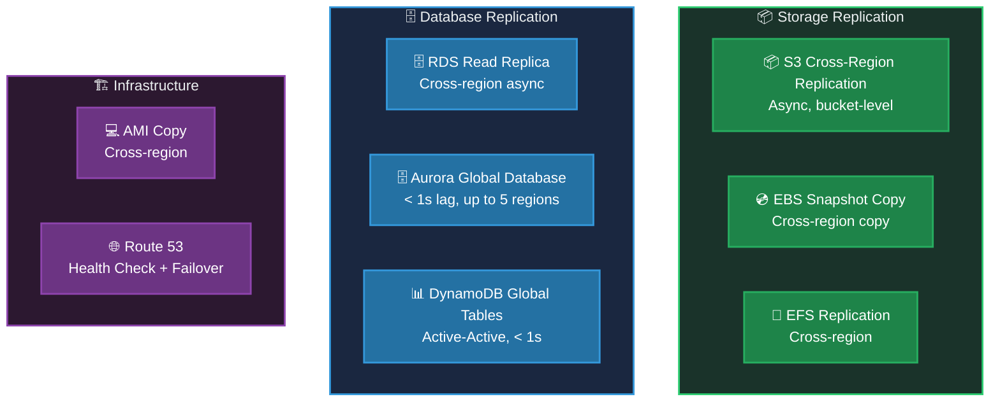

---

## Best Practices

```
┌─────────────────────────────────────────────────────────────────────────────┐
│                     DR & MIGRATION BEST PRACTICES                           │
├─────────────────────────────────────────────────────────────────────────────┤
│                                                                             │
│  1️⃣  DISASTER RECOVERY                                                      │
│  ├── ✅ Xác định RPO/RTO TRƯỚC KHI chọn DR pattern                          │
│  ├── ✅ Dùng AWS Backup cho centralized, cross-region backup                │
│  ├── ✅ Test DR plan định kỳ (quarterly DR drills)                          │
│  ├── ✅ Automate failover với Route53 + Lambda                              │
│  └── ✅ Dùng Infrastructure as Code (CloudFormation) cho DR region          │
│                                                                             │
│  2️⃣  MIGRATION (6Rs)                                                        │
│  ├── ✅ Assessment phase: xác định workloads + dependencies                 │
│  ├── ✅ Bắt đầu với Rehost (nhanh), optimize sau                            │
│  ├── ✅ Dùng DMS + CDC cho zero-downtime DB migration                       │
│  ├── ✅ Retire 10-20% workloads không cần thiết                             │
│  └── ✅ Dùng AWS Migration Hub để track progress                            │
│                                                                             │
│  3️⃣  DATA TRANSFER                                                          │
│  ├── ✅ > 10 TB offline → Snow Family                                       │
│  ├── ✅ < 10 TB online → DataSync                                           │
│  ├── ✅ Hybrid ongoing → Storage Gateway                                    │
│  ├── ✅ Enable versioning trước khi replicate S3                            │
│  └── ✅ Encrypt data in transit + at rest                                   │
│                                                                             │
│  4️⃣  MONITORING                                                             │
│  ├── ✅ Route 53 health checks cho failover                                 │
│  ├── ✅ CloudWatch alarms cho replication lag                               │
│  ├── ✅ AWS Config rules cho backup compliance                              │
│  └── ✅ EventBridge alerts cho DMS task failures                            │
│                                                                             │
└─────────────────────────────────────────────────────────────────────────────┘
```

---

## Exam Tips

> [!TIP]
> **Ghi nhớ nhanh:**
> - **RPO** = bao nhiêu DATA mất (Recovery **Point**) → liên quan đến backup frequency
> - **RTO** = bao lâu DOWN (Recovery **Time**) → liên quan đến infra sẵn sàng
> - **Backup/Restore** = rẻ nhất, chậm nhất
> - **Active-Active** = đắt nhất, nhanh nhất (RTO ≈ 0)
> - **Pilot Light** = chỉ DB chạy (ngọn lửa nhỏ)
> - **Warm Standby** = toàn bộ chạy nhưng scaled-down
> - **DMS** = database migration, KHÔNG downtime
> - **SCT** = cần khi khác engine (heterogeneous)
> - **Snow Family** = physical data transfer, > 10 TB
> - **DataSync** = online file sync (NFS/SMB → AWS)
> - **Storage Gateway** = hybrid bridge (ONGOING access)

> [!CAUTION]
> **Dễ nhầm lẫn:**
> - Pilot Light vs Warm Standby? → PL = chỉ DB chạy / WS = cả app chạy (scaled-down)
> - DataSync vs Storage Gateway? → DataSync = migration/sync job / SGW = ongoing hybrid access
> - DataSync vs Snow? → DataSync = qua mạng / Snow = physical ship (> 10 TB)
> - DMS vs SCT? → DMS = migrate data / SCT = convert schema (dùng khi khác engine)
> - Rehost vs Replatform? → Rehost = nguyên xi / Replatform = dùng managed service (reduce operational burden)
> - S3 File Gateway vs FSx File Gateway? → S3 FG = NFS/SMB→S3 / FSx FG = SMB→FSx Windows
> - Storage Gateway KHÔNG migrate data cũ — cần DataSync/Snow cho initial migration

---

## Liên kết tài liệu

- [DMS chi tiết](./aws-dms.md)
- [Snow Family chi tiết](./snow-family.md)
- [DataSync chi tiết](./aws-datasync.md)
- [Storage Gateway chi tiết](./aws-storage-gateway.md)
- [Transfer Family chi tiết](./aws-transfer-family.md)
- [Global Applications Architecture](./global-applications-architecture.md)
- [S3 Transfer Acceleration](./s3-transfer-acceleration.md)
- [Security & Encryption Overview](./aws-security-encryption-overview.md)
- [Monitoring & Audit Overview](./aws-monitoring-audit-overview.md)
