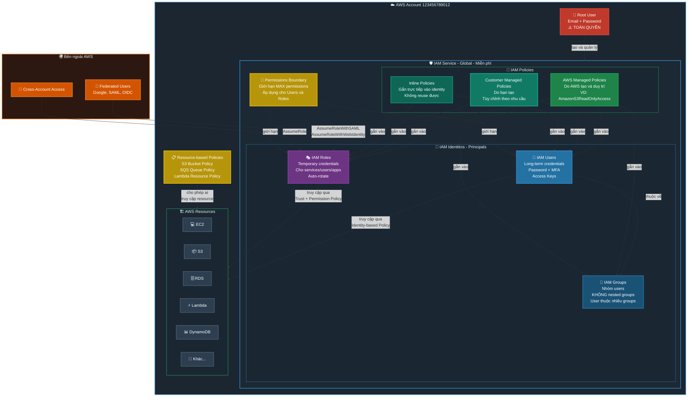
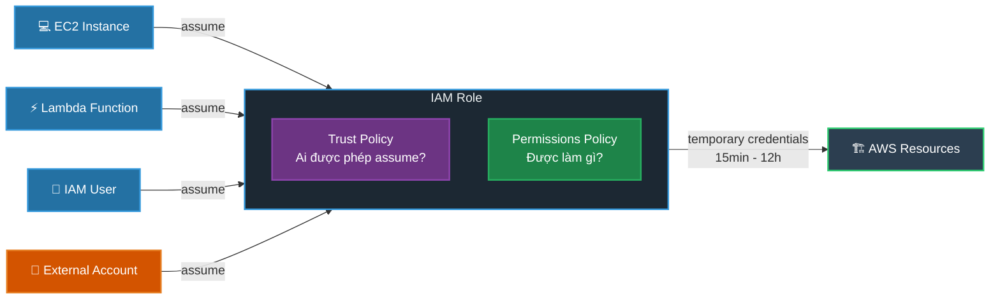
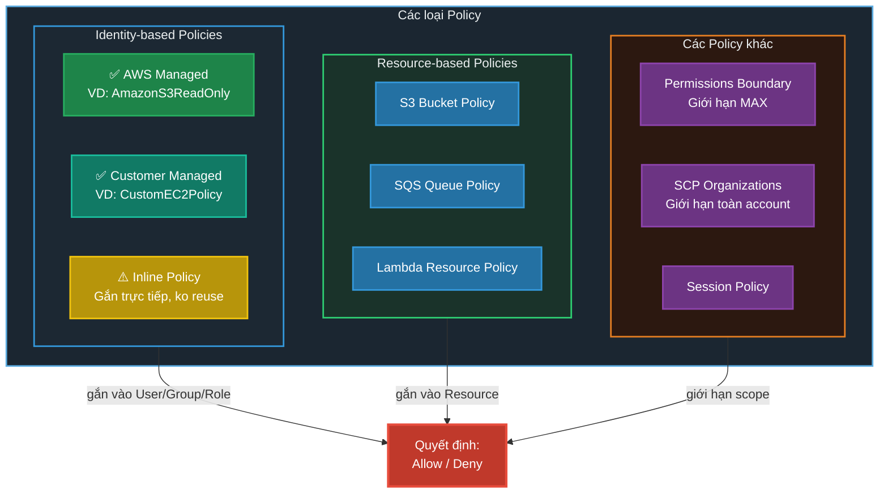
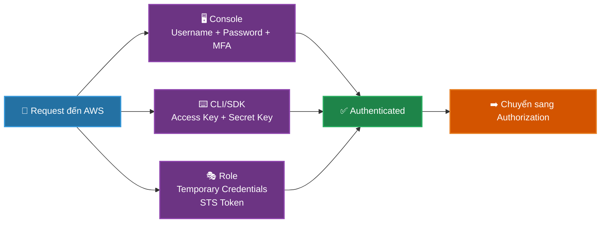
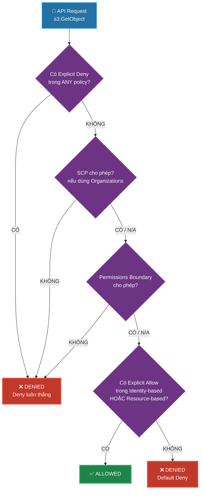
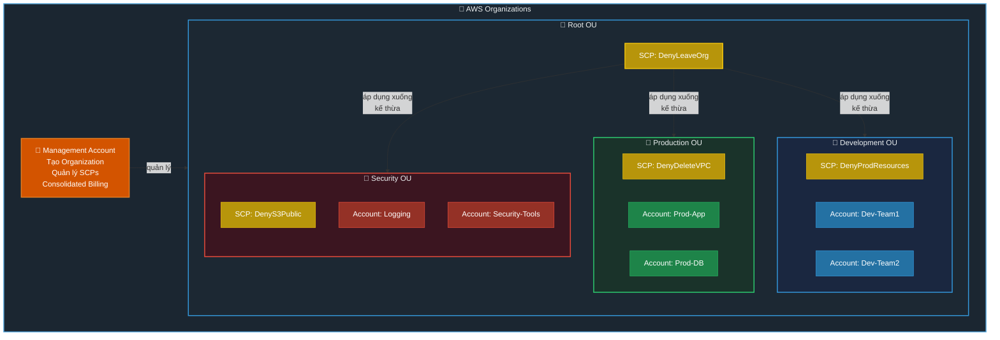
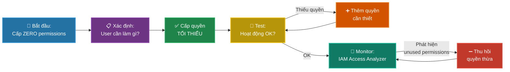

# AWS IAM Management - Tổng Quan & Best Practices

## 📋 Mục lục

- [Overview Diagram](#overview-diagram)
- [Các thành phần chính](#các-thành-phần-chính)
- [Luồng xác thực & phân quyền](#luồng-xác-thực--phân-quyền)
- [Policy Evaluation Flow](#policy-evaluation-flow)
- [Multi-Account Architecture](#multi-account-architecture)
- [Best Practices](#best-practices)
- [Exam Tips](#exam-tips)

---

## Overview Diagram

### Toàn cảnh hệ thống IAM trong AWS



---

### Mối quan hệ giữa các thành phần

```
┌─────────────────────────────────────────────────────────────────────────────────────┐
│                           AWS ACCOUNT                                               │
│                                                                                     │
│   ┌──────────┐                                                                      │
│   │Root User │──── ⚠️ Toàn quyền, chỉ dùng khi thật sự cần thiết                    │
│   └──────────┘                                                                      │
│         │                                                                           │
│         │ tạo & quản lý                                                             │
│         ▼                                                                           │
│   ┌─────────────────────────────────────────────────────────────────────────────┐   │
│   │                        IAM SERVICE (Global)                                 │   │
│   │                                                                             │   │
│   │   ┌─────────────────────────────────────────────────────────────────────┐   │   │
│   │   │                    IDENTITIES (Ai?)                                 │   │   │
│   │   │                                                                     │   │   │
│   │   │   ┌──────────┐    ┌──────────────┐    ┌──────────────┐              │   │   │
│   │   │   │  Users   │───▶│    Groups    │    │    Roles     │              │   │   │
│   │   │   │          │    │              │    │              │              │   │   │
│   │   │   │ • John   │    │ • Developers │    │ • EC2-S3Role │              │   │   │
│   │   │   │ • Jane   │    │ • Admins     │    │ • Lambda-Role│              │   │   │
│   │   │   │ • Bob    │    │ • DevOps     │    │ • CrossAcct  │              │   │   │
│   │   │   └──────────┘    └──────────────┘    └──────────────┘              │   │   │
│   │   └─────────────────────────────────────────────────────────────────────┘   │   │
│   │                              │                                              │   │
│   │                    gắn policies vào                                         │   │
│   │                              │                                              │   │
│   │   ┌─────────────────────────────────────────────────────────────────────┐   │   │
│   │   │                    POLICIES (Được phép làm gì?)                     │   │   │
│   │   │                                                                     │   │   │
│   │   │   JSON Document:                                                    │   │   │
│   │   │   {                                                                 │   │   │
│   │   │     "Effect": "Allow" | "Deny",                                     │   │   │
│   │   │     "Action": "s3:GetObject",        ← Hành động gì?                │   │   │
│   │   │     "Resource": "arn:aws:s3:::*",    ← Trên resource nào?           │   │   │
│   │   │     "Condition": { ... }             ← Với điều kiện gì?            │   │   │
│   │   │   }                                                                 │   │   │
│   │   └─────────────────────────────────────────────────────────────────────┘   │   │
│   │                              │                                              │   │
│   │                    cho phép/từ chối                                         │   │
│   │                              ▼                                              │   │
│   │   ┌─────────────────────────────────────────────────────────────────────┐   │   │
│   │   │                    AWS RESOURCES                                    │   │   │
│   │   │                                                                     │   │   │
│   │   │    EC2    S3    RDS    Lambda    DynamoDB    SQS    SNS   ...       │   │   │
│   │   └─────────────────────────────────────────────────────────────────────┘   │   │
│   └─────────────────────────────────────────────────────────────────────────────┘   │
└─────────────────────────────────────────────────────────────────────────────────────┘
```

---

## Các thành phần chính

### 1. 🔑 Root User

| Đặc điểm | Mô tả |
|-----------|-------|
| **Credentials** | Email + Password đăng ký AWS account |
| **Quyền** | TOÀN QUYỀN - không thể bị giới hạn bởi bất kỳ policy nào |
| **Dùng khi nào** | Chỉ khi bắt buộc: đóng account, thay đổi support plan, restore IAM permissions |

### 2. 👤 IAM Users

```
IAM User = "1 người hoặc 1 ứng dụng" cần truy cập AWS

Xác thực bằng:
├── Console Access: Username + Password + MFA (optional)
└── Programmatic Access: Access Key ID + Secret Access Key
```

| Đặc điểm | Giá trị |
|-----------|---------|
| Tối đa users/account | 5,000 |
| Groups/user | Tối đa 10 |
| Policies/user | Tối đa 10 managed policies |

### 3. 👥 IAM Groups

```
Group = "Nhóm users có cùng quyền"

┌─────────────────┐    ┌─────────────────┐    ┌─────────────────┐
│   Developers    │    │     Admins      │    │    Auditors     │
│                 │    │                 │    │                 │
│ • John          │    │ • Alice         │    │ • Charlie       │
│ • Jane          │    │ • Bob           │    │ • Diana         │
│                 │    │                 │    │                 │
│ Policy:         │    │ Policy:         │    │ Policy:         │
│ EC2, S3, Lambda │    │ AdminAccess     │    │ ReadOnlyAccess  │
└─────────────────┘    └─────────────────┘    └─────────────────┘
```

> [!IMPORTANT]
> - Groups **KHÔNG phải identity** → không thể dùng trong Resource-based Policy
> - Groups **KHÔNG thể nested** (group trong group)
> - User **KHÔNG bắt buộc** thuộc group nào
> - User có thể thuộc **NHIỀU groups** cùng lúc

### 4. 🎭 IAM Roles



**Khi nào dùng Role?**

| Tình huống | Ví dụ |
|------------|-------|
| **AWS Service cần quyền** | EC2 đọc S3, Lambda ghi DynamoDB |
| **Cross-account access** | Account A truy cập resource ở Account B |
| **Federated users** | Login bằng Google/Facebook/SAML |
| **Temporary access** | Contractor cần quyền tạm thời |

### 5. 📜 IAM Policies



#### Cấu trúc của 1 Policy (JSON)

```json
{
  "Version": "2012-10-17",
  "Statement": [
    {
      "Sid": "AllowS3Read",
      "Effect": "Allow",
      "Action": [
        "s3:GetObject",
        "s3:ListBucket"
      ],
      "Resource": [
        "arn:aws:s3:::my-bucket",
        "arn:aws:s3:::my-bucket/*"
      ],
      "Condition": {
        "IpAddress": {
          "aws:SourceIp": "203.0.113.0/24"
        }
      }
    }
  ]
}
```

| Trường | Ý nghĩa | Bắt buộc? |
|--------|----------|-----------|
| **Effect** | `Allow` hoặc `Deny` | ✅ |
| **Action** | Hành động gì? (`s3:GetObject`, `ec2:*`) | ✅ |
| **Resource** | Trên resource nào? (ARN) | ✅ (Identity-based) |
| **Principal** | Ai? | ✅ (Resource-based) |
| **Condition** | Điều kiện gì? (IP, MFA, time...) | ❌ |

---

## Luồng xác thực & phân quyền

### Authentication (Xác thực - "Bạn là ai?")



### Authorization (Phân quyền - "Bạn được phép làm gì?")



### Quy tắc vàng

```
1. Mặc định: TẤT CẢ đều bị DENY (Default Deny)
2. Explicit Allow ghi đè Default Deny
3. Explicit Deny LUÔN THẮNG Allow (Deny wins)
4. SCP/Permissions Boundary = "trần" (ceiling)
   → Chỉ GIỚI HẠN, KHÔNG CẤP quyền
```

---

## Multi-Account Architecture

### Với AWS Organizations + SCPs



### SCP vs IAM Policy - Sự khác biệt

```
┌──────────────────────────────────────────────────────────────────┐
│                                                                  │
│   SCP (Organizations)          IAM Policy (Account)              │
│   ═══════════════════          ═════════════════════             │
│                                                                  │
│   • Áp dụng cho TOÀN account   • Áp dụng cho user/group/role     │
│   • Chỉ GIỚI HẠN (ceiling)     • CẤP QUYỀN (Allow/Deny)          │
│   • Không áp dụng cho          • Áp dụng cho mọi identity        │
│     Management Account           trong account                   │
│   • Kế thừa từ OU cha          • Không kế thừa                   │
│                                                                  │
│   Effective Permissions = SCP ∩ IAM Policy                       │
│   (Giao của 2 tập hợp)                                           │
│                                                                  │
│   ┌─────────────────────────────┐                                │
│   │        SCP Allow            │                                │
│   │    ┌──────────────┐         │                                │
│   │    │ ████████████ │←── Effective Permissions                 │
│   │    │ ████████████ │    (chỉ phần GIAO)                       │
│   │    └──────────────┘         │                                │
│   │         IAM Allow ──────────┤                                │
│   └─────────────────────────────┘                                │
│                                                                  │
└──────────────────────────────────────────────────────────────────┘
```

---

## Tóm tắt: Ai / Cái gì / Bằng cách nào?

```mermaid
graph TB
    subgraph WHO["👤 AI TRUY CẬP? - Principal"]
        W1["Root User"]
        W2["IAM User"]
        W3["IAM Role"]
        W4["Federated User"]
        W5["AWS Service"]
    end

    subgraph HOW["📜 BẰNG CÁCH NÀO? - Policy"]
        H1["Identity-based Policy<br/>gắn vào User/Group/Role"]
        H2["Resource-based Policy<br/>gắn vào Resource"]
        H3["Permissions Boundary<br/>giới hạn User/Role"]
        H4["SCP<br/>giới hạn toàn Account"]
        H5["Session Policy<br/>giới hạn session"]
    end

    subgraph WHAT["🏗️ TRUY CẬP CÁI GÌ? - Resource"]
        R1["EC2, S3, RDS"]
        R2["Lambda, DynamoDB"]
        R3["SQS, SNS, Kinesis"]
        R4["VPC, CloudFront"]
        R5["IAM itself"]
    end

    WHO -->|"xác thực"| HOW
    HOW -->|"phân quyền"| WHAT

    style WHO fill:#1a2740,color:#ecf0f1,stroke:#3498db,stroke-width:2px
    style HOW fill:#2c1810,color:#ecf0f1,stroke:#e67e22,stroke-width:2px
    style WHAT fill:#1a332a,color:#ecf0f1,stroke:#2ecc71,stroke-width:2px
    style W1 fill:#c0392b,color:#fff,stroke:#e74c3c,stroke-width:2px
    style W2 fill:#2471a3,color:#fff,stroke:#3498db,stroke-width:2px
    style W3 fill:#6c3483,color:#fff,stroke:#8e44ad,stroke-width:2px
    style W4 fill:#d35400,color:#fff,stroke:#e67e22,stroke-width:2px
    style W5 fill:#2c3e50,color:#fff,stroke:#7f8c8d,stroke-width:2px
    style H1 fill:#1e8449,color:#fff,stroke:#27ae60,stroke-width:2px
    style H2 fill:#117a65,color:#fff,stroke:#1abc9c,stroke-width:2px
    style H3 fill:#b7950b,color:#fff,stroke:#f1c40f,stroke-width:2px
    style H4 fill:#6c3483,color:#fff,stroke:#8e44ad,stroke-width:2px
    style H5 fill:#0e6655,color:#fff,stroke:#16a085,stroke-width:2px
    style R1 fill:#2c3e50,color:#fff,stroke:#2ecc71,stroke-width:1px
    style R2 fill:#2c3e50,color:#fff,stroke:#2ecc71,stroke-width:1px
    style R3 fill:#2c3e50,color:#fff,stroke:#2ecc71,stroke-width:1px
    style R4 fill:#2c3e50,color:#fff,stroke:#2ecc71,stroke-width:1px
    style R5 fill:#2c3e50,color:#fff,stroke:#2ecc71,stroke-width:1px
```



---

## Best Practices

### 🔐 Security Best Practices

```
┌─────────────────────────────────────────────────────────────────────────┐
│                    AWS IAM BEST PRACTICES                               │
├─────────────────────────────────────────────────────────────────────────┤
│                                                                         │
│  1️⃣  ROOT USER                                                         │
│  ├── ✅ Enable MFA (dùng hardware key nếu được)                        │
│  ├── ✅ Xóa root access keys                                           │
│  ├── ❌ KHÔNG dùng root cho daily tasks                                 │
│  └── ❌ KHÔNG share root credentials                                    │
│                                                                         │
│  2️⃣  USERS & GROUPS                                                    │
│  ├── ✅ 1 user = 1 người thật (KHÔNG share accounts)                   │
│  ├── ✅ Dùng Groups để gán permissions (không gán trực tiếp cho user)  │
│  ├── ✅ Enable MFA cho tất cả users                                    │
│  └── ✅ Tạo strong password policy                                     │
│                                                                         │
│  3️⃣  PERMISSIONS                                                       │
│  ├── ✅ Least Privilege: chỉ cấp quyền TỐI THIỂU cần thiết           │
│  ├── ✅ Dùng AWS Managed Policies khi có thể                           │
│  ├── ✅ Review permissions định kỳ (IAM Access Analyzer)               │
│  ├── ✅ Dùng Conditions trong policies (IP, MFA, time...)              │
│  └── ❌ KHÔNG dùng wildcard (*) cho Actions và Resources               │
│                                                                         │
│  4️⃣  ROLES                                                             │
│  ├── ✅ Dùng Roles cho AWS services (EC2, Lambda...) thay vì Access Keys│
│  ├── ✅ Dùng Roles cho cross-account access                            │
│  ├── ✅ Dùng Roles cho federated users (SSO)                           │
│  └── ✅ Dùng External ID để chống Confused Deputy                      │
│                                                                         │
│  5️⃣  ACCESS KEYS                                                       │
│  ├── ✅ Rotate định kỳ (90 ngày)                                       │
│  ├── ✅ Remove unused keys                                              │
│  ├── ❌ KHÔNG commit vào source code                                    │
│  └── ❌ KHÔNG embed trong AMI/container                                 │
│                                                                         │
│  6️⃣  MONITORING & AUDITING                                             │
│  ├── ✅ Enable CloudTrail (log tất cả API calls)                       │
│  ├── ✅ Dùng IAM Access Analyzer (phát hiện unintended access)         │
│  ├── ✅ Review IAM Credential Report định kỳ                           │
│  └── ✅ Set up CloudWatch Alarms cho suspicious activities             │
│                                                                         │
│  7️⃣  ORGANIZATIONS (Multi-Account)                                     │
│  ├── ✅ Tách accounts theo môi trường (Dev/Staging/Prod)               │
│  ├── ✅ Dùng SCPs để enforce security guardrails                       │
│  ├── ✅ Centralized logging account                                     │
│  └── ✅ Dùng IAM Identity Center cho SSO                               │
│                                                                         │
└─────────────────────────────────────────────────────────────────────────┘
```

### Least Privilege Workflow



---

## Công cụ hỗ trợ quản lý IAM

| Công cụ | Mục đích | Tần suất |
|---------|----------|----------|
| **IAM Credential Report** | Liệt kê tất cả users + trạng thái credentials | Định kỳ (monthly) |
| **IAM Access Advisor** | Xem services nào user đã/chưa access | Khi review permissions |
| **IAM Access Analyzer** | Phát hiện resources bị chia sẻ ra ngoài | Liên tục (automated) |
| **IAM Policy Simulator** | Test policies trước khi apply | Khi tạo/sửa policies |
| **CloudTrail** | Log tất cả API calls (ai, làm gì, khi nào) | Luôn bật |
| **AWS Config** | Track thay đổi cấu hình IAM | Luôn bật |

---

## Exam Tips (Cloud Practitioner / SAA)

> [!TIP]
> **Ghi nhớ nhanh:**
> - **Users** = người/app cụ thể, long-term credentials
> - **Groups** = nhóm users, KHÔNG nested, KHÔNG phải identity
> - **Roles** = temporary credentials, cho services/cross-account/federation
> - **Policies** = JSON documents, Allow/Deny, Deny luôn thắng
> - **SCP** = ceiling cho account, KHÔNG cấp quyền, KHÔNG áp dụng Management Account
> - **Root** = toàn quyền, KHÔNG dùng hàng ngày, MFA bắt buộc
> - **Least Privilege** = câu trả lời "an toàn" nhất trong mọi tình huống

> [!CAUTION]
> **Câu hỏi hay gặp lẫn:**
> - "Làm sao để EC2 truy cập S3?" → **IAM Role** (KHÔNG PHẢI Access Keys trên EC2)
> - "Làm sao để giới hạn toàn bộ account?" → **SCP** (cần Organizations)
> - "Group có phải identity không?" → **KHÔNG** (không dùng được trong Resource-based Policy)
> - "SCP có cấp quyền không?" → **KHÔNG** (chỉ giới hạn) 
> - "Permissions Boundary cấp quyền?" → **KHÔNG** (chỉ giới hạn MAX)

---

## Liên kết tài liệu

- [IAM chi tiết](./iam.md)
- [IAM Roles - Deep Dive](./iam-roles.md)
- [IAM Identity Center](./iam-identity-center.md)
- [AWS Organizations](./aws-organizations.md)
- [Security Groups](./security-groups.md)
- [S3 Security](./s3-security.md)
