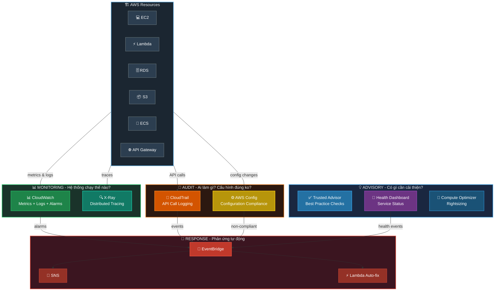
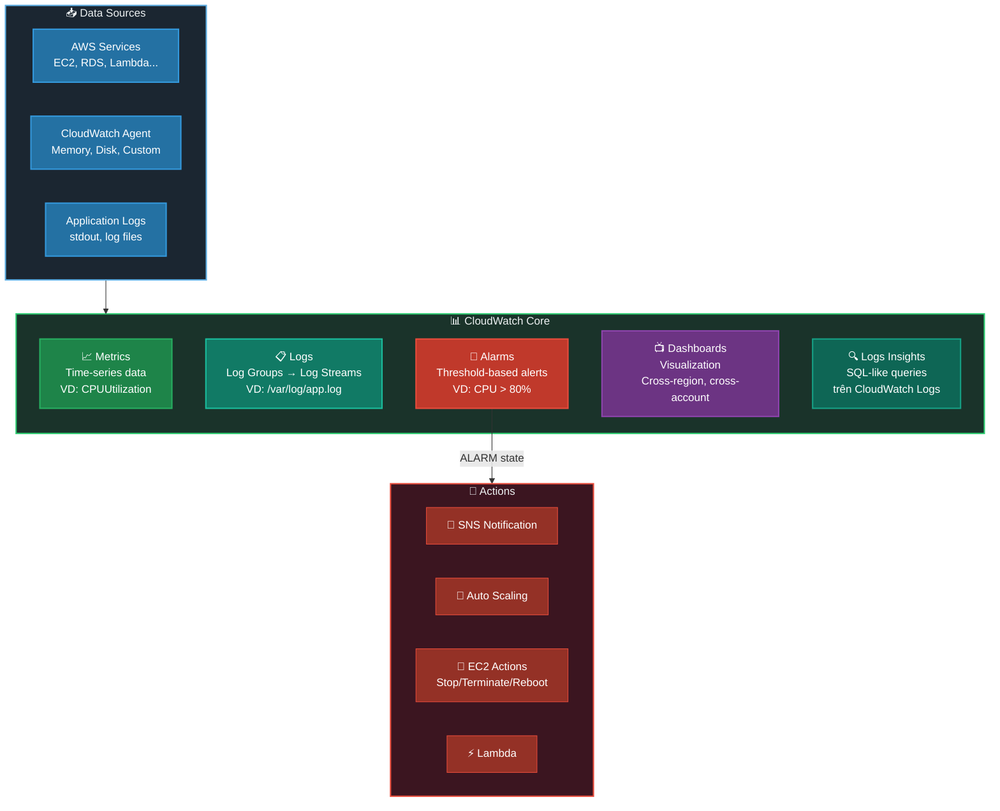
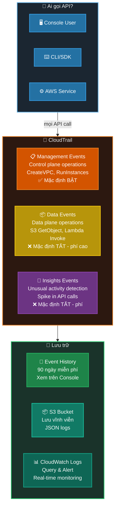
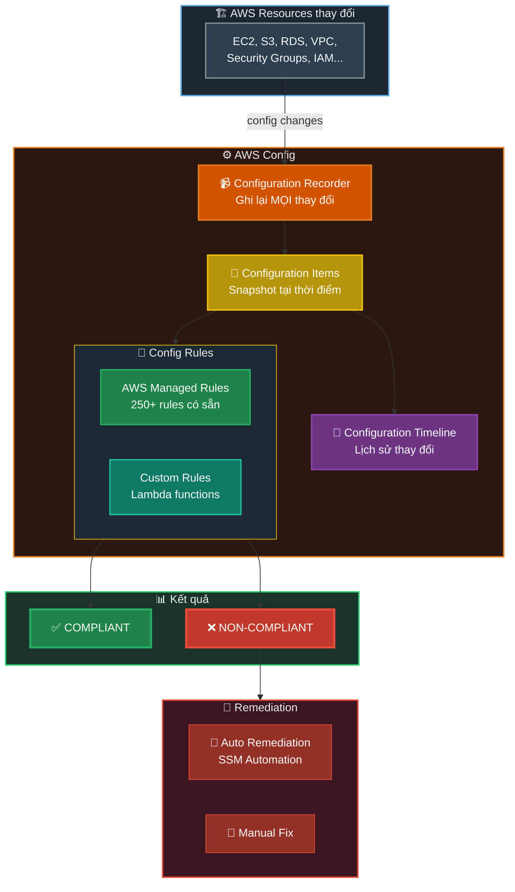
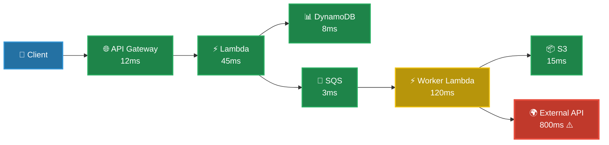
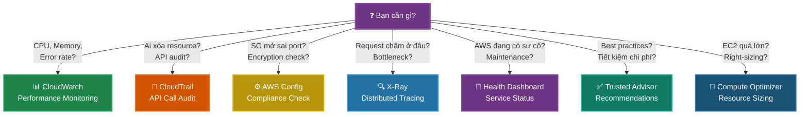
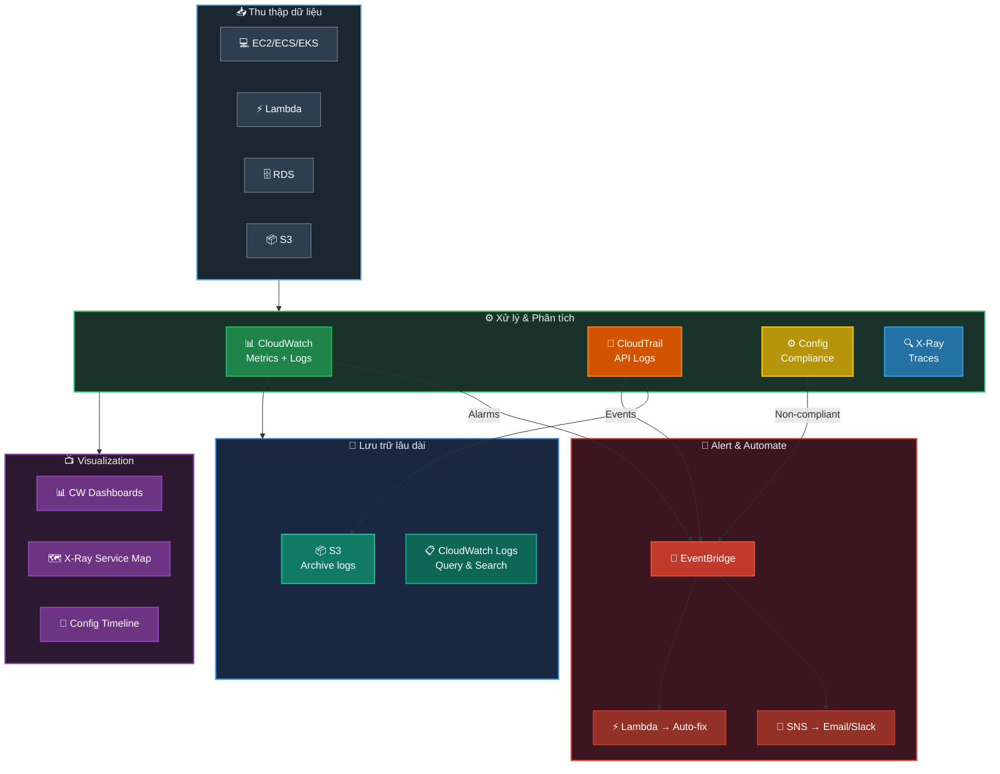

# AWS Monitoring & Audit - Tổng Quan & Diagrams

## 📋 Mục lục

- [Overview Diagram](#overview-diagram)
- [Từng service làm gì?](#từng-service-làm-gì)
- [CloudWatch - Monitoring](#cloudwatch---monitoring)
- [CloudTrail - Audit](#cloudtrail---audit)
- [AWS Config - Compliance](#aws-config---compliance)
- [X-Ray - Distributed Tracing](#x-ray---distributed-tracing)
- [Tổng hợp: Khi nào dùng service nào?](#tổng-hợp-khi-nào-dùng-service-nào)
- [Data Flow tổng thể](#data-flow-tổng-thể)
- [Best Practices](#best-practices)
- [Exam Tips](#exam-tips)

---

## Overview Diagram

### Toàn cảnh hệ thống Monitoring & Audit trong AWS



---

## Từng service làm gì?

### Bảng so sánh nhanh

| Service | Câu hỏi trả lời | Dữ liệu | Ví dụ |
|---------|-----------------|----------|-------|
| **CloudWatch** | Hệ thống **chạy thế nào**? | Metrics, Logs, Alarms | CPU 85%, Error rate 2% |
| **CloudTrail** | **Ai** đã làm **gì**? | API call logs | "John xóa S3 bucket lúc 3AM" |
| **AWS Config** | Cấu hình có **đúng chuẩn** không? | Configuration history | "SG mở port 22 ra 0.0.0.0/0" |
| **X-Ray** | Request đi qua đâu, **chậm ở đâu**? | Traces, Service Map | "DynamoDB query mất 800ms" |
| **Trusted Advisor** | Có gì cần **cải thiện**? | Best practice checks | "3 EIPs không dùng, phí $52/tháng" |
| **Health Dashboard** | AWS service có **sự cố** gì? | Service/Account events | "EC2 degraded ở us-east-1" |
| **Compute Optimizer** | Resource có **đúng size**? | Rightsizing recommendations | "EC2 m5.xlarge → m5.large" |

```
┌─────────────────────────────────────────────────────────────────────────────┐
│                     MONITORING vs AUDIT vs ADVISORY                         │
├─────────────────────────────────────────────────────────────────────────────┤
│                                                                             │
│  📊 MONITORING (Real-time)       📝 AUDIT (Historical)                    │
│  ════════════════════════        ════════════════════                       │
│  "Hệ thống đang chạy sao?"      "Ai đã làm gì? Đúng chuẩn ko?"          │
│                                                                             │
│  • CloudWatch  → Metrics/Logs    • CloudTrail → API logs                   │
│  • X-Ray       → Traces          • Config     → Compliance                 │
│                                                                             │
│  💡 ADVISORY (Recommendations)   🚨 RESPONSE (Automation)                 │
│  ════════════════════════════    ════════════════════════                   │
│  "Có gì cần cải thiện?"         "Tự động xử lý khi có vấn đề"            │
│                                                                             │
│  • Trusted Advisor → 5 pillars   • EventBridge → Route events             │
│  • Health Dashboard → Incidents  • SNS         → Notify                    │
│  • Compute Optimizer → Sizing    • Lambda      → Auto-remediate            │
│                                                                             │
└─────────────────────────────────────────────────────────────────────────────┘
```

---

## CloudWatch - Monitoring

### "Hệ thống đang chạy thế nào?"



### Điểm quan trọng cần nhớ

```
┌─────────────────────────────────────────────────────────────────────────────┐
│  📊 CLOUDWATCH KEY POINTS                                                   │
├─────────────────────────────────────────────────────────────────────────────┤
│                                                                             │
│  ⚠️ EC2 Default Metrics:                                                   │
│  ├── ✅ CÓ sẵn: CPU, Network, Disk I/O, Status Checks                     │
│  ├── ❌ KHÔNG có: Memory, Disk space (cần CloudWatch Agent)                │
│  └── Default period: 5 phút (Detailed: 1 phút, có phí)                    │
│                                                                             │
│  🔔 Alarm States: OK → ALARM → INSUFFICIENT_DATA                          │
│                                                                             │
│  📋 Log Retention: Mặc định NEVER EXPIRE (phải set manually)              │
│                                                                             │
│  📈 High-Resolution Metrics: Xuống tới 1 giây (custom metrics)            │
│                                                                             │
│  💡 Composite Alarms: Kết hợp nhiều alarms bằng AND/OR                    │
│                                                                             │
└─────────────────────────────────────────────────────────────────────────────┘
```

---

## CloudTrail - Audit

### "Ai đã làm gì, khi nào, từ đâu?"



### CloudTrail Event Record

```json
{
  "eventTime":    "2024-01-15T10:30:00Z",
  "eventSource":  "s3.amazonaws.com",
  "eventName":    "DeleteBucket",
  "userIdentity": {
    "type": "IAMUser",
    "userName": "john"
  },
  "sourceIPAddress": "203.0.113.50",
  "requestParameters": {
    "bucketName": "my-important-bucket"
  },
  "responseElements": null,
  "errorCode": null
}
```

> → **"john" xóa bucket "my-important-bucket" lúc 10:30 từ IP 203.0.113.50**

---

## AWS Config - Compliance

### "Cấu hình có đúng chuẩn không?"



### Popular Config Rules

| Rule | Kiểm tra gì? |
|------|--------------|
| `s3-bucket-public-read-prohibited` | S3 bucket không public read |
| `ec2-instance-no-public-ip` | EC2 không có public IP |
| `rds-storage-encrypted` | RDS storage encrypted |
| `encrypted-volumes` | EBS volumes encrypted |
| `iam-root-access-key-check` | Root không có access keys |
| `restricted-ssh` | SSH không mở 0.0.0.0/0 |

> [!IMPORTANT]
> AWS Config **KHÔNG ngăn chặn** changes — chỉ **recording và evaluating**.
> Để prevent changes → dùng SCPs hoặc IAM Policies.

---

## X-Ray - Distributed Tracing

### "Request đi qua đâu, chậm ở đâu?"



> ☝️ X-Ray Service Map cho thấy **External API** mất **800ms** — đây là bottleneck!

### X-Ray Core Concepts

```
┌─────────────────────────────────────────────────────────────────────────────┐
│  🔍 X-RAY KEY CONCEPTS                                                     │
├─────────────────────────────────────────────────────────────────────────────┤
│                                                                             │
│  Trace    = Toàn bộ journey của 1 request (end-to-end)                     │
│  Segment  = 1 service xử lý request đó                                     │
│  Subsegment = Chi tiết bên trong segment (DB call, HTTP call)              │
│                                                                             │
│  ┌─── TRACE ─────────────────────────────────────────────────────────┐     │
│  │                                                                    │     │
│  │  ┌─ Segment: API GW ─┐ ┌─ Segment: Lambda ──────────────────┐   │     │
│  │  │    12ms            │ │    45ms                              │   │     │
│  │  └────────────────────┘ │  ┌─ Sub: DynamoDB ─┐                │   │     │
│  │                         │  │    8ms           │                │   │     │
│  │                         │  └──────────────────┘                │   │     │
│  │                         │  ┌─ Sub: SQS ──────┐                │   │     │
│  │                         │  │    3ms           │                │   │     │
│  │                         │  └──────────────────┘                │   │     │
│  │                         └─────────────────────────────────────────┘     │
│  └────────────────────────────────────────────────────────────────────┘     │
│                                                                             │
│  Annotations = Key-value pairs để SEARCH traces                            │
│  Metadata    = Key-value pairs KHÔNG searchable (thêm context)             │
│  Sampling    = Chỉ trace 1 phần requests (tiết kiệm cost)                 │
│                                                                             │
└─────────────────────────────────────────────────────────────────────────────┘
```

---

## Tổng hợp: Khi nào dùng service nào?



### Câu hỏi thường gặp trong exam

| Câu hỏi | Đáp án |
|----------|--------|
| "Ai xóa S3 bucket?" | **CloudTrail** |
| "CPU EC2 bao nhiêu %?" | **CloudWatch** |
| "Security Group có mở port nguy hiểm?" | **AWS Config** |
| "Lambda function chậm do service nào?" | **X-Ray** |
| "EC2 us-east-1 có đang bị sự cố?" | **Health Dashboard** |
| "Có instance nào quá lớn lãng phí tiền?" | **Trusted Advisor / Compute Optimizer** |
| "S3 bucket có bật encryption chưa?" | **AWS Config** |
| "Phát hiện unusual API activity?" | **CloudTrail Insights** |
| "Log retention Policy?" | **CloudWatch Logs** |
| "Cấu hình resource thay đổi thế nào theo thời gian?" | **AWS Config (Timeline)** |

---

## Data Flow tổng thể

### Cách các services kết nối với nhau



---

## Best Practices

```
┌─────────────────────────────────────────────────────────────────────────────┐
│                    MONITORING & AUDIT BEST PRACTICES                        │
├─────────────────────────────────────────────────────────────────────────────┤
│                                                                             │
│  1️⃣  CLOUDWATCH                                                            │
│  ├── ✅ Cài CloudWatch Agent cho Memory & Disk metrics                     │
│  ├── ✅ Set Alarms cho critical metrics (CPU, Memory, Error rate)          │
│  ├── ✅ Dùng Composite Alarms tránh false positives                        │
│  ├── ✅ Set Log Retention (tránh lưu vĩnh viễn tốn phí)                   │
│  └── ✅ Dùng Logs Insights để query thay vì đọc raw logs                  │
│                                                                             │
│  2️⃣  CLOUDTRAIL                                                            │
│  ├── ✅ Enable cho ALL REGIONS (không chỉ region đang dùng)               │
│  ├── ✅ Lưu logs vào S3 với encryption + versioning                        │
│  ├── ✅ Enable Log File Validation (chống tamper)                          │
│  ├── ✅ Enable Insights cho unusual activity detection                     │
│  └── ❌ KHÔNG tắt CloudTrail (audit requirement)                           │
│                                                                             │
│  3️⃣  AWS CONFIG                                                            │
│  ├── ✅ Enable cho tất cả resource types                                   │
│  ├── ✅ Dùng Conformance Packs cho compliance frameworks                   │
│  ├── ✅ Set up Auto Remediation cho critical rules                         │
│  └── ✅ Dùng Aggregator cho multi-account visibility                      │
│                                                                             │
│  4️⃣  X-RAY                                                                │
│  ├── ✅ Enable cho production workloads                                    │
│  ├── ✅ Dùng Sampling Rules (không trace 100% requests)                    │
│  ├── ✅ Thêm Annotations cho searchable metadata                          │
│  └── ✅ Kết hợp với CloudWatch ServiceLens                                │
│                                                                             │
│  5️⃣  GENERAL                                                               │
│  ├── ✅ Dùng EventBridge để kết nối tất cả services                       │
│  ├── ✅ Centralized logging account (Organizations)                        │
│  ├── ✅ Set up automated responses cho security events                     │
│  └── ✅ Review dashboards và reports định kỳ                              │
│                                                                             │
└─────────────────────────────────────────────────────────────────────────────┘
```

---

## Exam Tips

> [!TIP]
> **Ghi nhớ nhanh:**
> - **CloudWatch** = PERFORMANCE monitoring (metrics, logs, alarms)
> - **CloudTrail** = API AUDIT (ai, làm gì, khi nào)
> - **Config** = COMPLIANCE (cấu hình đúng chuẩn không?)
> - **X-Ray** = TRACING (request đi qua đâu, bottleneck?)
> - **Health Dashboard** = AWS SERVICE STATUS
> - **Trusted Advisor** = BEST PRACTICE recommendations (5 pillars)

> [!CAUTION]
> **Dễ nhầm lẫn:**
> - "EC2 Memory metric?" → **CloudWatch Agent** (KHÔNG phải default metric!)
> - CloudTrail vs Config? → Trail = **ai làm gì** / Config = **cấu hình đúng ko**
> - CloudWatch vs CloudTrail Logs? → CW = **application logs** / CT = **API call logs**
> - Config có ngăn changes không? → **KHÔNG** (chỉ detect & alert)
> - CloudTrail Event History? → Chỉ **90 ngày** miễn phí trên Console
> - X-Ray vs CloudWatch? → X-Ray = **distributed tracing** / CW = **metrics & logs**

---

## Liên kết tài liệu

- [CloudWatch chi tiết](./cloudwatch.md)
- [CloudTrail chi tiết](./cloudtrail.md)
- [AWS Config chi tiết](./aws-config.md)
- [X-Ray chi tiết](./aws-xray.md)
- [Health Dashboard](./aws-health-dashboard.md)
- [Trusted Advisor](./aws-trusted-advisor.md)
- [Compute Optimizer](./aws-compute-optimizer.md)
- [EventBridge](./eventbridge.md)
