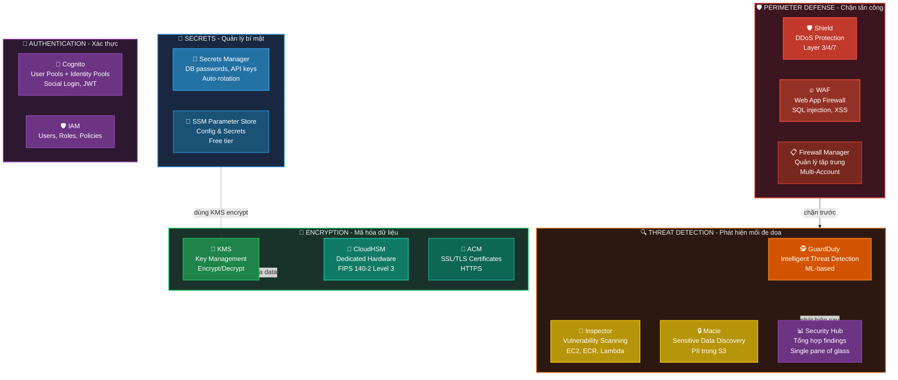
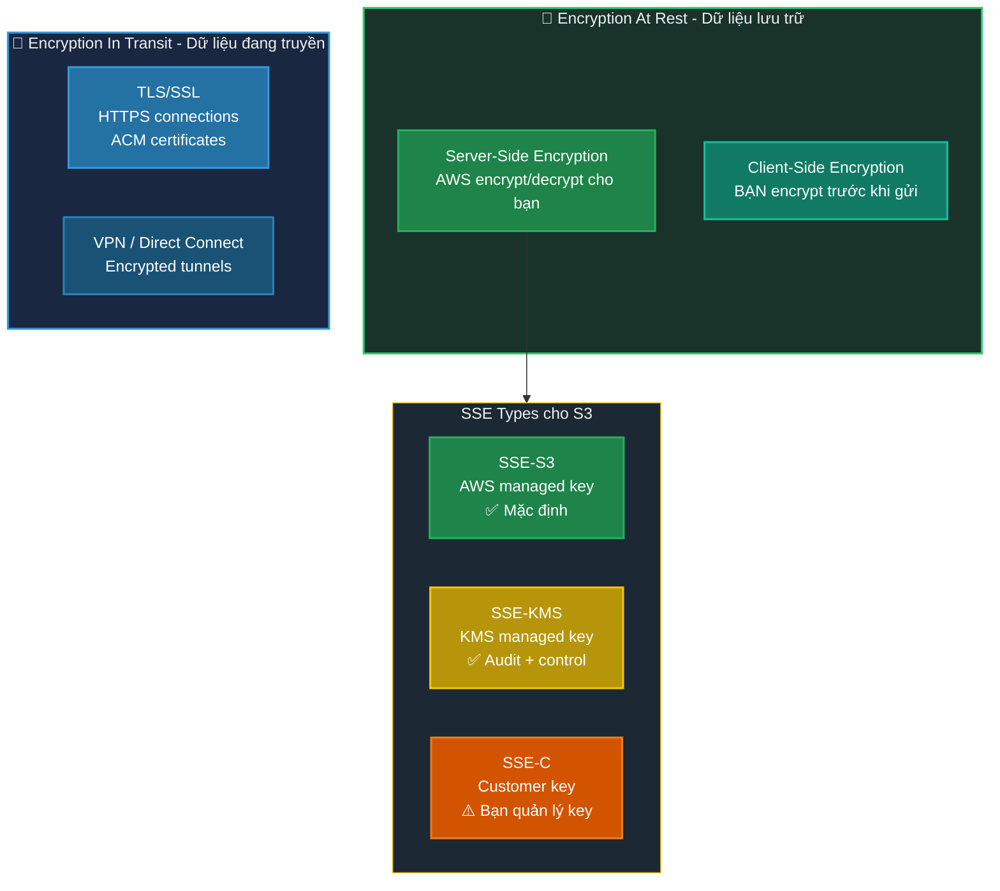
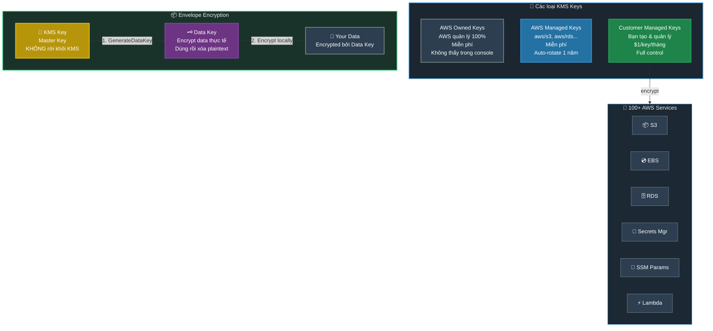
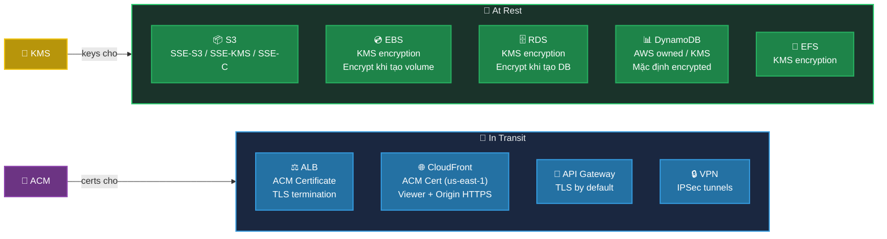
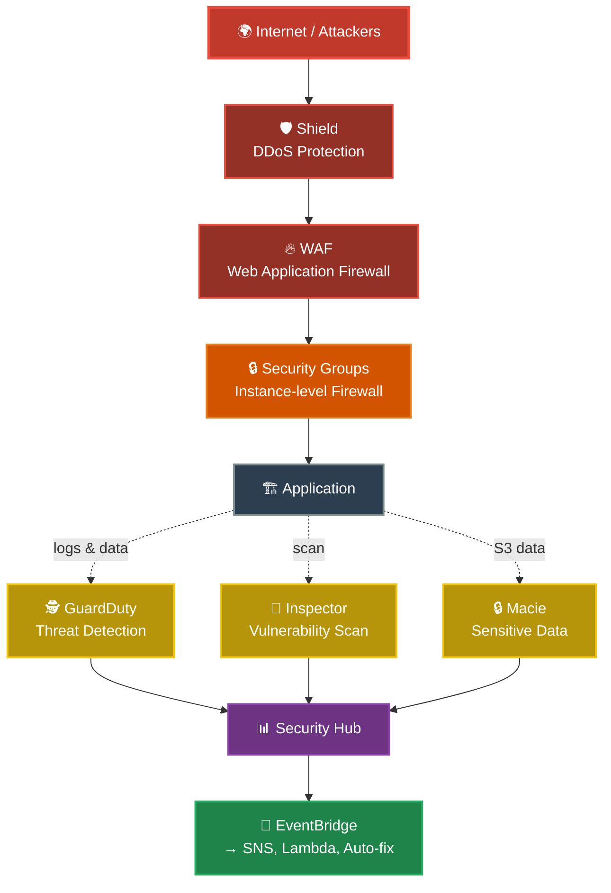
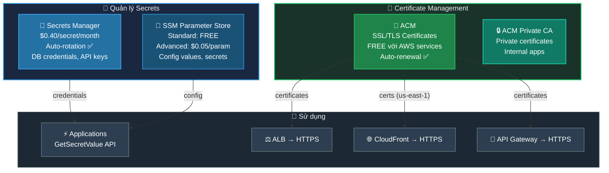
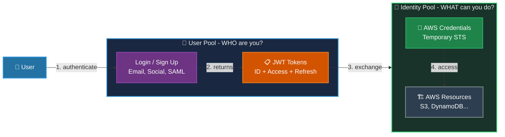
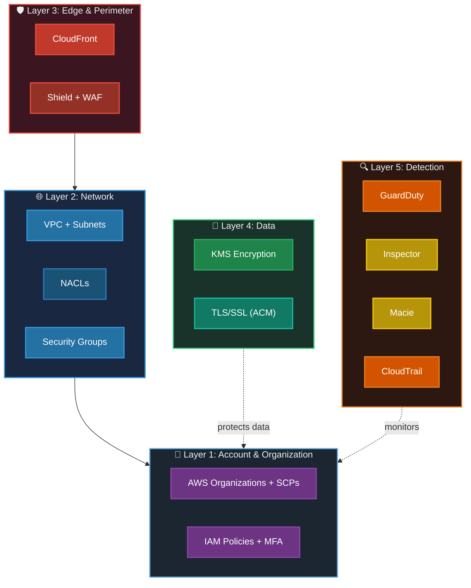

# AWS Security & Encryption - Tổng Quan & Diagrams

## 📋 Mục lục

- [Overview Diagram](#overview-diagram)
- [Encryption: Tổng quan](#encryption-tổng-quan)
- [KMS - Key Management Service](#kms---key-management-service)
- [Encryption At Rest vs In Transit](#encryption-at-rest-vs-in-transit)
- [Threat Detection & Protection](#threat-detection--protection)
- [Secrets & Certificate Management](#secrets--certificate-management)
- [Authentication: Cognito](#authentication-cognito)
- [Tổng hợp: Khi nào dùng service nào?](#tổng-hợp-khi-nào-dùng-service-nào)
- [Security Layers tổng thể](#security-layers-tổng-thể)
- [Best Practices](#best-practices)
- [Exam Tips](#exam-tips)

---

## Overview Diagram

### Toàn cảnh hệ thống Security & Encryption trong AWS



### Bảng so sánh nhanh

| Service | Câu hỏi trả lời | Ví dụ |
|---------|-----------------|-------|
| **Shield** | Chống DDoS? | UDP flood, SYN flood |
| **WAF** | Chặn web attack? | SQL injection, XSS, bot |
| **GuardDuty** | Ai đang tấn công? | Unusual API calls, crypto mining |
| **Inspector** | Có lỗ hổng bảo mật? | CVE trong EC2, ECR images |
| **Macie** | Có dữ liệu nhạy cảm lộ? | PII, credit cards trong S3 |
| **Security Hub** | Tổng hợp findings? | Aggregate từ tất cả services |
| **KMS** | Encrypt/Decrypt data? | S3, EBS, RDS encryption |
| **CloudHSM** | Cần FIPS Level 3? | Banking, government compliance |
| **ACM** | SSL/TLS certificates? | HTTPS cho ALB, CloudFront |
| **Secrets Manager** | Lưu passwords? | DB credentials, API keys |
| **Cognito** | User authentication? | Login, social auth, JWT |

---

## Encryption: Tổng quan

### 3 loại Encryption trong AWS



```
┌─────────────────────────────────────────────────────────────────────────────┐
│                     ENCRYPTION AT REST vs IN TRANSIT                        │
├─────────────────────────────────────────────────────────────────────────────┤
│                                                                             │
│  💾 AT REST (stored data)              🔄 IN TRANSIT (moving data)          │
│  ═════════════════════════             ═══════════════════════════          │
│                                                                             │
│  Data nằm trên disk/storage            Data đang di chuyển qua network      │
│                                                                             │
│  • S3: SSE-S3, SSE-KMS, SSE-C         • HTTPS (TLS 1.2/1.3)                 │
│  • EBS: KMS encryption                • VPN tunnels                         │
│  • RDS: KMS encryption                • Direct Connect + MACsec             │
│  • DynamoDB: KMS encryption            • API calls (SDK tự động TLS)        │
│  • EFS: KMS encryption                                                      │
│                                                                             │
│  ⚡ Hầu hết services hỗ trợ           ⚡ Hầu hết services ENFORCE             │
│     KMS encryption at rest                TLS in transit by default         │
│                                                                             │
└─────────────────────────────────────────────────────────────────────────────┘
```

---

## KMS - Key Management Service

### "Quản lý keys để encrypt/decrypt data"



### KMS vs CloudHSM

```
┌─────────────────────────────────────────────────────────────────────────────┐
│                          KMS vs CloudHSM                                    │
├─────────────────────────────────────────────────────────────────────────────┤
│                                                                             │
│  🔑 KMS (90% cases)                   🏦 CloudHSM (compliance)              │
│  ════════════════════                  ═══════════════════════              │
│                                                                             │
│  • Multi-tenant HSMs                   • Single-tenant dedicated HSMs       │
│  • FIPS 140-2 Level 2                  • FIPS 140-2 Level 3 ⭐              │
│  • AWS manages hardware               • BẠN quản lý keys                    │
│  • Symmetric + Asymmetric             • Full crypto library                 │
│  • $1/key/month                        • ~$1.45/hour (~$1,050/month)        │
│  • Auto-integrates 100+ services       • Manual integration                 │
│                                                                             │
│  ✅ Dùng khi:                          ✅ Dùng khi:                         │
│  • Cần encryption cho AWS services     • FIPS Level 3 required              │
│  • General encryption needs            • Oracle TDE, SSL offloading         │
│  • Cost-effective                      • Custom crypto (PKCS#11)            │
│                                                                             │
└─────────────────────────────────────────────────────────────────────────────┘
```

---

## Encryption At Rest vs In Transit

### Cách encrypt từng loại resource



---

## Threat Detection & Protection

### Tầng bảo vệ từ ngoài vào trong



### So sánh Threat Detection services

| Service | Scan gì? | Target | Tự động? |
|---------|----------|--------|----------|
| **GuardDuty** | Threats & attacks | VPC Flow, CloudTrail, DNS | ✅ Continuous, ML-based |
| **Inspector** | Vulnerabilities (CVE) | EC2, ECR, Lambda | ✅ Continuous scanning |
| **Macie** | Sensitive data (PII) | S3 buckets | ✅ / Scheduled jobs |
| **Security Hub** | Aggregate findings | All security services | ✅ Centralized view |

### Shield + WAF: Chống tấn công từ bên ngoài

```
┌─────────────────────────────────────────────────────────────────────────────┐
│                       SHIELD + WAF                                          │
├─────────────────────────────────────────────────────────────────────────────┤
│                                                                             │
│  🛡️ SHIELD                             🔥 WAF                               │
│  ═══════════                           ═════                                │
│                                                                             │
│  Chống DDoS attacks:                   Chặn web attacks:                    │
│  • Layer 3: UDP/ICMP floods            • SQL Injection                      │
│  • Layer 4: SYN floods                 • Cross-Site Scripting (XSS)         │
│  • Layer 7: HTTP floods                • IP blacklist/whitelist             │
│                                        • Rate limiting                      │
│  Standard: FREE (auto bật)             • Geo-blocking                       │
│  Advanced: $3,000/month                • Bot Control                        │
│  → DRT team, cost protection           • Custom rules                       │
│                                                                             │
│  Deploy trên:                          Deploy trên:                         │
│  • CloudFront                          • CloudFront                         │
│  • Route 53                            • ALB                                │
│  • ALB / NLB                           • API Gateway                        │
│  • Global Accelerator                  • AppSync                            │
│  • EC2 (Advanced only)                 • Cognito User Pool                  │
│                                                                             │
└─────────────────────────────────────────────────────────────────────────────┘
```

---

## Secrets & Certificate Management

### Lưu trữ và quản lý secrets



### Secrets Manager vs Parameter Store

```
┌─────────────────────────────────────────────────────────────────────────────┐
│               Secrets Manager vs SSM Parameter Store                        │
├─────────────────────────────────────────────────────────────────────────────┤
│                                                                             │
│  🔐 Secrets Manager                    📝 Parameter Store                   │
│  ════════════════════                  ═══════════════════                  │
│                                                                             │
│  • $0.40/secret/month                  • Standard: FREE (10,000 params)     │
│  • Auto-rotation ✅ (native)            • Advanced: $0.05/param/month       │
│  • Cross-account sharing ✅             • Manual rotation (Lambda)          │
│  • RDS/Redshift/DocumentDB native       • Parameter policies (expiration)   │
│  • Force encryption (KMS)              • Encryption optional                │
│  • Built-in Lambda rotation             • Hierarchical paths (/app/db/pass) │
│                                                                             │
│  ✅ Dùng khi:                          ✅ Dùng khi:                         │
│  • DB credentials cần auto-rotate      • Config values (feature flags)      │
│  • 3rd party API keys                  • Non-sensitive parameters           │
│  • Cross-account secrets               • Cost-sensitive (FREE tier)         │
│  • Compliance: rotation required        • Simple secrets (no rotation)      │
│                                                                             │
└─────────────────────────────────────────────────────────────────────────────┘
```

---

## Authentication: Cognito

### User Pools vs Identity Pools



```
User Pool → "Bạn là AI?" → JWT Token
Identity Pool → "Bạn ĐƯỢC LÀM GÌ trong AWS?" → AWS Credentials
Thường dùng CẢ HAI: User Pool → authenticate → Identity Pool → AWS access
```

---

## Tổng hợp: Khi nào dùng service nào?

```mermaid
graph TB
    Q["❓ Bạn cần gì?"]

    Q -->|"DDoS Layer 3/4?<br/>UDP, SYN flood"| A1["🛡️ Shield<br/>Absorb volumetric attacks"]
    Q -->|"DDoS Layer 7?<br/>HTTP flood"| DDOS7{"🌊 HTTP Flood"}
    DDOS7 -->|"Auto detect"| A1B["🛡️ Shield Advanced"]
    DDOS7 -->|"Rate limiting"| A2B["🔥 WAF Rate-based Rules"]
    Q -->|"SQL injection,<br/>XSS, bots?"| A2["🔥 WAF<br/>Web ACL Rules"]
    Q -->|"Block IPs /<br/>Geo-blocking?"| A2C["🔥 WAF<br/>IP Set / Geo Rules"]
    Q -->|"Encrypt data?"| A3["🔑 KMS"]
    Q -->|"FIPS Level 3?"| A4["🏦 CloudHSM"]
    Q -->|"SSL/TLS cert?"| A5["📜 ACM"]
    Q -->|"Lưu DB password?"| A6["🔐 Secrets Manager"]
    Q -->|"Config values?"| A7["📝 Parameter Store"]
    Q -->|"Threat detection?"| A8["🕵️ GuardDuty"]
    Q -->|"Vulnerability scan?"| A9["🔎 Inspector"]
    Q -->|"PII trong S3?"| A10["🔒 Macie"]
    Q -->|"User auth?"| A11["🧠 Cognito"]
    Q -->|"Tổng hợp findings?"| A12["📊 Security Hub"]
    Q -->|"WAF multi-account?"| A13["📋 Firewall Manager"]

    style Q fill:#6c3483,color:#fff,stroke:#8e44ad,stroke-width:3px
    style DDOS7 fill:#78281f,color:#fff,stroke:#c0392b,stroke-width:2px
    style A1 fill:#c0392b,color:#fff,stroke:#e74c3c,stroke-width:2px
    style A1B fill:#c0392b,color:#fff,stroke:#e74c3c,stroke-width:2px
    style A2 fill:#943126,color:#fff,stroke:#e74c3c,stroke-width:2px
    style A2B fill:#943126,color:#fff,stroke:#e74c3c,stroke-width:2px
    style A2C fill:#943126,color:#fff,stroke:#e74c3c,stroke-width:2px
    style A3 fill:#1e8449,color:#fff,stroke:#27ae60,stroke-width:2px
    style A4 fill:#117a65,color:#fff,stroke:#1abc9c,stroke-width:2px
    style A5 fill:#0e6655,color:#fff,stroke:#16a085,stroke-width:2px
    style A6 fill:#2471a3,color:#fff,stroke:#3498db,stroke-width:2px
    style A7 fill:#1a5276,color:#fff,stroke:#2980b9,stroke-width:2px
    style A8 fill:#d35400,color:#fff,stroke:#e67e22,stroke-width:2px
    style A9 fill:#b7950b,color:#fff,stroke:#f1c40f,stroke-width:2px
    style A10 fill:#b7950b,color:#fff,stroke:#f1c40f,stroke-width:2px
    style A11 fill:#6c3483,color:#fff,stroke:#8e44ad,stroke-width:2px
    style A12 fill:#6c3483,color:#fff,stroke:#8e44ad,stroke-width:2px
    style A13 fill:#78281f,color:#fff,stroke:#c0392b,stroke-width:2px
```



> [!NOTE]
> **Shield vs WAF cho DDoS:**
> - **Layer 3/4** (UDP flood, SYN flood) → **CHỈ Shield** xử lý được (WAF không hiểu traffic này)
> - **Layer 7** (HTTP flood) → **CẢ HAI** đều chặn được: Shield Advanced detect pattern bất thường, WAF dùng rate-based rules
> - Exam hỏi "chống DDoS?" → đáp án là **Shield**. Hỏi "rate limit HTTP?" → **WAF**

### Câu hỏi thường gặp trong exam

| Câu hỏi | Đáp án |
|----------|--------|
| "Encrypt S3 objects?" | **KMS (SSE-KMS)** hoặc SSE-S3 |
| "FIPS 140-2 Level 3?" | **CloudHSM** (không phải KMS!) |
| "Auto-rotate DB password?" | **Secrets Manager** |
| "Free SSL certificate?" | **ACM** |
| "CloudFront SSL cert ở region nào?" | **us-east-1** (bắt buộc) |
| "Chống DDoS?" | **Shield** (Standard = free) |
| "Block specific IPs?" | **WAF** (IP Set rules) |
| "Ai đang crypto mining trên EC2?" | **GuardDuty** |
| "EC2 có CVE vulnerabilities?" | **Inspector** |
| "PII data trong S3 buckets?" | **Macie** |
| "User login cho mobile app?" | **Cognito User Pool** |
| "Mobile access S3 directly?" | **Cognito Identity Pool** |
| "Tổng hợp security findings?" | **Security Hub** |
| "Quản lý WAF multi-account?" | **Firewall Manager** |

---

## Security Layers tổng thể

### Defense in Depth - Bảo mật nhiều lớp



---

## Best Practices

```
┌─────────────────────────────────────────────────────────────────────────────┐
│                     SECURITY & ENCRYPTION BEST PRACTICES                    │
├─────────────────────────────────────────────────────────────────────────────┤
│                                                                             │
│  1️⃣  ENCRYPTION                                                             │
│  ├── ✅ Encrypt EVERYTHING at rest (S3, EBS, RDS, DynamoDB)                 │
│  ├── ✅ Enforce TLS in transit                                              │
│  ├── ✅ Dùng SSE-KMS (customer managed key) cho audit trail                 │
│  ├── ✅ Enable key rotation                                                 │
│  └── ❌ KHÔNG dùng SSE-C trừ khi có lý do đặc biệt                          │
│                                                                             │
│  2️⃣  SECRETS MANAGEMENT                                                     │
│  ├── ✅ KHÔNG hard-code credentials trong source code                       │
│  ├── ✅ Dùng Secrets Manager cho DB passwords (auto-rotate)                 │
│  ├── ✅ Dùng Parameter Store cho config values                              │
│  └── ✅ Rotate secrets định kỳ (30-90 ngày)                                 │
│                                                                             │
│  3️⃣  THREAT DETECTION                                                       │
│  ├── ✅ Enable GuardDuty cho tất cả accounts/regions                        │
│  ├── ✅ Enable Inspector cho EC2 + ECR                                      │
│  ├── ✅ Enable Macie cho sensitive S3 buckets                               │
│  └── ✅ Aggregate vào Security Hub                                          │
│                                                                             │
│  4️⃣  PERIMETER                                                              │
│  ├── ✅ Shield Standard luôn bật (free)                                     │
│  ├── ✅ WAF cho tất cả public ALB/CloudFront                                │
│  ├── ✅ Dùng Managed Rules trước, custom rules sau                          │
│  └── ✅ Firewall Manager cho multi-account                                  │
│                                                                             │
│  5️⃣  CERTIFICATES                                                           │
│  ├── ✅ Dùng ACM (FREE) thay vì mua third-party                             │
│  ├── ✅ DNS validation (tự động renew)                                      │
│  ├── ✅ CloudFront cert PHẢI ở us-east-1                                    │
│  └── ✅ Request cả root + wildcard (example.com + *.example.com)            │
│                                                                             │
└─────────────────────────────────────────────────────────────────────────────┘
```

---

## Exam Tips

> [!TIP]
> **Ghi nhớ nhanh:**
> - **KMS** = encrypt data, quản lý keys (dùng cho hầu hết services)
> - **CloudHSM** = FIPS Level 3, dedicated hardware (banking/government)
> - **ACM** = SSL/TLS certificates (FREE)
> - **Secrets Manager** = passwords + auto-rotation
> - **Parameter Store** = config values (FREE tier)
> - **Shield** = DDoS protection (Standard = FREE)
> - **WAF** = web attacks (SQL injection, XSS, bots)
> - **GuardDuty** = threat detection (ML-based)
> - **Inspector** = vulnerability scanning (CVE)
> - **Macie** = PII discovery trong S3
> - **Cognito** = user authentication (User Pool + Identity Pool)

> [!CAUTION]
> **Dễ nhầm lẫn:**
> - KMS vs CloudHSM? → KMS = Level 2, CloudHSM = Level 3
> - Secrets Manager vs Parameter Store? → SM = auto-rotate / PS = free
> - Shield Standard vs Advanced? → Standard = free, auto / Advanced = $3K, DRT
> - GuardDuty vs Inspector? → GD = threats / Inspector = vulnerabilities
> - Macie vs GuardDuty? → Macie = S3 sensitive data / GD = account threats
> - User Pool vs Identity Pool? → UP = authentication / IP = AWS credentials
> - ACM region cho CloudFront? → **us-east-1 ONLY!**
> - SSE-S3 vs SSE-KMS? → KMS có audit trail + key control

---

## Liên kết tài liệu

- [KMS chi tiết](./aws-kms.md)
- [CloudHSM chi tiết](./aws-cloudhsm.md)
- [Secrets Manager chi tiết](./aws-secrets-manager.md)
- [ACM chi tiết](./aws-acm.md)
- [WAF chi tiết](./aws-waf.md)
- [Shield chi tiết](./aws-shield.md)
- [GuardDuty chi tiết](./amazon-guardduty.md)
- [Inspector chi tiết](./amazon-inspector.md)
- [Macie chi tiết](./amazon-macie.md)
- [Cognito chi tiết](./amazon-cognito.md)
- [IAM Overview](./aws-iam-management-overview.md)
- [Security Groups](./security-groups.md)
