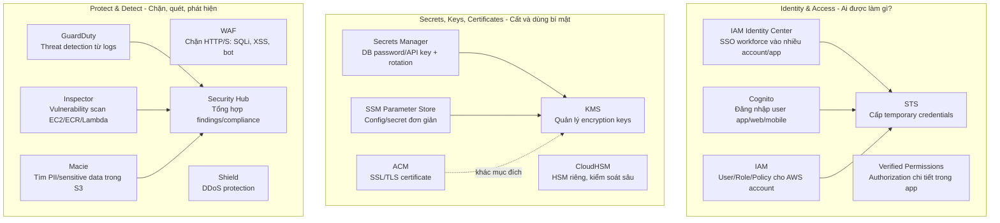

# AWS Security Services Comparison - Phân biệt KMS, Secrets Manager, IAM Identity Center, Cognito, STS

## Mục lục

- [Bản đồ tư duy nhanh](#bản-đồ-tư-duy-nhanh)
- [Một câu để nhớ từng dịch vụ](#một-câu-để-nhớ-từng-dịch-vụ)
- [Bảng phân biệt cốt lõi](#bảng-phân-biệt-cốt-lõi)
- [Nhóm Identity: IAM, IAM Identity Center, STS, Cognito](#nhóm-identity-iam-iam-identity-center-sts-cognito)
- [Nhóm Secrets, Keys, Certificates: KMS, Secrets Manager, Parameter Store, ACM, CloudHSM](#nhóm-secrets-keys-certificates-kms-secrets-manager-parameter-store-acm-cloudhsm)
- [Nhóm bảo vệ và phát hiện: WAF, Shield, GuardDuty, Inspector, Macie, Security Hub](#nhóm-bảo-vệ-và-phát-hiện-waf-shield-guardduty-inspector-macie-security-hub)
- [Các tình huống hay nhầm](#các-tình-huống-hay-nhầm)
- [Decision tree chọn dịch vụ](#decision-tree-chọn-dịch-vụ)
- [Ví dụ kiến trúc thực tế](#ví-dụ-kiến-trúc-thực-tế)
- [Exam tips](#exam-tips)
- [Nguồn AWS chính thức](#nguồn-aws-chính-thức)

---

## Bản đồ tư duy nhanh



Ý chính: **IAM/Identity Center/Cognito/STS trả lời “ai được truy cập?”; KMS/Secrets Manager/ACM trả lời “bí mật và khóa nằm ở đâu?”; WAF/Shield/GuardDuty/Inspector/Macie/Security Hub trả lời “bảo vệ và phát hiện rủi ro thế nào?”**

## Một câu để nhớ từng dịch vụ

| Dịch vụ | Câu nhớ nhanh |
|---|---|
| **IAM** | Nền tảng phân quyền trong AWS account: user, group, role, policy. |
| **IAM Identity Center** | SSO cho nhân viên vào nhiều AWS accounts và AWS managed applications. |
| **STS** | Máy phát **temporary credentials**: AssumeRole, federation, role session. |
| **Cognito** | Đăng ký/đăng nhập user cho app web/mobile; phát JWT và/hoặc AWS credentials qua identity pool. |
| **Verified Permissions** | Authorization chi tiết trong ứng dụng bằng Cedar policy; không thay thế Cognito/IAM. |
| **KMS** | Tạo/quản lý key để encrypt/decrypt/sign; key không rời KMS ở dạng plaintext. |
| **Secrets Manager** | Lưu secret như DB password/API key và tự động rotate. |
| **SSM Parameter Store** | Lưu config và secret đơn giản; thường rẻ/đơn giản hơn Secrets Manager. |
| **ACM** | Quản lý SSL/TLS certificate cho HTTPS. |
| **CloudHSM** | HSM chuyên dụng single-tenant khi cần kiểm soát cryptographic key sâu hơn KMS. |
| **WAF** | Firewall tầng web cho HTTP/HTTPS request. |
| **Shield** | Bảo vệ DDoS. |
| **GuardDuty** | Phát hiện hành vi nguy hiểm từ CloudTrail, VPC Flow Logs, DNS logs và nguồn khác. |
| **Inspector** | Quét vulnerability/unintended network exposure cho EC2, ECR image, Lambda. |
| **Macie** | Tìm dữ liệu nhạy cảm/PII trong S3 và giám sát posture S3. |
| **Security Hub** | Gom findings và kiểm tra compliance/security best practices. |

## Bảng phân biệt cốt lõi

| Nhu cầu | Dùng dịch vụ | Không nên nhầm với | Vì sao |
|---|---|---|---|
| Nhân viên công ty login một portal để vào nhiều AWS account | **IAM Identity Center** | Cognito | Identity Center là workforce SSO; Cognito là customer/app user identity. |
| Workload AWS gọi service khác không dùng access key dài hạn | **IAM Role + STS** | IAM User access key | STS cấp credentials ngắn hạn, hết hạn tự vô hiệu. |
| App mobile/web có sign up, sign in, social login | **Cognito User Pool** | IAM Identity Center | Cognito phục vụ user của app, phát JWT/OAuth tokens. |
| App cần user đã đăng nhập truy cập S3/DynamoDB trực tiếp | **Cognito Identity Pool + STS/IAM Role** | User Pool một mình | User Pool phát JWT; Identity Pool đổi identity token lấy AWS temporary credentials. |
| Lưu database password/API key/OAuth token | **Secrets Manager** | KMS | Secrets Manager lưu và rotate secret; KMS giữ encryption key. |
| Mã hóa data trong S3/EBS/RDS/app | **KMS** | Secrets Manager | KMS quản lý key và cryptographic operation, không phải kho password ứng dụng. |
| HTTPS certificate cho ALB/API Gateway/CloudFront | **ACM** | KMS/Secrets Manager | ACM quản lý certificate; CloudFront cần cert ACM ở us-east-1. |
| Yêu cầu HSM riêng, control thuật toán/key sâu, PKCS#11/JCE/CNG | **CloudHSM** | KMS | CloudHSM là HSM single-tenant, bạn kiểm soát nhiều hơn nhưng vận hành nhiều hơn. |
| Chặn SQL injection/XSS/bot ở ALB/API Gateway/CloudFront | **WAF** | Security Group | WAF hiểu HTTP layer 7; Security Group chỉ firewall network stateful. |
| Phát hiện credential bị compromise hoặc crypto mining | **GuardDuty** | Inspector | GuardDuty detect threat behavior; Inspector scan vulnerability. |
| Tìm bucket S3 chứa PII hoặc public risk | **Macie** | GuardDuty | Macie tập trung sensitive data discovery trong S3. |
| Một dashboard security findings toàn tổ chức | **Security Hub** | GuardDuty/Inspector/Macie riêng lẻ | Security Hub gom findings và chạy controls/standards. |

## Nhóm Identity: IAM, IAM Identity Center, STS, Cognito

### IAM - nền móng quyền truy cập AWS

**IAM trả lời:** trong AWS account này, principal nào được làm action nào trên resource nào?

Thành phần quan trọng:

- **IAM User**: danh tính dài hạn trong AWS account. Nên hạn chế dùng access key dài hạn.
- **IAM Group**: gom user để gắn policy.
- **IAM Role**: danh tính có thể được assume bởi service, user, account khác hoặc federated identity.
- **IAM Policy**: JSON định nghĩa `Allow`/`Deny` cho actions/resources/conditions.

Dùng IAM khi:

- Gán quyền cho EC2/Lambda/ECS task qua role.
- Cho account A truy cập resource account B bằng cross-account role.
- Viết policy least privilege cho AWS resources.

Không dùng IAM để:

- Làm trang đăng nhập customer-facing cho app. Dùng Cognito hoặc IdP khác.
- Lưu DB password/API key. Dùng Secrets Manager hoặc Parameter Store.

### IAM Identity Center - SSO cho workforce

**IAM Identity Center trả lời:** nhân viên/đội nhóm trong công ty đăng nhập ở đâu và được vào AWS account/app nào?

Điểm chính:

- Kết nối identity provider có sẵn hoặc tạo user/group trực tiếp trong Identity Center.
- Cấp quyền vào nhiều AWS accounts bằng **permission sets**.
- Có AWS access portal cho user đăng nhập một lần.
- Organization instance là best practice cho production multi-account.

Dùng khi:

- Công ty có nhiều AWS accounts và muốn SSO tập trung.
- Muốn map group `Developers`, `Admins`, `Auditors` vào permission sets.
- Muốn tích hợp identity workforce với AWS managed applications.

Không dùng khi:

- App thương mại cần đăng ký user cuối, social login, reset password. Dùng Cognito.
- Workload cần temporary credentials để gọi AWS API. Identity Center có thể là nguồn đăng nhập ban đầu, nhưng credentials thực tế vẫn dựa trên STS/role session.

### STS - máy phát credential tạm thời

**STS trả lời:** cấp access key tạm thời cho principal đã được tin cậy như thế nào?

Temporary credentials gồm:

- Access key ID
- Secret access key
- Session token
- Thời hạn hiệu lực ngắn

Dùng khi:

- `AssumeRole` để truy cập cross-account.
- EC2/Lambda/ECS dùng role thay vì hard-code key.
- Federation SAML/OIDC đổi identity ngoài AWS lấy AWS credentials.
- Cognito Identity Pool cấp AWS credentials cho app user.

Nhớ: STS **không phải identity store**. Nó không lưu user như Cognito/User Pool hay Identity Center. Nó chỉ phát credential tạm dựa trên trust policy và permission policy.

### Cognito - identity cho ứng dụng web/mobile

Cognito có 2 mảnh hay bị nhầm:

| Thành phần | Là gì | Output chính | Dùng khi |
|---|---|---|---|
| **User Pool** | User directory + authentication server + OIDC/OAuth | JWT tokens: ID token, access token, refresh token | App cần sign up/sign in, social login, MFA, hosted UI |
| **Identity Pool** | Federated identity đổi token thành AWS credentials | STS temporary AWS credentials | App user cần gọi AWS services như S3, DynamoDB trực tiếp |

Luồng phổ biến:

1. User đăng nhập qua Cognito User Pool.
2. App nhận JWT.
3. Nếu cần gọi AWS API trực tiếp, app đưa JWT cho Cognito Identity Pool.
4. Identity Pool dùng STS để cấp temporary credentials theo IAM role.

Không dùng Cognito để:

- Quản lý quyền nhân viên vào nhiều AWS account. Dùng IAM Identity Center.
- Lưu secret hoặc encryption key. Dùng Secrets Manager/KMS.

### Amazon Verified Permissions - authorization trong app

Verified Permissions **không xác thực user**. Nó giả định principal đã được authenticate bởi Cognito/OIDC/SAML/giải pháp khác, rồi trả lời câu hỏi:

> User này có được thực hiện action này trên resource này trong context này không?

Dùng khi app cần policy phức tạp kiểu:

- Tenant A không được xem data tenant B.
- Manager được approve expense dưới 10 triệu.
- Owner của document được share document, viewer chỉ được đọc.

## Nhóm Secrets, Keys, Certificates: KMS, Secrets Manager, Parameter Store, ACM, CloudHSM

### KMS - quản lý key mã hóa

**KMS trả lời:** key mã hóa nằm ở đâu, ai được dùng key, và dữ liệu được encrypt/decrypt thế nào?

KMS phù hợp cho:

- Server-side encryption cho S3, EBS, RDS, DynamoDB, Lambda env vars, CloudWatch Logs...
- Envelope encryption trong application.
- Audit key usage qua CloudTrail.
- Key policy + IAM policy kiểm soát ai được `kms:Decrypt`, `kms:Encrypt`, `kms:GenerateDataKey`.

Điểm dễ nhầm:

- KMS **có automatic key rotation**, nhưng nó rotate **key material** của KMS key, không rotate password/API key của ứng dụng.
- Với customer managed KMS key đủ điều kiện, bạn có thể bật automatic rotation; mặc định khi bật thì AWS KMS tạo key material mới hằng năm, hoặc bạn cấu hình rotation period tùy chỉnh. KMS cũng hỗ trợ on-demand rotation.
- Sau khi rotate, **Key ID/ARN/policy/alias vẫn là cùng logical KMS key**; AWS KMS tự chọn đúng key material cũ để decrypt ciphertext cũ, nên thường không cần đổi code.
- KMS rotation **không re-encrypt dữ liệu đã mã hóa**, không rotate data keys đã được generate trước đó, và không khắc phục nếu data key đã bị lộ.
- KMS **không phải nơi lưu password**. Nó bảo vệ encryption keys.
- KMS key không rời KMS ở dạng plaintext.
- Data lớn thường không gửi toàn bộ vào KMS để encrypt; app/service dùng envelope encryption: KMS tạo/decrypt data key, data key mã hóa dữ liệu.

### Secrets Manager - quản lý secret có lifecycle

**Secrets Manager trả lời:** secret như DB password/API key nằm ở đâu, lấy lúc runtime thế nào, rotate thế nào?

Phù hợp cho:

- Database credentials.
- API keys.
- OAuth tokens.
- Secret cần automatic rotation.
- Secret cần cross-account sharing/centralized management.

Quan hệ với KMS:

- Secrets Manager dùng KMS để encrypt secret at rest.
- Bạn có thể dùng AWS managed key `aws/secretsmanager` hoặc customer managed KMS key.
- Khi app gọi `GetSecretValue`, app cần quyền Secrets Manager và nếu dùng customer managed key thì cần quyền KMS decrypt phù hợp.

### SSM Parameter Store - config và secret đơn giản

Parameter Store thuộc Systems Manager, thường dùng cho:

- Config không nhạy cảm: `/app/prod/log-level`.
- Secret đơn giản dạng `SecureString`.
- Hierarchical parameters.

Chọn **Secrets Manager** thay vì Parameter Store khi cần:

- Automatic rotation tích hợp tốt.
- Secret lifecycle chuyên dụng.
- Database credential rotation.

Chọn **Parameter Store** khi:

- Chủ yếu là configuration.
- Secret đơn giản, ít rotation.
- Muốn tích hợp chặt với SSM/AppConfig/automation.

### ACM - certificate cho TLS/HTTPS

**ACM trả lời:** certificate TLS cho domain được cấp, lưu, renew, gắn vào service nào?

Dùng cho:

- Application Load Balancer.
- API Gateway.
- CloudFront.
- App Runner và các integrated AWS services khác.

Điểm cần nhớ:

- ACM certificate là regional resource.
- CloudFront yêu cầu ACM certificate ở **US East (N. Virginia) / us-east-1**.
- ACM không phải nơi lưu arbitrary private key cho app tự đọc. Nó tích hợp với dịch vụ AWS được hỗ trợ.

### CloudHSM - HSM riêng khi KMS chưa đủ

Dùng CloudHSM khi:

- Cần HSM single-tenant.
- Cần kiểm soát thuật toán, key, crypto library sâu.
- Cần tích hợp PKCS#11, JCE, CNG, KSP.
- Yêu cầu compliance/control khiến managed KMS chưa phù hợp.

Trade-off:

- **KMS**: dễ dùng, managed, tích hợp sâu AWS services.
- **CloudHSM**: kiểm soát nhiều hơn, nhưng bạn chịu nhiều trách nhiệm vận hành hơn.

## Nhóm bảo vệ và phát hiện: WAF, Shield, GuardDuty, Inspector, Macie, Security Hub

### WAF vs Shield

| Dịch vụ | Bảo vệ khỏi | Layer | Gắn vào đâu |
|---|---|---|---|
| **WAF** | SQL injection, XSS, bad IP, bot, request pattern xấu | Layer 7 HTTP/HTTPS | CloudFront, ALB, API Gateway REST API, AppSync, Cognito user pool, App Runner, Verified Access, Amplify |
| **Shield** | DDoS | Layer 3/4 và với Shield Advanced có cả Layer 7 | CloudFront, Route 53, Global Accelerator, ELB, Elastic IP... |

Nhớ: **WAF đọc nội dung HTTP request; Shield chống DDoS volume/protocol/application attacks.**

### GuardDuty vs Inspector vs Macie

| Dịch vụ | Câu hỏi nó trả lời | Nguồn/tài nguyên chính |
|---|---|---|
| **GuardDuty** | Có dấu hiệu bị tấn công/credential compromise/malware/crypto mining không? | CloudTrail events, VPC Flow Logs, DNS logs và dữ liệu workload được hỗ trợ |
| **Inspector** | Workload có CVE, package vulnerable, network exposure không? | EC2, ECR container images, Lambda |
| **Macie** | S3 có chứa PII/sensitive data hoặc bucket risk không? | S3 buckets/objects |

Cách nhớ:

- GuardDuty = **detect attacker behavior**.
- Inspector = **detect software vulnerability**.
- Macie = **detect sensitive data in S3**.

### Security Hub

Security Hub không thay thế GuardDuty/Inspector/Macie. Nó là nơi:

- Nhận findings từ nhiều dịch vụ và third-party products.
- Chạy security controls theo standards như AWS Foundational Security Best Practices, CIS, PCI DSS, NIST.
- Hỗ trợ automation qua EventBridge/automation rules.

## Các tình huống hay nhầm

### KMS vs Secrets Manager

| Câu hỏi | KMS | Secrets Manager |
|---|---|---|
| Lưu DB password? | Không trực tiếp | Có |
| Tạo encryption key? | Có | Không, nó dùng KMS để encrypt secret |
| Rotate key/secret? | Có automatic/on-demand rotation cho **KMS key material**; không đổi Key ID/ARN và không đổi password ứng dụng | Rotate **secret value**, ví dụ đổi password DB/API key/OAuth token |
| App gọi để lấy password? | Không | Có, `GetSecretValue` |
| App gọi để decrypt data key/data? | Có | Không phải mục tiêu chính |

Ví dụ: password database nằm trong Secrets Manager; secret đó được encrypt at rest bằng KMS key. Nếu bật KMS rotation, thứ được rotate là key material dùng để bảo vệ secret at rest; còn password database chỉ đổi khi Secrets Manager rotation chạy.

### IAM Identity Center vs Cognito

| Tiêu chí | IAM Identity Center | Cognito |
|---|---|---|
| Đối tượng | Workforce: nhân viên, admin, developer | Customer/app users |
| Mục tiêu | SSO vào AWS accounts và AWS managed apps | Auth cho web/mobile app |
| Output thường gặp | AWS access portal, account assignments, role sessions | JWT tokens, optionally AWS credentials qua identity pool |
| Ví dụ | Nhân viên DevOps login vào account prod/read-only | User login app e-commerce bằng Google/Apple/email |

### IAM Role vs STS

- **IAM Role** là danh tính/quyền/trust policy.
- **STS** là service cấp credentials tạm thời khi ai đó assume role.

Nói ngắn: role là “ghế quyền hạn”; STS là “người phát thẻ tạm để ngồi vào ghế đó”.

### Cognito User Pool vs Identity Pool

- **User Pool**: “Bạn là ai?” → xác thực, phát JWT.
- **Identity Pool**: “Bạn được lấy AWS credentials nào?” → đổi token từ IdP thành STS credentials.

Nếu backend API tự xử lý request bằng JWT, có thể chỉ cần User Pool. Nếu frontend cần gọi S3 trực tiếp bằng AWS SDK, thường cần thêm Identity Pool.

### GuardDuty vs Security Hub

- GuardDuty tạo findings threat detection.
- Security Hub gom findings GuardDuty và nhiều nguồn khác, đồng thời đánh giá security standards.

### WAF vs Security Group vs NACL

| Công cụ | Layer | Stateful? | Dùng để |
|---|---:|---:|---|
| **WAF** | L7 HTTP/HTTPS | Theo request rule | Chặn SQLi/XSS/bot/path/header/query pattern |
| **Security Group** | L3/L4 | Có | Allow inbound/outbound cho ENI/resource |
| **NACL** | L3/L4 subnet | Không | Allow/Deny ở subnet boundary |

## Decision tree chọn dịch vụ

```text
Bạn đang xử lý vấn đề gì?

1) Người hoặc workload cần quyền AWS?
   ├─ Nhân viên vào nhiều AWS accounts/apps? → IAM Identity Center
   ├─ AWS service/workload cần gọi AWS API? → IAM Role + STS
   ├─ Cross-account access? → IAM Role + STS AssumeRole
   └─ User app web/mobile đăng nhập? → Cognito User Pool

2) App user cần gọi AWS resources trực tiếp?
   ├─ Có → Cognito Identity Pool + IAM Role + STS
   └─ Không → Cognito User Pool JWT cho backend/API

3) Bạn cần lưu bí mật hay mã hóa?
   ├─ Encryption key/data encryption? → KMS
   ├─ DB password/API key/OAuth token? → Secrets Manager
   ├─ Config/secret đơn giản? → SSM Parameter Store
   ├─ HTTPS certificate? → ACM
   └─ HSM riêng/crypto control sâu? → CloudHSM

4) Bạn cần bảo vệ/phát hiện?
   ├─ Chặn HTTP attack? → WAF
   ├─ DDoS? → Shield
   ├─ Threat/compromise behavior? → GuardDuty
   ├─ Vulnerability scan? → Inspector
   ├─ Sensitive data trong S3? → Macie
   └─ Tổng hợp findings/compliance? → Security Hub
```

## Ví dụ kiến trúc thực tế

### 1. Công ty multi-account

```text
Corporate IdP / Microsoft Entra ID / Okta
        ↓ federation
IAM Identity Center
        ↓ permission sets
AWS Accounts: dev, staging, prod
        ↓ role sessions
STS temporary credentials
        ↓
Users thao tác AWS Console/CLI
```

Dịch vụ chính: IAM Identity Center, IAM permission sets, STS, IAM roles.

### 2. Web app có user login và upload file S3

```text
User → Cognito User Pool → nhận JWT
User → Cognito Identity Pool → nhận STS temporary credentials
User → S3 PutObject theo IAM role giới hạn prefix user
S3 object encrypted bằng SSE-KMS
App backend lấy DB password từ Secrets Manager
Secrets Manager encrypt secret bằng KMS
```

Dịch vụ chính: Cognito User Pool, Cognito Identity Pool, STS, IAM Role, S3, KMS, Secrets Manager.

### 3. Public API cần bảo vệ và giám sát

```text
Client → CloudFront/API Gateway/ALB
        ↓
AWS WAF chặn SQLi/XSS/bot/IP xấu
        ↓
Application
        ↓ logs/events
GuardDuty phát hiện threat behavior
Inspector quét EC2/ECR/Lambda vulnerabilities
Macie kiểm tra S3 sensitive data
Security Hub gom findings và compliance controls
```

Dịch vụ chính: WAF, GuardDuty, Inspector, Macie, Security Hub.

## Exam tips

- Thấy **temporary credentials**, **AssumeRole**, **federation**, **cross-account** → nghĩ **STS**.
- Thấy **SSO cho nhân viên nhiều AWS accounts** → **IAM Identity Center**.
- Thấy **customer web/mobile sign-up/sign-in/social login/JWT** → **Cognito User Pool**.
- Thấy **app user cần AWS credentials tạm để gọi S3/DynamoDB** → **Cognito Identity Pool**.
- Thấy **database credentials/API keys/automatic rotation** → **Secrets Manager**.
- Thấy **encryption keys/envelope encryption/kms:Decrypt** → **KMS**.
- Thấy **TLS/SSL certificate/HTTPS/CloudFront cert in us-east-1** → **ACM**.
- Thấy **dedicated HSM/PKCS#11/FIPS Level 3/customer controls key material sâu** → **CloudHSM**.
- Thấy **SQL injection/XSS/HTTP request filtering** → **WAF**.
- Thấy **DDoS** → **Shield**.
- Thấy **compromised credentials/suspicious behavior/crypto mining** → **GuardDuty**.
- Thấy **CVE/vulnerability scan EC2/ECR/Lambda** → **Inspector**.
- Thấy **PII/sensitive data discovery in S3** → **Macie**.
- Thấy **single pane of glass/security standards/findings aggregation** → **Security Hub**.

## Nguồn AWS chính thức

- [What is IAM?](https://docs.aws.amazon.com/IAM/latest/UserGuide/introduction.html)
- [What is IAM Identity Center?](https://docs.aws.amazon.com/singlesignon/latest/userguide/what-is.html)
- [Temporary security credentials in IAM / AWS STS](https://docs.aws.amazon.com/IAM/latest/UserGuide/id_credentials_temp.html)
- [What is Amazon Cognito?](https://docs.aws.amazon.com/cognito/latest/developerguide/what-is-amazon-cognito.html)
- [What is Amazon Verified Permissions?](https://docs.aws.amazon.com/verifiedpermissions/latest/userguide/what-is-avp.html)
- [AWS Key Management Service](https://docs.aws.amazon.com/kms/latest/developerguide/overview.html)
- [What is AWS Secrets Manager?](https://docs.aws.amazon.com/secretsmanager/latest/userguide/intro.html)
- [What is AWS Certificate Manager?](https://docs.aws.amazon.com/acm/latest/userguide/acm-overview.html)
- [What is AWS CloudHSM?](https://docs.aws.amazon.com/cloudhsm/latest/userguide/introduction.html)
- [What are AWS WAF, AWS Shield Advanced, and AWS Firewall Manager?](https://docs.aws.amazon.com/waf/latest/developerguide/what-is-aws-waf.html)
- [What is Amazon GuardDuty?](https://docs.aws.amazon.com/guardduty/latest/ug/what-is-guardduty.html)
- [What is Amazon Inspector?](https://docs.aws.amazon.com/inspector/latest/user/what-is-inspector.html)
- [What is Amazon Macie?](https://docs.aws.amazon.com/macie/latest/user/what-is-macie.html)
- [Introduction to AWS Security Hub CSPM](https://docs.aws.amazon.com/securityhub/latest/userguide/what-is-securityhub.html)
