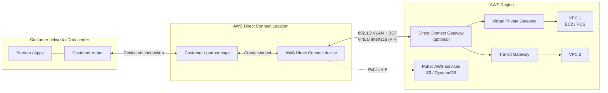

# AWS Direct Connect

## Mục lục
- [Giới thiệu](#giới-thiệu)
- [Kiến trúc và cách hoạt động](#kiến-trúc-và-cách-hoạt-động)
- [Các loại kết nối](#các-loại-kết-nối)
- [Virtual Interfaces (VIFs)](#virtual-interfaces-vifs)
- [Direct Connect Gateway](#direct-connect-gateway)
- [Link Aggregation Groups (LAG)](#link-aggregation-groups-lag)
- [Tính năng bảo mật](#tính-năng-bảo-mật)
- [SiteLink](#sitelink)
- [So sánh Direct Connect vs VPN](#so-sánh-direct-connect-vs-vpn)
- [Use Cases](#use-cases)
- [Pricing](#pricing)
- [Best Practices](#best-practices)
- [Exam Tips](#exam-tips)

---

> [!NOTE]
> **Đừng nhầm lẫn!** AWS Direct Connect ≠ Amazon Connect
> - **AWS Direct Connect**: Dịch vụ **networking** - kết nối mạng riêng từ on-premises đến AWS
> - **Amazon Connect**: Dịch vụ **contact center** (tổng đài) - xây dựng hệ thống CSKH trên cloud
>
> Xem thêm: [Amazon Connect](./amazon-connect.md)

## Giới thiệu

**AWS Direct Connect** là dịch vụ cung cấp **kết nối mạng riêng, chuyên dụng** từ on-premises (data center, văn phòng) đến AWS, **không đi qua Internet công cộng**.

### Lợi ích chính

| Lợi ích | Mô tả |
|---------|-------|
| **Hiệu suất ổn định** | Băng thông nhất quán, không bị ảnh hưởng bởi Internet congestion |
| **Độ trễ thấp** | Latency thấp và có thể dự đoán được |
| **Bảo mật cao** | Traffic không đi qua Internet công cộng |
| **Tiết kiệm chi phí** | Giảm phí data transfer out so với Internet |
| **Băng thông cao** | Hỗ trợ từ 50 Mbps đến 400 Gbps |

```
┌─────────────────┐         ┌──────────────────────┐         ┌─────────────────┐
│                 │         │  AWS Direct Connect  │         │                 │
│   On-Premises   │◄───────►│      Location        │◄───────►│      AWS        │
│   Data Center   │ Private │   (Colocation)       │ Private │   Cloud         │
│                 │ Link    │                      │ Link    │                 │
└─────────────────┘         └──────────────────────┘         └─────────────────┘
                                     │
                            Không đi qua Internet
```

---

## Kiến trúc và cách hoạt động

### Các thành phần chính



> Direct Connect tạo **kết nối vật lý chuyên dụng** tới một Direct Connect location. Sau khi có physical connectivity, bạn tạo **Virtual Interface (VIF)** chạy trên VLAN 802.1Q và dùng **BGP** để truy cập tài nguyên AWS: private VIF tới VPC/VGW/DX Gateway, transit VIF tới Transit Gateway/Cloud WAN, hoặc public VIF tới dịch vụ public của AWS.

### Quy trình thiết lập

1. **Chọn Direct Connect Location** - Chọn một trong 100+ locations trên toàn cầu
2. **Yêu cầu kết nối** - Qua AWS Console hoặc qua Partner
3. **Thiết lập Cross-connect** - Kết nối vật lý tại colocation facility
4. **Cấu hình Virtual Interface** - Tạo VIF để định tuyến traffic
5. **Cấu hình BGP** - Thiết lập Border Gateway Protocol routing

---

## Các loại kết nối

### 1. Dedicated Connection

Kết nối vật lý **chuyên dụng** được AWS cung cấp trực tiếp cho khách hàng.

| Đặc điểm | Chi tiết |
|----------|----------|
| **Tốc độ** | 1 Gbps, 10 Gbps, 100 Gbps, 400 Gbps |
| **Yêu cầu** | Yêu cầu trực tiếp qua AWS Console |
| **Thời gian setup** | 4-12 tuần |
| **Port** | AWS cung cấp physical port |
| **Sử dụng LAG** | ✅ Có thể tạo LAG |

### 2. Hosted Connection

Kết nối được **cung cấp bởi AWS Direct Connect Partner** thay mặt cho khách hàng.

| Đặc điểm | Chi tiết |
|----------|----------|
| **Tốc độ** | 50 Mbps - 10 Gbps |
| **Yêu cầu** | Qua AWS Partner |
| **Thời gian setup** | Nhanh hơn Dedicated |
| **Linh hoạt** | Dễ scale up/down |
| **Sử dụng LAG** | ❌ Không thể tạo LAG trực tiếp |

### So sánh

```
┌─────────────────────────────────────────────────────────────────┐
│                    Connection Type Comparison                   │
├─────────────────────────────────────────────────────────────────┤
│                                                                 │
│  Dedicated Connection              Hosted Connection            │
│  ─────────────────────            ─────────────────────         │
│                                                                 │
│  ┌─────────┐      ┌─────┐        ┌─────────┐    ┌──────┐        │
│  │Customer │──────│ AWS │        │Customer │────│Partner│──AWS  │
│  │         │Direct│     │        │         │    │      │        │
│  └─────────┘      └─────┘        └─────────┘    └──────┘        │
│                                                                 │
│  • 1/10/100/400 Gbps              • 50 Mbps - 10 Gbps           │
│  • Chuyên dụng hoàn toàn          • Chia sẻ qua Partner         │
│  • Setup 4-12 tuần                • Setup nhanh hơn             │
│  • Có thể dùng LAG                • Không dùng LAG trực tiếp    │
│                                                                 │
└─────────────────────────────────────────────────────────────────┘
```

---

## Virtual Interfaces (VIFs)

Virtual Interface (VIF) là **logical interface** được tạo trên connection để định tuyến traffic đến các mạng khác nhau.

### 3 loại VIF

| Loại VIF | Mục đích | Sử dụng BGP |
|----------|----------|-------------|
| **Private VIF** | Kết nối đến VPC (Private IP) | Private ASN |
| **Public VIF** | Truy cập AWS public services (S3, DynamoDB, etc.) | Public ASN |
| **Transit VIF** | Kết nối đến Transit Gateway | Private ASN |

```
┌──────────────────────────────────────────────────────────────────────────┐
│                        Virtual Interface Types                           │
├──────────────────────────────────────────────────────────────────────────┤
│                                                                          │
│  Direct Connect                                                          │
│  Connection                                                              │
│       │                                                                  │
│       ├───► Private VIF ──────► VPC (via Virtual Private Gateway)        │
│       │                         hoặc Direct Connect Gateway              │
│       │                                                                  │
│       ├───► Public VIF ───────► AWS Public Services                      │
│       │                         (S3, Glacier, DynamoDB, SQS, etc.)       │
│       │                                                                  │
│       └───► Transit VIF ──────► Transit Gateway ──► Multiple VPCs        │
│                                                                          │
└──────────────────────────────────────────────────────────────────────────┘
```

### Private VIF vs Transit VIF

| Tiêu chí | Private VIF | Transit VIF |
|----------|-------------|-------------|
| **Kết nối đến** | 1 VPC hoặc nhiều VPC (via DX Gateway) | Transit Gateway |
| **Số VPC tối đa** | 10 VGW per DX Gateway | Hàng nghìn VPCs |
| **Routing** | BGP với VGW | BGP với Transit Gateway |
| **Use case** | Ít VPCs | Enterprise với nhiều VPCs |

---

## Direct Connect Gateway

**Direct Connect Gateway** là tài nguyên **global** cho phép kết nối từ on-premises đến **nhiều VPCs ở nhiều AWS Regions** thông qua một connection duy nhất.

```
┌──────────────────────────────────────────────────────────────────────────────┐
│                         Direct Connect Gateway                               │
├──────────────────────────────────────────────────────────────────────────────┤
│                                                                              │
│    On-Premises                     AWS                                       │
│                                                                              │
│    ┌─────────┐     ┌────────────┐     ┌─────────────────────┐                │
│    │         │     │            │     │  DX Gateway         │                │
│    │ Router  │─────│ Private    │─────│  (Global Resource)  │                │
│    │         │     │ VIF        │     │                     │                │
│    └─────────┘     └────────────┘     └──────────┬──────────┘                │
│                                                  │                           │
│                          ┌───────────────────────┼───────────────────────┐   │
│                          │                       │                       │   │
│                          ▼                       ▼                       ▼   │
│                    ┌──────────┐            ┌──────────┐          ┌──────────┐│
│                    │  VPC 1   │            │  VPC 2   │          │  VPC 3   ││
│                    │ us-east-1│            │eu-west-1 │          │ap-south-1││
│                    └──────────┘            └──────────┘          └──────────┘│
│                                                                              │
│    • Kết nối nhiều VPCs từ nhiều Regions                                     │
│    • Sử dụng 1 Private VIF hoặc Transit VIF                                  │
│    • Tối đa 10 Virtual Private Gateways mỗi DX Gateway                       │
│                                                                              │
└──────────────────────────────────────────────────────────────────────────────┘
```

### Lưu ý quan trọng

> ⚠️ **Direct Connect Gateway KHÔNG cho phép route traffic giữa các VPC với nhau.** Nó chỉ cho phép on-premises kết nối đến nhiều VPCs. Để VPC-to-VPC communication, cần sử dụng Transit Gateway.

---

## Link Aggregation Groups (LAG)

**LAG** là cơ chế kết hợp **nhiều physical connections** thành **một logical connection** để tăng băng thông và độ tin cậy.

### Đặc điểm LAG

| Đặc điểm | Chi tiết |
|----------|----------|
| **Giao thức** | LACP (Link Aggregation Control Protocol) |
| **Chế độ** | Active/Active |
| **Loại connection** | Chỉ Dedicated Connections |
| **Cùng tốc độ** | Tất cả connections phải cùng port speed |
| **Cùng endpoint** | Tất cả phải terminate tại cùng DX endpoint |

### Giới hạn LAG

```
┌───────────────────────────────────────────────────────────────┐
│                    LAG Limits                                 │
├───────────────────────────────────────────────────────────────┤
│                                                               │
│  Port Speed           │  Maximum Connections per LAG          │
│  ─────────────────────┼─────────────────────────────────────  │
│  < 100 Gbps           │  4 connections                        │
│  100 Gbps             │  2 connections                        │
│  400 Gbps             │  2 connections                        │
│                                                               │
│  ⚠️ MLAG (Multi-chassis LAG) KHÔNG được hỗ trợ                │
│                                                               │
└───────────────────────────────────────────────────────────────┘
```

### Ví dụ LAG

```
┌───────────────────────────────────────────────────────────┐
│                    LAG Example                            │
├───────────────────────────────────────────────────────────┤
│                                                           │
│  Customer Router                    AWS Device            │
│                                                           │
│  ┌─────────────┐                  ┌─────────────┐         │
│  │             │ ── 10 Gbps ────► │             │         │
│  │             │ ── 10 Gbps ────► │             │         │
│  │  Router     │ ── 10 Gbps ────► │   AWS DX    │         │
│  │             │ ── 10 Gbps ────► │   Endpoint  │         │
│  │             │                  │             │         │
│  └─────────────┘                  └─────────────┘         │
│        │                                │                 │
│        └──────────── LAG ───────────────┘                 │
│                   (40 Gbps total)                         │
│                                                           │
│  • 4 x 10 Gbps Dedicated Connections                      │
│  • Tổng băng thông: 40 Gbps                               │
│  • Nếu 1 link fail → còn 30 Gbps                          │
│                                                           │
└───────────────────────────────────────────────────────────┘
```

---

## Tính năng bảo mật

### Encryption Options

| Tùy chọn | Mô tả | Tốc độ hỗ trợ |
|----------|-------|---------------|
| **MACsec** | Point-to-point encryption (IEEE 802.1AE) | 10, 100, 400 Gbps |
| **IPsec VPN** | Chạy VPN tunnel qua Direct Connect | Tất cả |

### MACsec (Media Access Control Security)

```
┌──────────────────────────────────────────────────────────────┐
│                    MACsec Encryption                         │
├──────────────────────────────────────────────────────────────┤
│                                                              │
│  ┌─────────────┐   MACsec Encrypted    ┌─────────────┐       │
│  │   Customer  │◄─────────────────────►│    AWS      │       │
│  │   Router    │                       │   Device    │       │
│  │  (MACsec    │                       │  (MACsec    │       │
│  │   capable)  │                       │   enabled)  │       │
│  └─────────────┘                       └─────────────┘       │
│                                                              │
│  • Layer 2 encryption                                        │
│  • Near wirespeed performance                                │
│  • Chỉ có ở select DX locations                              │
│                                                              │
└──────────────────────────────────────────────────────────────┘
```

### Private IP VPN over Direct Connect

Kết hợp Direct Connect với Site-to-Site VPN để có cả tốc độ cao VÀ encryption.

```
┌──────────────────────────────────────────────────────────────┐
│              Private IP VPN over Direct Connect              │
├──────────────────────────────────────────────────────────────┤
│                                                              │
│  On-Premises          Direct Connect              AWS        │
│                                                              │
│  ┌─────────┐     ┌─────────────────┐     ┌─────────────┐     │
│  │ VPN     │────►│  Private VIF    │────►│ Transit     │     │
│  │ Gateway │     │  (Private IP)   │     │ Gateway     │     │
│  └─────────┘     └─────────────────┘     └────┬────────┘     │
│       │                                       │              │
│       │◄──────── IPsec Tunnel ───────────────►│              │
│                                                              │
│  ✅ Không dùng Public IP                                     │
│  ✅ Traffic encrypted end-to-end                             │
│  ✅ Thích hợp cho regulated industries                       │
│                                                              │
└──────────────────────────────────────────────────────────────┘
```

---

## SiteLink

**SiteLink** cho phép gửi traffic **giữa các Direct Connect locations** mà không cần đi qua on-premises network.

```
┌──────────────────────────────────────────────────────────────────────────┐
│                              SiteLink                                    │
├──────────────────────────────────────────────────────────────────────────┤
│                                                                          │
│     Office A          AWS Network (SiteLink)           Office B          │
│   (Tokyo)                                            (Singapore)         │
│                                                                          │
│   ┌─────────┐         ┌────────────────┐         ┌─────────┐             │
│   │         │◄───────►│    AWS         │◄───────►│         │             │
│   │ Router  │   DX    │    Global      │   DX    │ Router  │             │
│   │         │         │    Network     │         │         │             │
│   └─────────┘         └────────────────┘         └─────────┘             │
│                             ▲                                            │
│                             │                                            │
│                       SiteLink traffic                                   │
│                    (không qua Internet)                                  │
│                                                                          │
│  Use cases:                                                              │
│  • Kết nối các văn phòng/data center qua AWS backbone                    │
│  • Disaster recovery giữa các site                                       │
│  • Low-latency inter-office communication                                │
│                                                                          │
└──────────────────────────────────────────────────────────────────────────┘
```

---

## So sánh Direct Connect vs VPN

| Tiêu chí | AWS Direct Connect | AWS Site-to-Site VPN |
|----------|-------------------|---------------------|
| **Kết nối** | Private, dedicated | Qua Internet (encrypted) |
| **Băng thông** | 50 Mbps - 400 Gbps | ~1.25 Gbps per tunnel |
| **Latency** | Thấp, ổn định | Phụ thuộc Internet |
| **Chi phí ban đầu** | Cao | Thấp |
| **Thời gian setup** | 4-12 tuần | Vài phút - vài giờ |
| **Encryption** | Optional (MACsec/VPN) | Built-in (IPsec) |
| **Reliability** | Cao, ổn định | Phụ thuộc ISP |

### Tại sao Direct Connect không cần Internet, còn VPN thì cần?

Sự khác biệt nằm ở **hạ tầng vật lý**:

```
┌──────────────────────────────────────────────────────────────────────────────┐
│                    SITE-TO-SITE VPN - Dùng Internet có sẵn                   │
├──────────────────────────────────────────────────────────────────────────────┤
│                                                                              │
│   On-Premises              PUBLIC INTERNET                    AWS            │
│                                                                              │
│   ┌─────────┐         ┌─────────────────────┐         ┌─────────┐            │
│   │   VPN   │────────►│  🌐 ISP ──► ISP 🌐  │────────►│  VGW    │            │
│   │ Gateway │         │  (Nhiều hop, shared)│         │         │            │
│   └─────────┘         └─────────────────────┘         └─────────┘            │
│        │                        ▲                          │                 │
│        └── Dùng Internet ───────┘                          │                 │
│            có sẵn từ ISP              IPsec Tunnel (encrypted)               │
│                                                                              │
│   ✅ Setup nhanh (vài phút)           ❌ Latency không ổn định               │
│   ✅ Chi phí thấp                     ❌ Bandwidth giới hạn ~1.25 Gbps       │
│   ✅ Không cần đầu tư hạ tầng         ❌ Phụ thuộc chất lượng ISP            │
│                                                                              │
└──────────────────────────────────────────────────────────────────────────────┘

┌──────────────────────────────────────────────────────────────────────────────┐
│                    DIRECT CONNECT - Đường cáp riêng                          │
├──────────────────────────────────────────────────────────────────────────────┤
│                                                                              │
│   On-Premises          DX Location (Colocation)              AWS             │
│                                                                              │
│   ┌─────────┐      ┌────────────────────────┐         ┌─────────┐            │
│   │ Router  │─────►│ 🏢 Physical Facility   │────────►│ VGW     │            │
│   │         │      │   (AWS có port tại đây)│         │         │            │
│   └─────────┘      └────────────────────────┘         └─────────┘            │
│        │                    ▲            ▲                  │                │
│        │                    │            │                  │                │
│   Private Fiber ────────────┘            └────────── Private Fiber           │
│   (Bạn thuê)                                         (AWS sở hữu)            │
│                                                                              │
│   ✅ Latency thấp, ổn định              ❌ Setup 4-12 tuần                   │
│   ✅ Bandwidth cao (tới 400 Gbps)       ❌ Chi phí cao (thuê fiber, colo)    │
│   ✅ KHÔNG đi qua Internet              ❌ Cần có DC gần DX Location         │
│                                                                              │
└──────────────────────────────────────────────────────────────────────────────┘
```

**Tóm lại:**
- **VPN** = Phần mềm tạo tunnel mã hóa **qua Internet có sẵn** → nhanh, rẻ, không ổn định
- **Direct Connect** = Đường cáp vật lý riêng **không dính gì đến Internet** → chậm setup, đắt, nhưng cực kỳ ổn định

### Khi nào dùng gì?

```
┌─────────────────────────────────────────────────────────────┐
│                   Decision Tree                             │
├─────────────────────────────────────────────────────────────┤
│                                                             │
│  Cần bandwidth > 1.25 Gbps?                                 │
│       │                                                     │
│       ├── Yes ──► Direct Connect                            │
│       │                                                     │
│       └── No                                                │
│            │                                                │
│            ├── Cần latency thấp, ổn định?                   │
│            │       │                                        │
│            │       ├── Yes ──► Direct Connect               │
│            │       │                                        │
│            │       └── No                                   │
│            │            │                                   │
│            │            ├── Cần nhanh & rẻ?                 │
│            │            │       │                           │
│            │            │       ├── Yes ──► VPN             │
│            │            │       │                           │
│            │            │       └── No ──► Direct Connect   │
│            │                                                │
│            └── Budget hạn chế + OK với hiệu suất thay đổi?  │
│                    │                                        │
│                    └── Yes ──► VPN                          │
│                                                             │
└─────────────────────────────────────────────────────────────┘
```

---

## Use Cases

### 1. Large-scale Data Migration
```
Scenario: Di chuyển petabytes dữ liệu lên AWS
Solution: Direct Connect 100 Gbps
Benefit: Tốc độ nhanh, ổn định, không phụ thuộc Internet
```

### 2. Hybrid Cloud
```
Scenario: Workloads chạy cả on-premises và AWS
Solution: Direct Connect + Transit Gateway
Benefit: Seamless integration, low latency
```

### 3. Real-time Applications
```
Scenario: Trading platform, video streaming
Solution: Direct Connect với MACsec
Benefit: Ultra-low latency, secure
```

### 4. Disaster Recovery
```
Scenario: DR site trên AWS
Solution: Direct Connect (primary) + VPN (backup)
Benefit: Reliable replication, encrypted backup path
```

### 5. Regulatory Compliance
```
Scenario: Healthcare/Finance với strict data requirements
Solution: Private IP VPN over Direct Connect
Benefit: End-to-end encryption, no public IP exposure
```

---

## Pricing

### Pricing Model

AWS Direct Connect sử dụng mô hình **pay-as-you-go**, không có upfront fee hoặc minimum commitment.

### Thành phần chi phí

| Thành phần | Mô tả | Ví dụ giá (US East) |
|------------|-------|---------------------|
| **Port Hours** | Phí cho thời gian port được provision | $0.30/hr (1 Gbps dedicated) |
| **Data Transfer Out** | Phí cho data transfer từ AWS ra | $0.02/GB |
| **Data Transfer In** | Phí cho data transfer vào AWS | **FREE** |

### Ví dụ tính giá

```
┌─────────────────────────────────────────────────────────────┐
│             Monthly Cost Example (US East)                  │
├─────────────────────────────────────────────────────────────┤
│                                                             │
│  1 Gbps Dedicated Connection                                │
│  1 TB outbound data transfer                                │
│                                                             │
│  Port Hours:                                                │
│    $0.30/hr × 730 hrs = $219.00                             │
│                                                             │
│  Data Transfer Out:                                         │
│    1,024 GB × $0.02/GB = $20.48                             │
│                                                             │
│  Data Transfer In:                                          │
│    FREE                                                     │
│                                                             │
│  ─────────────────────────────────────────                  │
│  TOTAL: ~$239.48/month                                      │
│                                                             │
└─────────────────────────────────────────────────────────────┘
```

> 💡 **Tip:** Sử dụng [AWS Pricing Calculator](https://calculator.aws) để estimate chi phí chính xác.

---

## Best Practices

### High Availability

```
┌─────────────────────────────────────────────────────────────────────────┐
│                    High Availability Design                             │
├─────────────────────────────────────────────────────────────────────────┤
│                                                                         │
│  Development/Non-critical              Production/Critical              │
│  ─────────────────────                 ─────────────────────            │
│                                                                         │
│  ┌─────────┐    ┌─────┐              ┌─────────┐    ┌─────┐    ┌─────┐  │
│  │On-prem  │────│ DX  │              │On-prem  │────│ DX  │────│ DX  │  │
│  │         │    │Loc 1│              │         │    │Loc 1│    │Loc 2│  │
│  └─────────┘    └─────┘              └─────────┘    └─────┘    └─────┘  │
│                                                                         │
│  Single connection                   Dual connections at 2 locations    │
│  (backup: VPN)                       (full redundancy)                  │
│                                                                         │
│  Recommendation:                                                        │
│  • Non-critical: 1 DX + 1 VPN backup                                    │
│  • Critical: 2 DX connections at different locations                    │
│  • Maximum: 4 connections (2 per location) for highest resiliency       │
│                                                                         │
└─────────────────────────────────────────────────────────────────────────┘
```

### Recommended Practices

1. **Multiple connections** - Ít nhất 2 connections cho production workloads
2. **Different locations** - Sử dụng 2+ Direct Connect locations khác nhau
3. **VPN backup** - Luôn có VPN làm backup path
4. **Monitoring** - Sử dụng CloudWatch metrics để monitor connection health
5. **BGP** - Cấu hình AS path prepending cho failover control

---

## Exam Tips

### Key Points for AWS Exams

1. **Direct Connect vs VPN**
   - Direct Connect = private, dedicated, consistent (4-12 weeks setup)
   - VPN = encrypted over Internet, quick setup (minutes)

2. **Virtual Interfaces**
   - Private VIF → VPC (private IP)
   - Public VIF → AWS public services (S3, etc.)
   - Transit VIF → Transit Gateway

3. **Direct Connect Gateway**
   - Global resource
   - Kết nối on-prem đến nhiều VPCs/Regions
   - KHÔNG cho phép VPC-to-VPC routing

4. **LAG**
   - Chỉ với Dedicated Connections
   - Cùng port speed
   - Max 4 connections (<100G) hoặc 2 connections (100G/400G)

5. **Encryption**
   - Direct Connect không encrypted by default
   - MACsec cho 10/100/400 Gbps
   - Private IP VPN for end-to-end encryption
   - **Exam note:** Khi đề nhấn mạnh đồng thời **encrypted + dedicated**, đáp án thường là **Direct Connect + Site-to-Site VPN** (IPsec over DX), trừ khi đề nêu rõ dùng MACsec.
   - Tham chiếu AWS:
     - Direct Connect encryption in transit: https://docs.aws.amazon.com/directconnect/latest/UserGuide/encryption-in-transit.html
     - Direct Connect + Site-to-Site VPN (VPC Connectivity Options): https://docs.aws.amazon.com/whitepapers/latest/aws-vpc-connectivity-options/aws-direct-connect-site-to-site-vpn.html

6. **High Availability**
   - Minimum 2 connections cho resilience
   - Khác locations cho maximum HA
   - VPN backup cho failover

### Common Exam Scenarios

| Scenario | Answer |
|----------|--------|
| Cần kết nối nhanh, budget thấp | VPN |
| Cần consistent bandwidth cao | Direct Connect |
| Kết nối on-prem đến nhiều VPCs | Direct Connect Gateway |
| Encrypted traffic + dedicated connection (exam default) | Direct Connect + Site-to-Site VPN (hoặc MACsec nếu đề nêu rõ điều kiện hỗ trợ) |
| Cần gộp nhiều connections | LAG (chỉ Dedicated) |
| Office-to-office qua AWS backbone | SiteLink |

---

## Liên kết liên quan

- [VPC](./vpc.md)
- [Transit Gateway](./vpc.md#transit-gateway)
- [AWS Site-to-Site VPN](./vpc.md#site-to-site-vpn)
