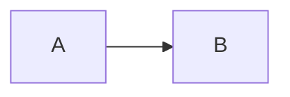

# Authoring và AWS verification

## Hai loại nội dung

Repository duy trì hai luồng kiến thức liên quan nhưng khác contract:

1. **Bài học dài** — file Markdown ở root, được `README.md` catalog và build vào Fumadocs.
2. **Q&A luyện tập** — record D1 được tạo theo AWS explain skill, hiển thị ở `/practice/`.

Cả hai phải viết tiếng Việt và xác minh những claim AWS dễ thay đổi bằng nguồn AWS chính thức. [`AGENTS.md`](../../AGENTS.md) là policy gốc; trang này chuyển policy đó thành workflow thao tác.

## Thêm một bài AWS mới

### 1. Chọn category hợp lệ

Dùng một section đã có trong [`README.md`](../../README.md), ví dụ Compute, Storage, Database, Networking, Security. Category web thực tế phải tồn tại trong `SECTION_TO_DIR` của [`scripts/prepare-content.mjs`](../../scripts/prepare-content.mjs).

### 2. Tạo source Markdown tại root

Không thêm YAML frontmatter. Bắt đầu bằng H1:

```markdown
# Tên AWS Service

## Mục lục

- [Tổng quan](#tổng-quan)
- [Kiến trúc](#kiến-trúc)
- [Nguồn chính thức](#nguồn-chính-thức)

---

## Tổng quan
```

Quy tắc TOC:

- cần TOC khi bài có từ 3 `##` headings;
- đặt ngay sau H1;
- liệt kê các `##` headings;
- bỏ emoji khỏi anchor, lowercase, thay space bằng `-`, bỏ ký tự đặc biệt;
- kết thúc TOC bằng `---` để content processor loại đúng section này trên web.

### 3. Đăng ký trong README

Bắt buộc thêm đúng format:

```markdown
- [x] [Tên hiển thị](ten-file.md) - Mô tả ngắn
```

README quyết định bài có được build, category/URL, description và order. Không đăng ký thì source tồn tại nhưng website không biết đến nó.

Không đăng ký cùng filename ở hai section. Parser dùng `Map`, occurrence cuối thắng; duplicate hiện tại của `iam-identity-center.md` là ví dụ về category ambiguity.

### 4. Thêm liên kết liên quan

Link root docs bằng filename tương đối đơn giản:

```markdown
[Xem thêm S3 Security](s3-security.md)
```

Build sẽ đổi link nếu target nằm trong catalog. Link có uppercase, nested path hoặc pattern khác có thể không được rewrite; kiểm tra output generated khi dùng dạng đặc biệt.

### 5. Xác minh build

```bash
npm run prepare-content
npm run build
```

Kiểm tra:

- log có dòng file → đúng category;
- generated frontmatter đúng title/description;
- route và sidebar xuất hiện;
- TOC, links, table/callout/diagram render đúng;
- không commit generated directories.

## Sửa một bài hiện có

1. Tìm source bằng README, không sửa `content/docs/`.
2. Giữ H1 và TOC đồng bộ khi thêm/xóa `##`.
3. Review các bài liên quan nếu thay một khái niệm dùng chung.
4. Nếu thay title/category/filename, cập nhật README và mọi cross-link.
5. Với rename/removal, xóa generated `content/docs/` cũ trước khi regenerate để tránh stale output, vì prepare script không clear toàn bộ docs tree.
6. Chạy build và mở route ảnh hưởng.

Các bài như [`amazon-data-firehose.md`](../../amazon-data-firehose.md) thể hiện pattern đầy đủ: giới thiệu, kiến trúc/flow, comparison, examples, quotas/pricing và nguồn. [`bastion-host-deep-dive.md`](../../bastion-host-deep-dive.md) là mẫu cho deep dive có diagram editable/rendered đi kèm.

## Accuracy workflow cho AWS

Không suy đoán API names, limits, defaults, Region availability hay launch dates. Quy trình bắt buộc:

1. **Xác định claim cần kiểm chứng** — service behavior, API field, quota, pricing, Region hoặc ngày.
2. **Tìm tài liệu AWS chính thức qua MCP** — ưu tiên `aws-knowledge` search.
3. **Đọc tài liệu gốc**, không kết luận từ search snippet.
4. Dùng regional availability tool cho câu hỏi Region.
5. Nếu primary MCP unavailable/rate-limited, dùng AWS documentation MCP fallback; nếu vẫn không xác minh được, ghi rõ “Chưa xác minh được từ tài liệu AWS tại thời điểm viết”.
6. Gắn link AWS Documentation, What's New, Blog hoặc Pricing cho các điểm quan trọng.
7. Với claim theo thời gian, ghi ngày cụ thể thay vì “hiện nay/gần đây” mơ hồ.

Nguồn ưu tiên theo policy repository:

```text
AWS Documentation > AWS What's New > AWS Blog > AWS Pricing
```

Khi sửa một claim hiện hữu, đừng mặc định nguồn cũ vẫn đúng; đọc lại source chính thức, nhất là quotas, naming và supported destinations/features.

## Diagram workflow

### Mermaid

Dùng fenced block khi diagram phù hợp với text và có thể maintain trực tiếp:

````markdown

````

Fumadocs pipeline biến block thành client component. Production build là bắt buộc để bắt lỗi MDX/transform.

### Excalidraw/PNG

Với diagram phức tạp:

1. Lưu editable `.excalidraw` trong `docs/diagrams/`.
2. Export PNG/SVG vào cùng directory và version-control cả source lẫn rendered file.
3. Embed bằng `/diagrams/<rendered-file>`.
4. Có thể link file source để người sau biết chỗ chỉnh.
5. Chạy prepare/build; script copy directory sang `public/diagrams/`.

Không chỉnh `public/diagrams/` vì lần build kế tiếp sẽ xóa và tạo lại directory đó.

## Tạo và lưu AWS Q&A

Skill canonical là [`.agents/skills/aws-explain/SKILL.md`](../../.agents/skills/aws-explain/SKILL.md). Khi task là phân tích câu AWS, phải dùng skill thay vì tự tạo record tùy ý.

Luồng chính:

1. Chuẩn hóa question và giữ nguyên option IDs `#1`, `#2`, ...
2. Phát hiện single/multi-select, negation, cost-driven và near-twin services.
3. Đọc `references/teaching-patterns.md`; chỉ load `special-cases.md` khi multi-select/negation trigger.
4. Xác minh bằng AWS MCP và chọn đáp án từ chứng cứ, không tin answer pre-marked một cách mặc định.
5. Ghi mức xác minh: direct/inferred/unverified.
6. Trả lời theo structure skill và lưu cùng nội dung vào D1 bằng questions API.

### Contract lưu trữ

- `description`: question + `Options:` + các `#N — ...` + `Answer:`.
- `notes`: các section `## Giải thích câu hỏi`, `## Vì sao đúng`, `## Vì sao các đáp án khác sai`, `## Nguồn`.
- `metadata.answer`: chứa `#N` để Practice UI chấm điểm.
- `metadata.question_type`: `single` hoặc `multi-select`.
- labels: tối thiểu `aws`, service và domain phù hợp.

`notes` phải là bản sao nguyên văn của phần giải thích đã trả cho người dùng, không phải summary. Xem parser và API details ở [Practice Q&A và data model](../architecture/practice-and-data.md).

## Review checklist nội dung

### Bài Markdown

- [ ] H1 có mặt, không có YAML frontmatter.
- [ ] TOC có mặt nếu ≥3 H2 và anchors đúng.
- [ ] README entry đúng format/category và không duplicate filename.
- [ ] Claim AWS quan trọng có source chính thức đã đọc.
- [ ] Cross-links trỏ target có trong README.
- [ ] Diagram có source editable nếu cần và render đúng.
- [ ] `npm run build` thành công.

### Q&A

- [ ] Option order/IDs giữ nguyên.
- [ ] Single/multi-select và negation được nhận diện đúng.
- [ ] `metadata.answer` khớp đáp án đã giải thích.
- [ ] Notes headings tương thích UI.
- [ ] Sources là AWS official và support trực tiếp kết luận.
- [ ] Record POST thành công và có ID/sequence number.
- [ ] Practice UI chấm đúng và reveal notes đúng.
